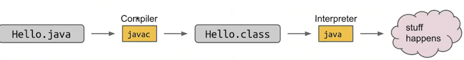

# HelloWorld
 
* [python和Java的对比](#python和Java的对比)
* [编译和解释_静态检查](#编译和解释_静态检查)
* [面向对象编程_oop](#面向对象编程_oop)

## python和Java的对比

我们用python和java编写几个相同的程序

```py
print('hello world')
```

```java
public class HelloWorld {
    public static void main(String[] args) {
        System.out.println("hello world");
    }
}
```

* **所有的代码必须是类的一部分**
* `class`使用`public class CLASSNAME`定义
* `{}`来限制事物的起始结束，而不是缩进
* **分号**结束语句

```py
x = 0

while (x < 10):
    print(x)
    x = x + 1
```

```java
public class HelloWorld {
    public static void main(String[] args) {
        int x;
        x = 0;
        while (x < 10) {
            System.out.println(x);
            x = x + 1;
        }
    }
}
```

* 使用变量时必须要**声明 同时指定类型**
* 声明后不能再改变类型，也不能重新声明
* 区别于python会在执行过程中发现类型错误（比如整数和字符串相加），Java会在**运行前检查类型是否正确**

```py
def larger(x, y):
    if x > y:
        return x
    else:
        return y

print(larger(-5, 10))
```

```java
public class HelloWorld {
    public static int larger(int x, int y) {
        if (x > y) {
            return x;
        } else {
            return y;
        }
    }

    public static void main(String[] args) {
        System.out.println(larger(-5, 10));
    }
}
```

* **函数必须作为类的一部分来声明** `public static`
* 函数的参数必须声明类型，函数的返回值也声明类型
* 函数只能返回一个值

## 编译和解释_静态检查



Java中编译和解释是两个单独的步骤

* 在运行前，编译器检查程序中的所有类型是否匹配
* 当程序经过检查且所有类型匹配的情况下，才可以真正执行

关于静态检查

好处是

* 捕捉类型错误 更好调试
* 代码可读性增加 只要看到声明就知道总是这个类型
* 运行中不需要类型检查，更快一些（Java比Python通常快）

坏处是

* 代码更长
* 代码有些不通用 比如想比较小数

## 面向对象编程_oop

组织程序的一种模型

* **模块化** 构建一部分而不担心其他
* **数据抽象** 和对象交互而不必了解内部细节

```py
class Car:
    
    def __init__(self, m):
        self.model = m
        self.wheels = 4

    def drive(self):
        if (self.wheels < 4):
            print(self.model + " no go vroom")
            return 
        print(self.model + " goes vroom")

    def getNumWheels(self):
        return self.wheels

    def driveIntoDitch(self, wheelsLost):
        self.wheels = self.wheels - wheelsLost

c1 = Car("Civic Type R")
c2 = Car("Toyota Camry")

c1.drive()
c1.driveIntoDitch(2)
c1.drive()

print(c2.getNumWheels())
```

```java
public class Car {

    String model;
    int wheels;

    public Car(String m) {
        this.model = m;
        this.wheels = 4;
    }

    public void drive() {
        if (this.wheels < 4) {
            System.out.println(this.model + " no go vroom");
            return;
        }
        System.out.println(this.model + " go vroom");
    }

    public int getNumWheels() {
        return this.wheels;    
    }

    public void driveIntoDitch(int wheelsLost) {
        this.wheels = this.wheels - wheelsLost;
    }

    public static void main(String[] agrs) {
        Car c1;
        Car c2;

        c1 = new Car("Civic Type R");
        c2 = new Car("Totota Camry");

        c1.drive();
        c1.driveIntoDitch(2);
        c1.drive();

        System.out.println(c2.getNumWheels());
    }
}
```

* `java`中在不引起冲突的情况，this可以省略
* 通过`new`创建
