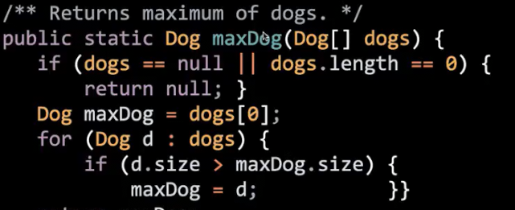

# 高阶函数_多态
 
* [高阶函数](#高阶函数)
  * [早期的Java_用类模拟函数](#早期的Java_用类模拟函数)
* [多态_](#多态_)
  * [Comparable](#Comparable)
  * [自然比较_不同比较依据_比较器](#自然比较_不同比较依据_比较器)

## 高阶函数

函数作为参数

### 早期的Java_用类模拟函数

我们不能用一个确切的类型表示函数，所以要把其包装为类，创建一个表示函数的对象，并将该对象传递给函数

```java
public interface IntUnaryFuntion {
    public int apply(int x);
}
```

表示一个**传入一个整数** **返回一个整数**的函数

我们可以据此定义函数

```java
public class Tenx implements IntUnaryFuntion {
    
    @Override
    public int apply(int x) {
        return 10 * x;
    }
}
```

那么高阶函数就定义如下

```java
public class Demo {
    public static int doTwice(IntUnaryFuntion f, int x) {
        return f.apply(f.apply(x))
    }
}
```

调用如下 我们需要传入模拟函数实例

```java
    public static void main(String[] args) {
        int result = doTwice(new Tenx(), 2);
        System.out.println(result);
    }
```

## 多态_

为不同类型的实体提供一个统一的接口

比如我们在项目1构建的`deque`，可以基于数组也可以基于链表，但是！我们不需要关注其底层类型，我们只需要`deque.addFirst`，无论数组还是链表实现都有这些方法

而`addFirst`到底执行什么，其**真实表现**依据运行时类型


而python和javascript，往往不依赖多态，总是喜欢显式传递函数


这就是一个多态形式的python函数

多态更依赖**对象为我们自动处理类型问题**

在Java中，我们考虑这样一个函数，其第一个和第三个框是没问题的，分别运用了静态类型的检查规则


* 但是第二个框处，不一定每个对象都可以用`>`连接，可能会导致异常
* 那么如果我们只给`Dog`一个方法来或许最大的狗呢？



这又违背了我们的期望，**一个对于任意类都选出最大值的函数**

我们尝试对自定义的`max`只应用一种特定的对象`OurComparable`，所有其实现类都是可以比较的

```java
public interface OurComparable {

    /**
     * Returns -1 if I am less than o.
     * Returns 0 if I am equal to o.
     * Return 1 if I am greater than o.
     */
    public int comparaTo(Object o);
}
```

```java
    @Override
    public int comparaTo(Object o) {
        Dog otherDog = (Dog) o;
        if (this.size < otherDog.size) {
            return -1;
        } else if (this.size == otherDog.size) {
            return 0;
        } else {
            return 1;
        }
    }
```

进行类型转换的原因是，编译器在检查`o.size`时，依据其静态类型，由于是Object，不是完全有size属性，无法通过编译

max函数实现如下


这就是一种多态 可以比较多个类的实例，这些类都是OurComparable的子类，都具有`compareTo`的方法

### Comparable

现在有两个小问题

* 我们Dog中的`comparaTo`需要进行强制类型转换，如果传入的不是Dog，就会报错，是一个隐患
* 自定义的`OurComparable`只有`Dog`在使用

事实上有**真正的**OurComparable


其用泛型解决了强制类型转换问题


而在`Collections`库中，已经有基于这个CompareTo的`max` `mean`等等

### 自然比较_不同比较依据_比较器

我们刚刚在Dog中实现了`comparable`的`comparable`方法，这个方法就是自然比较，作为**默认的比较方式**

我们可以按照size比较，也可以名字字母比较

在高阶函数中，我们可以转入自定义比较函数来完成


但是我们在使用多态时


`.largerthan`只是可以比较x和y的一种方式，似乎没有放置比较依据的地方

解决方法是传入一个**比较器**

这是比较器的实现


实现内置的`Comparator`接口类（传入泛型为比较项目），其`compare`就是我们比较的方法

现在我们就可以使用我们的比较器来用不同的方法比较两只狗


现在我们使用`Collections.max`等函数就可以额外传入自己的比较器实例

而一些细节是

* 实现比较器不必是一个类，可以嵌套在`Dog`中
* 并且其是所有狗共有的，因此`static`修饰作为整个类的属性

实例化通过这种方式


* 最后将比较器设置私有，而对外界暴露一个方法可以访问这个类实例


