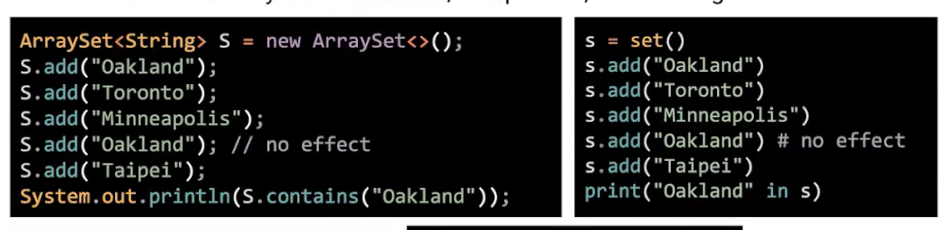
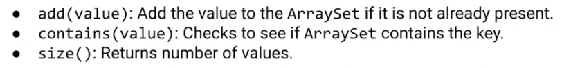
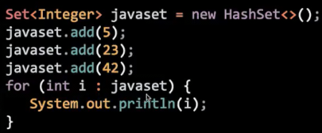
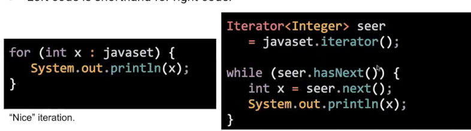

# 强化for toString equals
 
* [强化for](#强化for)
  * [集合](#集合)
  * [增强for的原理_iterable_iterator](#增强for的原理_iterable_iterator)
* [Object的两个常用方法](#Object的两个常用方法)
  * [toString](#toString)
  * [equals](#equals)

## 强化for

### 集合

集合是一组无序、不重复的对象

允许添加和查询是否包含操作


 


```java
public class ArraySet<T> {
    private T[] items;
    private int size;

    public ArraySet() {
        items = (T[]) new Object[100];
        size = 0;
    }

    /* Add an item to the set. but no repeat. */
    public void add(T x) {
        if (contains(x)) {
            return;
        }
        items[size] = x;
        size += 1;
    }

    /* Returns true if this set contains x */
    public boolean contains(T x) {
        for (int i = 0; i < size; i++) {
            if (items[i].equals(x)) {
                return true;
            }
        }
        return false;
    }

    public static void main(String[] args) {
        ArraySet<Integer> S = new ArraySet<>();
        S.add(5);
        S.add(23);
        S.add(42);

        System.out.println(S.contains(42));
        System.out.println(S.contains(50));
    }
}
```

### 增强for的原理_iterable_iterator

Java中支持这种for循环



我们希望我们的集合类也支持

增强for循环实际上是另一种代码的等效



从对象的`iterator()`方法中获取本对象迭代器，不断调用迭代器的`hasNext()`和`next()`方法进行迭代

```java
    private class ArraySetIterator implements Iterator<T> {
        private int wizPos;

        public ArraySetIterator() {
            wizPos = 0;
        }

        @Override
        public boolean hasNext() {
            return wizPos < size;
        }

        @Override
        public T next() {
            wizPos++;
            return items[wizPos-1];
        }
    }

    public Iterator<T> iterator() {
        return new ArraySetIterator();
    } 
```

在构造了集合类的迭代器后，我们可以运行上面*复杂的*代码

但是如果用到python的强化for语法，我们还需要将集合从接口类`Iterable`中继承 `iterator`方法就是它的签名，我们已经实现

## Object的两个常用方法

### toString

* `System.out.println`调用这个方法，以打印对象

默认情况继承自Object，打印出对象的名称，和内存的位置

```java
    @Override
    public String toString() {
        String x = "(";
        for (T i : this) {
            // 添加后会创建新的字符串对象，原来的如果被其他引用指向则留在原处
            x += i.toString() + " ";
        }
        x += ")";
        return x;
    }
```

鉴于String的上述问题，每次都需要完整复制原内容，我们可以使用`StringBuilder`

```java
    @Override
    public String toString() {
        StringBuilder x = new StringBuilder();
        x.append("(");
        for (T i : this) {
            // 添加后会创建新的字符串对象，原来的如果被其他引用指向则留在原处
            x.append(i.toString());
            x.append(" ");
        }
        x.append(")");
        return x.toString();
    }
```

### equals

`==`只是比较了比特位！有点像赋值的黄金法则

我们可以自定义`.equals`比较什么

从Object默认继承的是==的作用

```java
    @Override
    public boolean equals(Object obj) {
        if (obj instanceof ArraySet otherArraySet) {
            if (this.size != otherArraySet.size) {
                return false;
            }
            for (T i : this) {
                if (!otherArraySet.contains(i)) {
                    return false;
                }
            }
        }
        return true;
    }
```

* `obj instanceof ArraySet otherArraySet` 表示判断obj是否为ArraySet的实例，如果是，转化为otherArraySet，`obj`和`otherArraySet`持有相同引用，只不过静态类型变化
* 奇怪的是`instanceof`不能查看在类实现中的泛型**用T这种代号，尽管已经确定**
    * 这里`obj instanceof ArraySet<T> otherArraySet` 会报错

