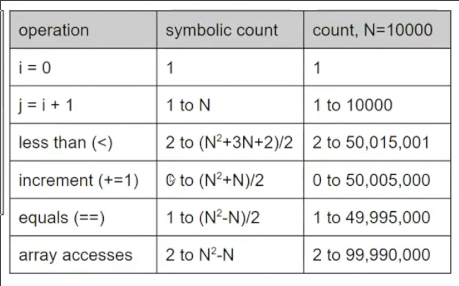
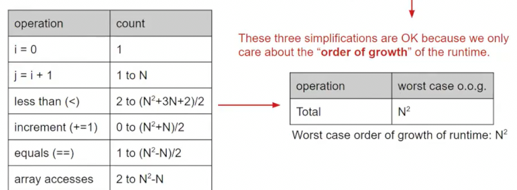
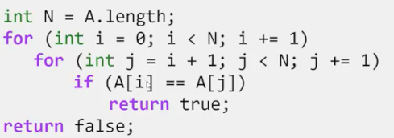

# 衡量程序运行的时间
 
* [观察](#观察)
* [数学原因](#数学原因)
  * [不同操作数函数运行时间的增长阶](#不同操作数函数运行时间的增长阶)
  * [简化计算](#简化计算)
  * [分析方法](#分析方法)
* [符号和术语](#符号和术语)

## 观察

这是一个有序的数组，目标是找出是否有重复的数字


* 一种算法是找出数组中所有对，查看两元素是否相同
* 另一种则基于这个数组已经是有序的了，我们每次只需要查看相邻的元素是否相同

显然第二种算法好些 那么具体好多少？

```java
    public static boolean dup1(int[] A) {
        for (int i = 0; i < A.length; i++) {
            for (int j = i + 1; j < A.length; j++) {
                if (A[i] == A[j]) {
                    return true;
                }
            }
        }
        return false;
    }

    public static boolean dup2(int[] A) {
        for (int i = 0, j = 1; j < A.length; i++, j++) {
            if (A[i] == A[j]) {
                return true;
            }
        }
        return false;
    }
```

我们可以利用ucb提供的库进行时间测试

```java
    public static void main(String[] args) {
        int testsize = 1000;
        double lasttestruntime = 0.0;
        while(lasttestruntime < 10) {
            int[] arr = new int[testsize];
            for (int j = 0; j < testsize; j++) {
                arr[j] = j;
            }
            Stopwatch s = new Stopwatch();
            s.start();
            boolean b = dup1(arr);
            double newtime = s.getElapsed() / 1000.0;
            s.stop();
            System.out.println("Test of size " + testsize + " compeleted. Time elapsed: " + newtime + " seconds.");
            testsize *= 2;
            lasttestruntime = newtime;
        }
    }
```

对于dup1

```java
Test of size 1000 compeleted. Time elapsed: 0.006 seconds.
Test of size 2000 compeleted. Time elapsed: 0.002 seconds.
Test of size 4000 compeleted. Time elapsed: 0.009 seconds.
Test of size 8000 compeleted. Time elapsed: 0.015 seconds.
Test of size 16000 compeleted. Time elapsed: 0.074 seconds.
Test of size 32000 compeleted. Time elapsed: 0.178 seconds.
Test of size 64000 compeleted. Time elapsed: 0.591 seconds.
Test of size 128000 compeleted. Time elapsed: 2.234 seconds.
Test of size 256000 compeleted. Time elapsed: 8.836 seconds.
Test of size 512000 compeleted. Time elapsed: 35.568 seconds.
```

对于dup2

```java
Test of size 1000 compeleted. Time elapsed: 0.0 seconds.
Test of size 2000 compeleted. Time elapsed: 0.0 seconds.
Test of size 4000 compeleted. Time elapsed: 0.0 seconds.
Test of size 8000 compeleted. Time elapsed: 0.0 seconds.
Test of size 16000 compeleted. Time elapsed: 0.0 seconds.
Test of size 32000 compeleted. Time elapsed: 0.0 seconds.
Test of size 64000 compeleted. Time elapsed: 0.001 seconds.
Test of size 128000 compeleted. Time elapsed: 0.002 seconds.
Test of size 256000 compeleted. Time elapsed: 0.001 seconds.
Test of size 512000 compeleted. Time elapsed: 0.001 seconds.
Test of size 1024000 compeleted. Time elapsed: 0.0 seconds.
Test of size 2048000 compeleted. Time elapsed: 0.001 seconds.
Test of size 4096000 compeleted. Time elapsed: 0.002 seconds.
Test of size 8192000 compeleted. Time elapsed: 0.004 seconds.
Test of size 16384000 compeleted. Time elapsed: 0.008 seconds.
Test of size 32768000 compeleted. Time elapsed: 0.015 seconds.
Test of size 65536000 compeleted. Time elapsed: 0.032 seconds.
Test of size 131072000 compeleted. Time elapsed: 0.066 seconds.
Test of size 262144000 compeleted. Time elapsed: 0.116 seconds.
Test of size 524288000 compeleted. Time elapsed: 0.23 seconds.
```

我们做一些观察，dup1随着规模的增倍，运行时间大概变为4倍

而dup2规模加倍后，运行时间会变为大概两倍

## 数学原因

### 不同操作数函数运行时间的增长阶

我们尝试对两种算法执行的不同操作计数 假设输入为N=10000大小的数组


不过这个计算很繁琐，并且也依赖于具体的N 如果N为100或1000呢？我们需要得到**一个关于N的函数**

根据我们的计算过程



但似乎还是难以计算，并且我们希望能得到关于整个函数确切耗时的一些信息

对于另一种算法，各操作的计算是这样


对比可以看出后者的数字或者表达式更小

我们实际上只关心前者的操作次数大约是`N^2`的函数 而后者的操作是`N`的函数

当我们进行**渐近分析**时，只关心**特别多的输入**

* `2N^2`和`500N`次操作 在N比较小时，似乎前者执行操作更少
* 但是当N越来越大，500N的操作就显著少于前者


**运行时间的增长阶**


### 简化计算

我们希望简化计算过程，以免每次都计算很多操作 其次数关于N的完整函数

* 我们**只关注最差的情况**，忽略最佳情况


对于这个二重循环，最坏的情况是传入数组没有重复

* 我们关注**执行次数关于N的函数次数最大的操作**


原因在于总次数是所有操作函数相加当N足够大时，**最高次数的起主导作用**

* 忽略**系数**和**次数较小的项** 


* 假设**各操作执行都算作一次**，无论加法、赋值等等（其时间的不同只是系数）



同理对于另一种算法，得到的简化后操作次数为N

但是我们如何不通过这些繁琐的计算，直接简化得到N或者N^2呢

### 分析方法

* 将所有花费常数时间（相对N，即无论N是多少）的一系列操作作为单一操作
* 通过计数、直觉、检查或者数学计算找出和N有关的部分的简化操作次数函数



* 循环内部的操作和N无关，因此花费常数时间，计数为1个操作
* 计数整个循环执行多少这种单一操作，可以通过绘图等形式
 


显然是一个N^2的

## 符号和术语


* 表示前者的增长阶数和后者几乎相同


对于极大的N, 存在常数k1、k2使得不等式成立，则可以写为上面的形式

由于操作次数和时间直接相关 如果说某个函数是θ(n)，实际上是其**时间复杂度**为θ(n)

此外我们还有`O(n)`和`Ω(n)`分别表示**上界和下界**


* 当说一个函数是O(n^2)时，其复杂度可能是θ(n^2)或者更快比如θ(n)
