# 并查集
 
* [接口](#接口)
* [实现](#实现)
  * [集合_列表实现](#集合_列表实现)
  * [快速查实现](#快速查实现)
  * [快速合并实现](#快速合并实现)
  * [加权快速合并实现](#加权快速合并实现)

* 接口 用户看到的
* 实现 对数据接口接口速度产生的印象

## 接口

* connect(x, y) 连接两个元素
* isConnected(x, y) 两个元素是否相连？

连接是可以传递的a连接了b，b连接了c，那么a也和c相连

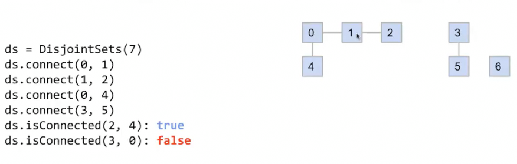

我们做出简化

* 假设元素都是整数
* 在构造函数时，通过数量给出所有元素，这里首先`0-6`都是断开的 之后我们依次连接

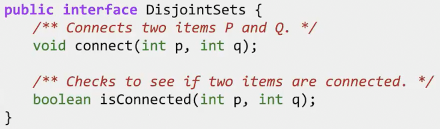

## 实现

用户不关注，而我们需要关心的

当不相交集合中有上百万项 数十亿项，是否仍然快速

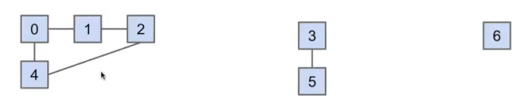

我们可以快速看出每个元素是否相连，那么计算机如何知道？

一种想法是每当连接发生时，我们记录下这个连接

当检查是否连接，我们以某种方式遍历连接 这又变的很麻烦，很慢 因此ab相连 bc相连，那么ac也相连，我们要考虑这种情况

寻找更好的实现

我们关注我们是如何思考的？我们注意到`0124`似乎是一组，`35`是一组，`6`是一组

**当查询02连接是，发现其在同一组，因此在它们确实连接**

当发生连接时，我们只要合并两个组别

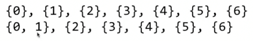

那我们如何实际用Java实现这个想法？要维护那些变量

### 集合_列表实现

一种想法是，我们可以维护元素是一系列Set的List，每一个Set为一组

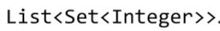

但是我们分析一些复杂度

* 如果最开始有上百万个组别，它们彼此不连接
* 查看某两个元素是否相连
* 最坏的情况，我们要遍历列表中的所有集合中的所有元素，以查看这两个元素具体在哪 O(N)
* 连接两个元素也是同样的复杂度，我们需要遍历所有集合的所有元素找到位置，之后创建一个新集合并复制两个集合 

### 快速查实现

另一种想法，**有几个元素我们就开辟多少数组**，而数组对应位置存储数字代表，这个元素（索引）是第几组

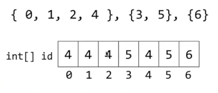

* 判断两个元素是否连接，只需要判断两个索引中元素是否相等 O(1)
* 连接两个元素，找到两个索引存储元素，扫描整个数组，将值为其中一个的改为另一个 O(N)
* 这种实现的特点是可以**快速查找**

### 快速合并实现

而可以在次基础上**优化连接**的想法是

* 与其任意给某组别编号，比如给每个元素索引分配父项，其位置存储父项索引
 
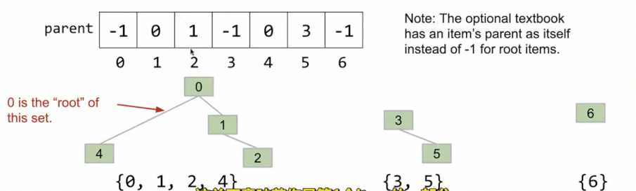

* 2的父项是1，因此索引2存储1...
* 当没有父项时，则存-1

连接操作

* 找到每个自己的最高父项，其中一个的父项从-1改为另一个

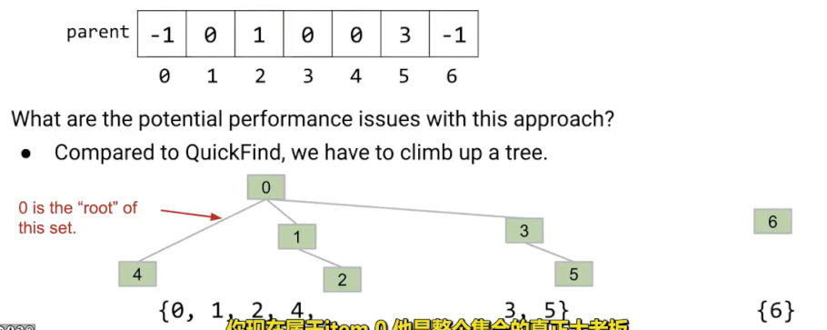

检查查看两个元素所在组最高父节点是否为一个

似乎会快一点，只需要爬两棵树

但是如果树是这样的呢
 
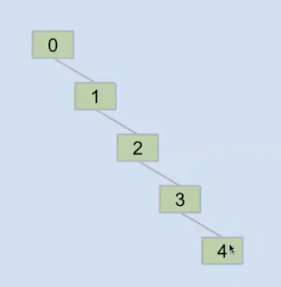

我们几乎要爬整个数组 无论连接还是检查是否为一组 

这种情况两个操作都是θ(N)

这种并查集为**快速合并**

### 加权快速合并实现

我们希望尽量避免出现这种树 **可以在连接时，把元素较少的树接到元素较多的上** 这样从较大树的元素爬升，不会增加耗时

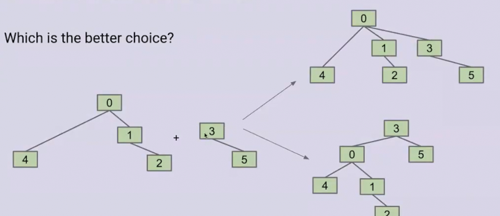

这种并查集称为**加权快速合并**

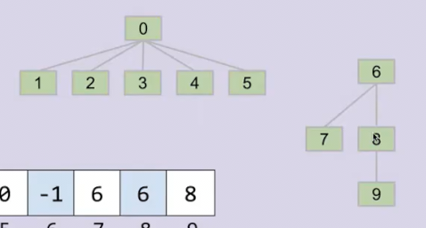

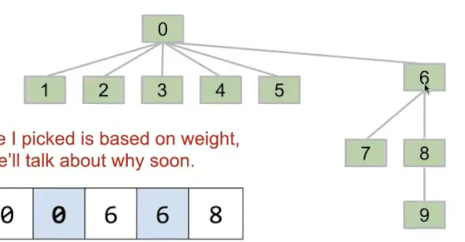

我们可以通过最高父项的绝对值大小跟踪元素项数 

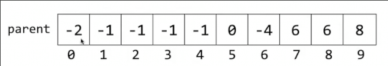

复杂度是多少呢

实际上，这种加权快速合并算法不会出现我们刚刚的结构

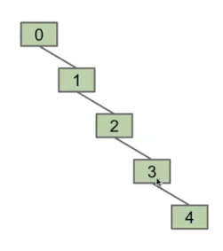

而对于不同元素个数最糟糕的结构就是这样

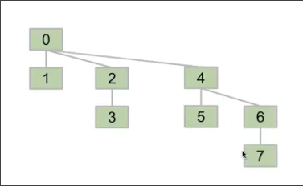

从2个到4个,从4个的最坏到8个的，只是将两个4个的合并，树高加1

尽管元素每次翻倍，但是树高总是线性增长，因此操作是**对数复杂度**的

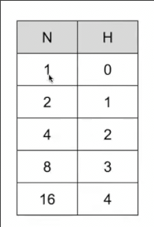

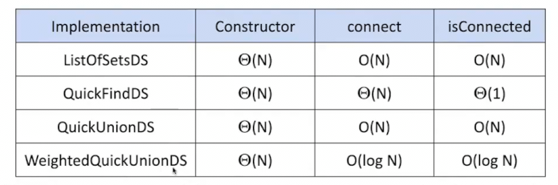

如果我们连接时，比较的不是元素个数，而是高度呢？

事实上是可以的，我们将矮的树始终放在高的树下面，两种操作复杂度也是log(n)，但是代码可能稍微难写一点 `HeightedQuickUnion`
