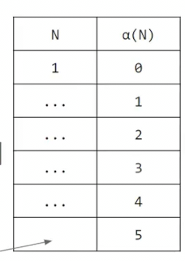
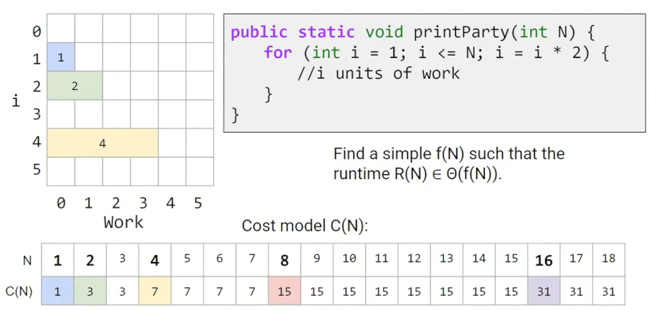

## 路径压缩
 
* [路径压缩](#路径压缩)
* [渐近分析](#渐近分析)
* [摊销时间](#摊销时间)

是否有比`WeightQuickUnion`和`HeightQuickUnion`更快速的并查集实现？

在比较15和10时，我们逐步爬树，这时候我们不仅仅最终判断15和10都在0的团队，还能判断**沿途**的元素也属于0的团队，我们可以将其记录下来

**我们将沿途的任何元素直接和最终的根节点关联**

每次爬树时，也在展平树，这个数据结构被用的越多，就变得越快

这个复杂度的分析很困难，但是树的高度增长相当缓慢 几乎永远不能到达5

M代表操作次数 N代表元素个数

其中α是一个名为`ackermann`的函数，增长非常缓慢，在不可思议的N下，仍不超过5，因此每次操作耗时几乎是一个常数（随着N的增加，几乎不增加每次操作耗时）

## 渐近分析

一些复杂度的表现

| 复杂度 | 表现 |
| - | - |
| θ(1) | 随着输入的增加运行时间不增 |
| θ(log n) | 每次n指数级别增加（2倍、3倍）时，运行时间加一（线性增加）|
| θ(n) | 每次n加倍时，运行时间加倍 |
| θ(n^2) | n加倍时，运行时间加4倍 |
| θ(2^n) | n加1时，运行时间指数级别增加（2倍、3倍） | 

思考这个算法的复杂度

我们拆分一下，首先外部肯定是一个log(n)的算法，那么里面执行了i次就一定是nlog(n)吗？我们可以说是O(log n)，因为里面并没有精准执行n次，而是i次

可以通过尝试N和执行次数的曲线/图标来思考

我们比较一些复杂度

执行次数**似乎**总是在0.5N和2N之间，根据定义，其是一个θ(N)的复杂度

但是如何证明呢：

观察得到N=1、2、4、8的总执行次数，小于N=16的，而且总是少一个

所以当数据量为N时，总的次数为1+2+4+..+N(-1)，(N=2^k)由等比数量求和，得到2*(2^k)-1，=2*N-1,故整个算法为线性O(N)

事实上，分析算法复杂度没有捷径，我们只能通过数学分析和观察入手

这是一些有时分析复杂度会用到的公式

更常用的是这种形式

对于一些程序，其运行时间可以是一种求和形式 往往也会用到黎曼和

## 摊销时间

据此，我们可以了解之前我们ArratList扩容的复杂度

添加n次时无论是添加和扩容都是O(n), 因此添加一个复杂度O(1)

对于添加一个，最坏情况仍是O(N)，但是其**摊销**运行时间是O(1)，这种摊销运行时间往往更有用，其代表了大量操作的平均
