# 渐近分析以及几种算法_二叉搜索树
 
* [递归](#递归)
* [二分查找](#二分查找)
* [归并排序](#归并排序)
* [二叉搜索树_BST](#二叉搜索树_BST)
  * [定义](#定义)
  * [算法](#算法)
    * [查找](#查找)
    * [插入](#插入)
    * [删除](#删除)
* [集合和映射](#集合和映射)
* [B-Trees](#B-Trees)
  * [构建B树](#构建B树)
  * [B树的查找](#B树的查找)
 
## 递归
 
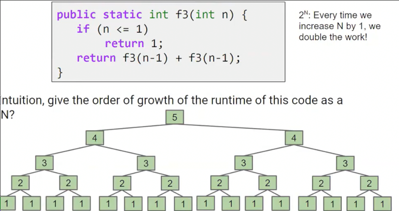

这个树状递归算法的时间复杂度是θ(2^n)

那么这个算法呢

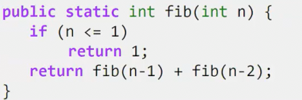

也是一个指数级别的 但是会比刚刚的算法快，因为这个树不完整，相当于剪掉一部分分支 O(2^n)

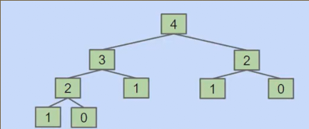

## 二分查找

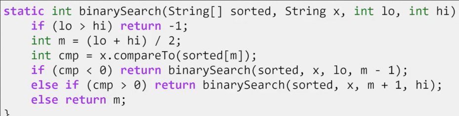

每次列表都变为原来的一半，操作增加一

反方向来看，从1开始，每次列表变为两倍，每次操作增加一

因此是O(log n)

## 归并排序

对于一个无序的列表，一分为2，按照相同的方法排好两边，之后合并

时间复杂度 θ(NlogN) 每层N次合并 logN层

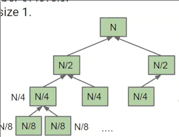

这样，我们回顾之前的两个算法

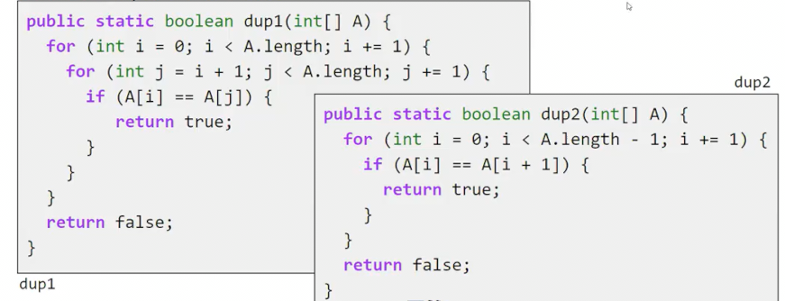

当数组未排序，我们不能使用O(N)的dup2，但是可以使用O(N^2)的dup1，但是更好的做法应该是O(NlogN)的归并排序再用dup2

这是非常好的转变，N^2转变NlogN的成果巨大，而NlogN转N的成果就相对较少

## 二叉搜索树_BST

### 定义

抽象数据类型 ADTs 指的是**接口** 不包括实现，告诉人们其能做什么

Java可以很好区分抽象数据类型和实际实现

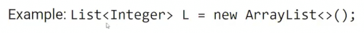

这种语法告诉我们左侧是列表，右侧是我们具体如何实现的列表

我们回到之前的LinkedList 同时，我们希望所有的元素是有序的，一个OrderedLinkedList

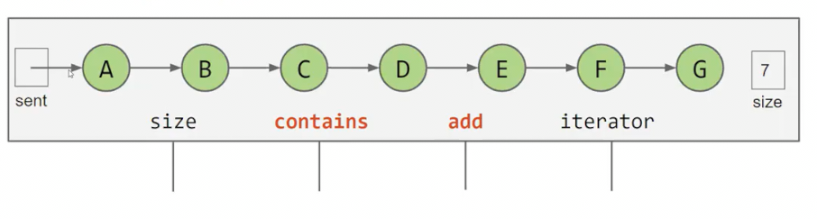

其中contains、add的时间复杂度都是 θ(n) 从头扫描到尾以放在合适位置或查找元素在哪

但是这个链表已经排好序了，可不可以加以利用

将哨兵放在中间？比较目标元素和哨兵处元素的大小？这样时间缩短一半

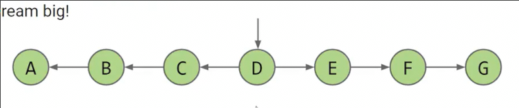

如果我们将哨兵所指元素，其指向是B和F呢

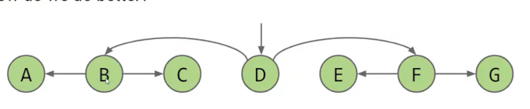

这样时间又缩短一半！以此类推，时间复杂度变为 O(logn)

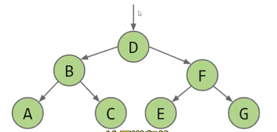

在**树**中，从一个节点到另一个有且只有一条路径

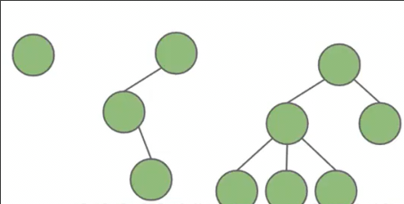

这些都是树

**有根树**就是在树的基础上，**任意选定一个节点**作为根节点

* 在此基础上，节点通往根节点时遇到的第一个节点就是**父节点** 而相对的，后者就是前者的**子节点** **父节点有且只有一个**，因为通往根节点的路径有且只有一条
* **二叉树**每个节点都有0、1、2个子节点

**二叉搜索树**是有根的二叉树,并且具有`BST`属性

* BST表面，树中所有左子树中的所有元素都小于其根节点 右子树..
* 二叉搜索树的元素必须可以比较，同时比较具有**传递性**
* 二叉搜索树的**元素不允许相同**

### 算法

#### 查找

从根元素开始，如果目标和根元素相同则返回，否则如果目标比根元素小，将左子节点作为新的根节点进行上述，大，则...

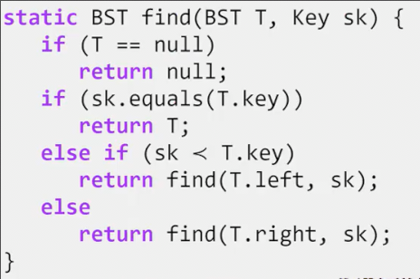

如果二分搜索树是一个茂密的树，则是一个θ(log n)的算法，因为元素每翻一倍，树大概增加一层，我们寻找的过程是在爬下树，因此时间增加1

#### 插入

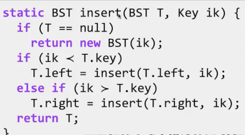

返回插入后的树

当比根节点的label小时，插入到子树，将结果（插入后新的树）作为新的左子树

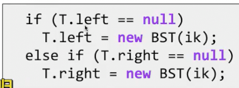

这种写法看上去好想一点，但是并没有真正递归到基本情况，因此**并不规范** *远程递归*

#### 删除

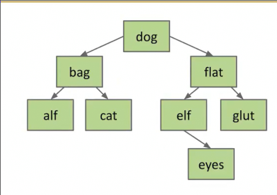

这有些复杂，这时我们不妨将其划分为三种

* 被删除节点没有孩子
* 被删除节点只有一个孩子
* 被删除节点有两个孩子

对于**没有孩子**的节点，只需要将其父节点的对应儿子设置为`null`

对于**一个孩子**的节点，将其父节点的对应儿子设置为被删除节点的儿子

但是两个子节点的被删除节点怎么处理？

删除k

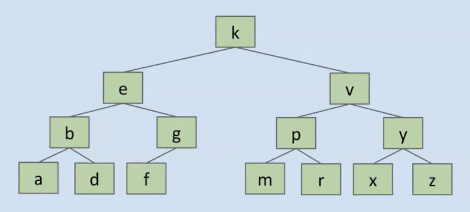

谁来接替k的位置？

根据树的性质（根左永远小于根右）

可以发现被删除节点的**右儿子的左左..左儿子和左儿子的右右**...右儿子满足新根的性质 而**其余位置不需要变**

## 集合和映射

根据搜索二叉树构建

集合在这个搜索二叉树的基础上向外宝库插入、包含？、删除操作

映射的话，我们将搜索二叉树中的label分为两部分，分别作为k-v

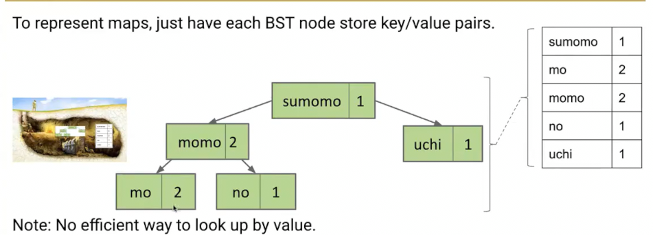

## B-Trees

如何树是茂密的，我们对于搜索二叉树的各项操作，只需要爬树，也就是O(log n)的复杂度

但是当树的形状变得不那么美妙时，复杂度便会退化为O(n)

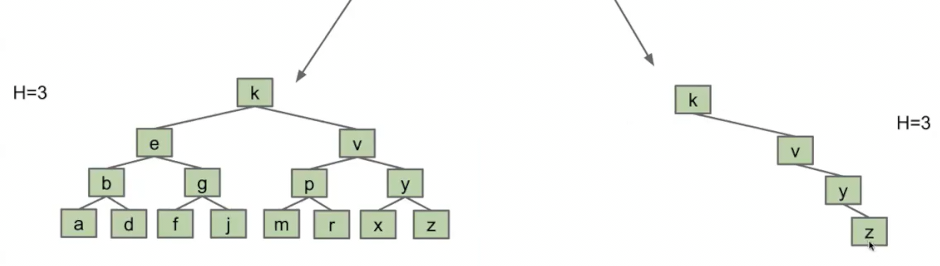

我们详细思考茂盛的定义是什么

* 对于每个节点，其相对根节点有一个**深度**
* 而整个树的**高度**，是其所有节点的**最大深度**
* **树的平均深度**的计算就是**所有节点的深度之和/节点树** 反映了繁茂与否，约小表示越茂盛

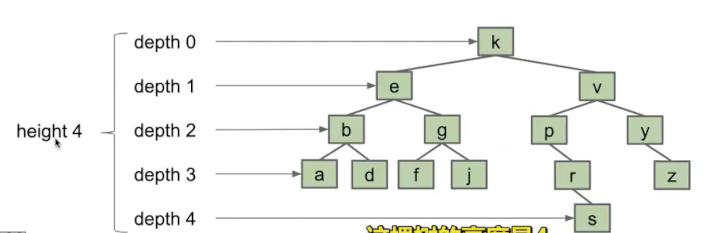

如何得到一个繁茂的树呢？研究证明将数据打乱后随机插入会得到繁密的树。

但是如果如果不打乱是否可以做到呢？

### 构建B树

一种想法时，当加入会导致树不茂盛，我们不加入到叶节点中，而是**放到和其添加到的叶节点同等位置**

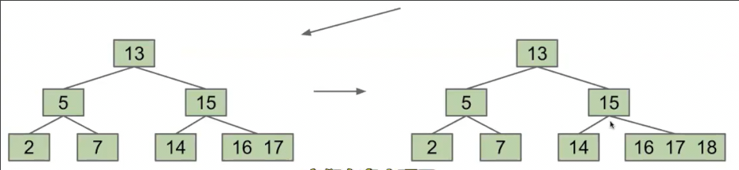

但是当表示同等位置如列表等变得过长时，这又退化为了狭窄的树，我们会在列表中从头至尾搜索东西

于是我们同时限制列表的长度，比如不能超过3

当过长时，我们取**中左**的节点，并把它放入父节点列表中

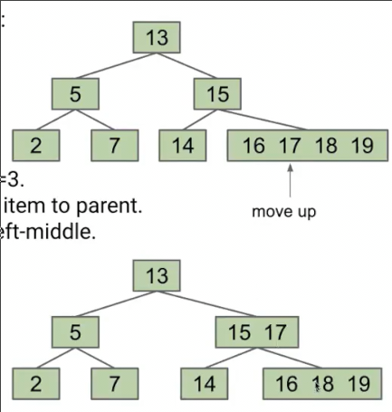

并且，我们在17从叶子列表中离开后，叶子列表从17的原位置一分为2

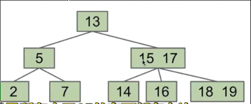

新的父节点有三个儿子，小于15的在最左侧，15和17中间的为中儿子，17以上的为右儿子

我们尝试打破这个树，添加更多东西，来查看这个结构的效果

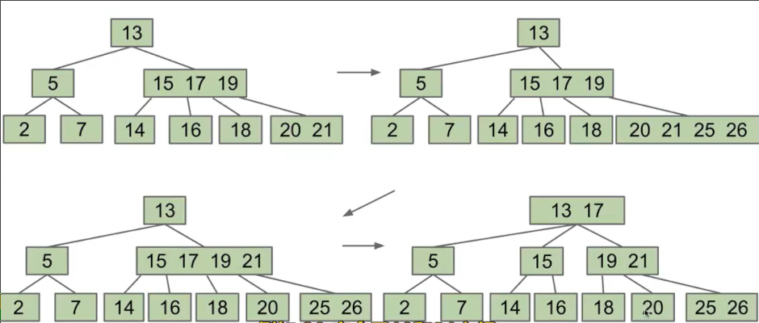

当根节点满时

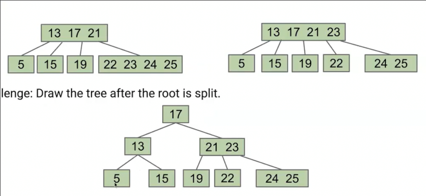

*分割树*

其是完全平衡的，不管我们添加什么项目，都会得到**对数运行时间**

**两个不变量**

* 所有**叶节点永远在相同深度** *增加树高的唯一方式是提升出新的根节点*
* 一个含有n个项目的节点，有且只有n+1个子节点

如果我们B树的当前深度为2，其列表最多有2个元素，那么这是最坏的情况 最少装下8件东西

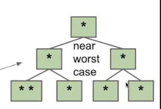

而这是最好的情况 高度为2装下最多装下26件东西

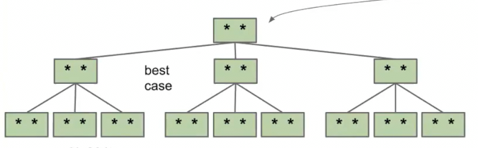

最坏情况时再加一层需要项目个数翻倍，因此最坏的复杂度是log2 N

最好情况 再加一层项目增加三倍 复杂度是log3 N

因此总体上就是log n的性能

### B树的查找

和二叉树一样，但是当节点中有多个东西时，需要遍历

但是由于每个节点的长度L为常数

因此总体上复杂度还是O(logN)
