# 树旋转和左偏红黑树
 
* [树的旋转](#树的旋转)
  * [旋转的定义](#旋转的定义)
  * [平衡](#平衡)
* [左偏红黑树](#左偏红黑树)
  * [LLRB的来源](#LLRB的来源)
  * [LLRB的构建](#LLRB的构建)

B树可以通过对节点的过度填充并分割节点，保持树的完美平衡

但是B树的实现比较麻烦 

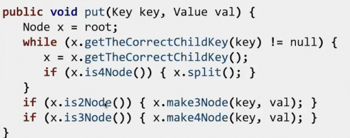

需要处理不同类型节点的情况（有些是两项，有些是三项）

## 树的旋转

这是几种不同添加元素顺序的全部合法的二叉搜索树

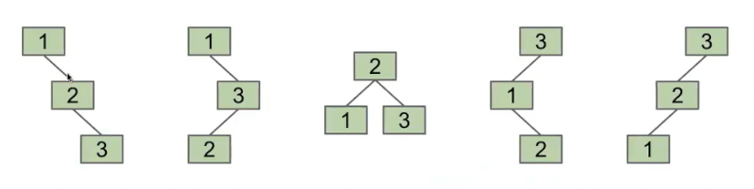

本质上这些是同一棵树，只是结构不同，是否有方式从一种转为另一种？

通过旋转可以做到

### 旋转的定义

比如**向左旋转**G节点

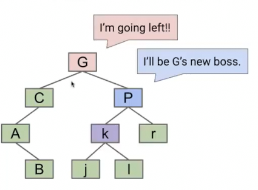

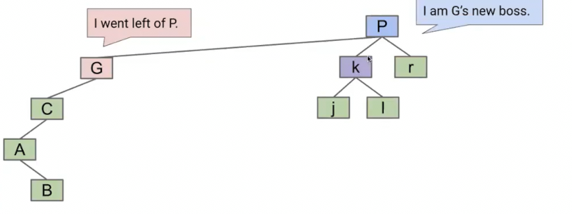

被旋转的节点的右儿子替代了被旋转节点的位置，但是！其原右儿子现在很可能有三个儿子，根据搜索二叉树的性质，我们知道现在将k移动到G的右儿子是不改变树的

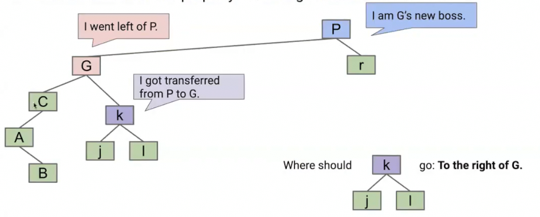

完成旋转

总结来说，节点n发生左旋时，n的右子节点替代n的位置，而n成为原右子节点的左儿子。

之后将原右子节点的原左儿子挂到n的右（理解为原右子节点多了左，节点n少了右）

这是理解旋转的另一种方案

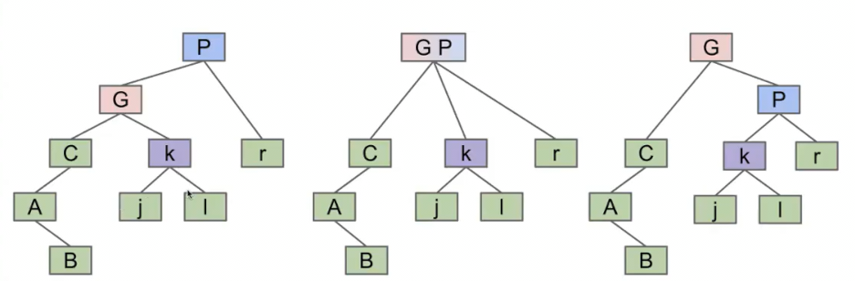

### 平衡

研究证明可以在O(N)的步骤内对任意的树进行旋转，使其成为茂密的树 N为节点数
 
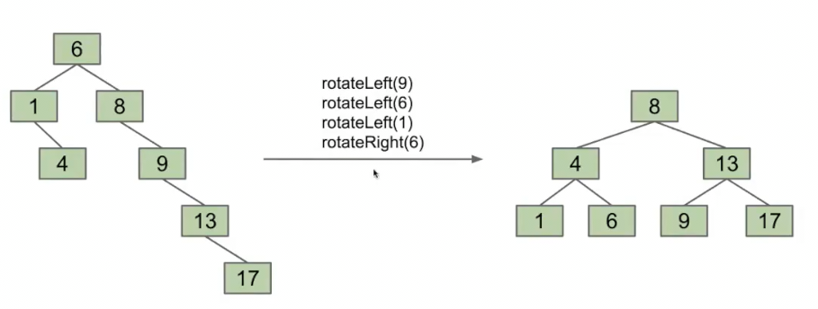

## 左偏红黑树

### LLRB的来源

LLRB Left-Leaning Red Black 

我们有比构建出不平衡树后，耗费O(n)的时间旋转整理使其茂盛，更好的算法

我们回顾之前的2-3树，这是一个每个节点最多容纳2个元素的B树。其永远是平衡繁茂的

能不能不构建2-3树，但是构建一个结构上和2-3完全相同的**二叉搜索树**呢

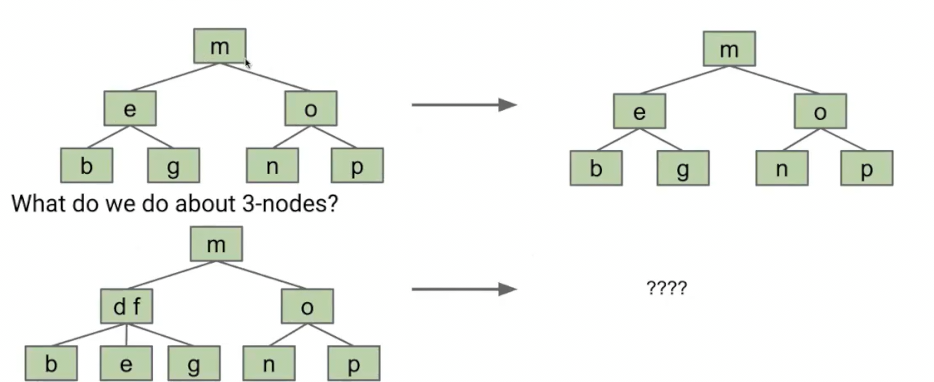

我们可以简单的将d、f分开，其子节点分别划分给d和f，但是这时候父节点有3个子节点，因此添加一个**虚拟节点**来作为d和f新的父节点

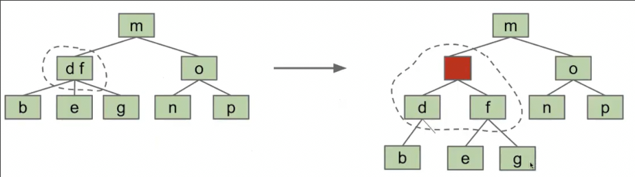

但是有些浪费，因为我们不得不创建一个虚拟节点，并且d的右子节点我们永远不会使用（因为B树的df节点永远只会有三个儿子）

我们使用**虚拟连接**，将d作为f的节点，这有点像左旋的后一部分

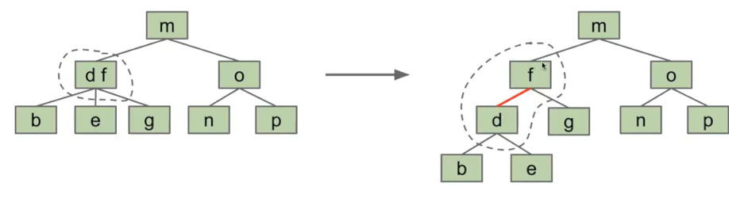

红色是**虚拟连接**，代表在B树中，这个连接并不真实存在，而是同一个节点

这就是**左偏二叉树LLRB**，其就是一个普通的二叉树，但是都是由一个特定的2-3树在2个项目的节点执行左旋的后一部分对应得来

每一个2-3树都有一个对应的左偏二叉树 而左偏二叉树也始终保持平衡（即便多了虚拟连接，注意在B树中，这种虚拟连接表现为同一节点中常数时间内的遍历，因此具有虚拟连接的左偏二叉树也可以看做平衡）

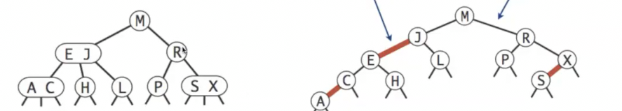

在进行左倾红黑树的**查找时，和普通的搜索二叉树完全相同**

**LLRB树的高度最多是其对应2-3树高度的大约2倍** 因此时间复杂度是相同的

### LLRB的构建

我们先构建一个2-3树，再通过左旋了两个项目的节点完成对LLRB的构建？

但是2-3树的缺点之一就是难以实现，可否单独实现呢？

当我们向**LLRB**中添加项目时，**和插入普通二叉搜索树一样**

**之后通过树旋转修复平衡性，恢复和2-3树的映射关系**

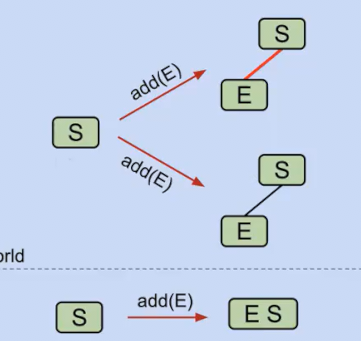

显然，当红黑树中有一个项目S时，添加项目应该用红线连接（虚拟连接）

1. 在添加项目时，**始终用红线连接**

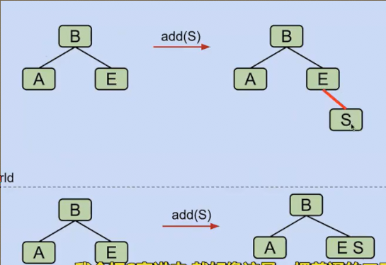

然而，仅仅在普通的二叉搜索树添加项目的基础上用红线连接似乎也不满足图中的2-3树。此时E点显然需要左旋

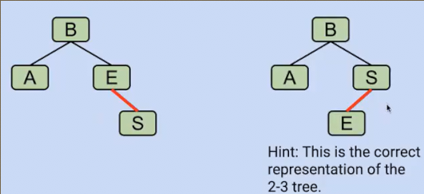

2. 在添加项目时，如果添加在父节点的右儿子，同时父节点还没有左儿子，则应左旋父节点

如果发生过度填充了呢？

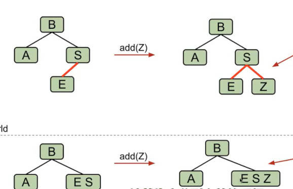

处于这个分裂前暂时的状态，我们如何在左斜红黑树中表示

然而对于添加在左侧，按照步骤1和步骤2会出现这种错误的表示

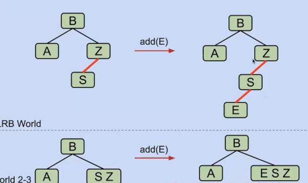

我们通过右旋z节点，得到合适的结构

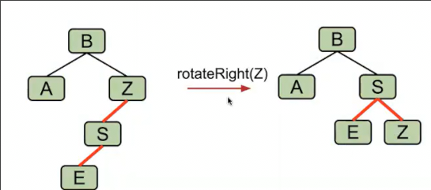

3. 因此对于过度填充的节点中间状态，永远表示为中间节点连接两个红线到左右儿子

4. 在分裂时，我们只需要将拥有两条红线的父节点与其父节点之间的连接设为红色，然后将其与子节点之间的连接变为黑色。结构不变

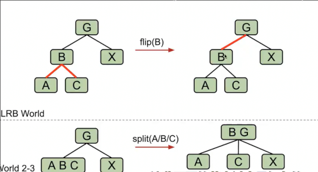

**总结来说**

* 我们在添加节点时，始终通过红线添加
* 父节点右偏，左旋父节点
* 爷节点和左儿子，以及左儿子的左儿子之间都是红连接 右旋爷节点
* 父节点此时的两个儿子都是红连接则应当分裂。则将父节点的所有连接切换颜色
* 上述的某些操作会导致另一个操作的发生 可能是连续的

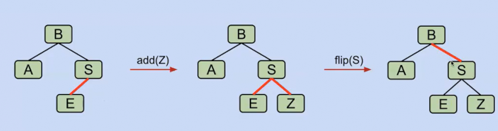

这里分裂导致了右偏，因此触发条件2，应当左旋B

* 右偏指的是红线指向朝右

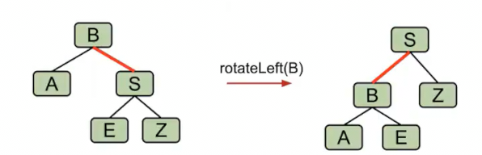
