# 优先队列和堆
 
* [优先队列的表现](#优先队列的表现)
* [不好的实现](#不好的实现)
  * [有序数组](#有序数组)
  * [茂盛的BST](#茂盛的BST)
  * [哈希表](#哈希表)
* [堆](#堆)
  * [定义](#定义)
  * [操作](#操作)
    * [查询最小元素](#查询最小元素)
    * [添加](#添加)
    * [删除最小的值](#删除最小的值)
    * [_复杂度分析](#_复杂度分析)
  * [代码实现](#代码实现)
    * [如何表示树？](#如何表示树？)
      * [父子关联](#父子关联)
      * [父-长兄-兄弟关联_兄弟树](#父-长兄-兄弟关联_兄弟树)
      * [数组表示](#数组表示)
      * [完整树的数组表示](#完整树的数组表示)
* [目前的数据结构的总结](#目前的数据结构的总结)

先前我们讨论了两种抽象数据类型（集合、映射）的一些数据结构实现

本次我们将学习新的同样非常重要的抽象数据类型**优先队列** *PQ*

## 优先队列的表现

用户期望看到的是**一堆项目**

期望通过这些方式和数据集交互

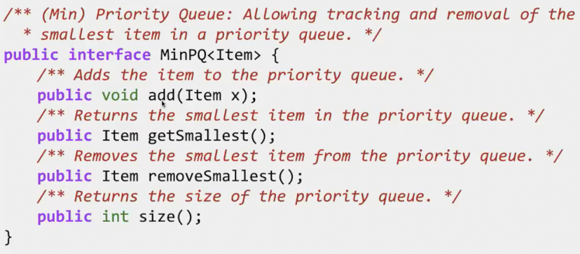

* 添加到项目集
* 用户**只会查询或删除最小的一个**
* 获取项目集大小

一个应用场景 我们想从每天不断新增的一堆粒子中获取到能量最高的10个

* 一种想法是，粒子新增时，加入一个列表。而当我们统计时，排序列表
  * 首先这在空间上低效，我们最终关注的是10个项目，但不得不跟踪百万个
* 使用优先队列 粒子新增，放入优先队列。但是，当size超过10,我们从优先队列中删除最小的，因此，总是跟踪最大的10个

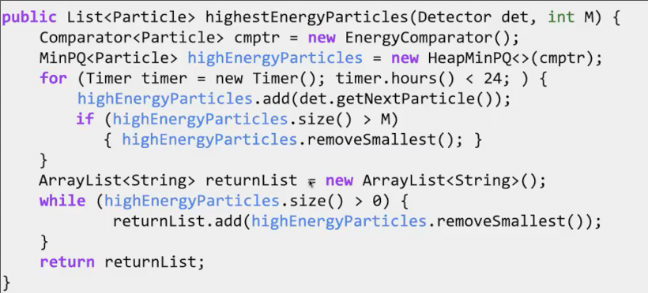

## 不好的实现

我们尝试之前的数据结构进行实现

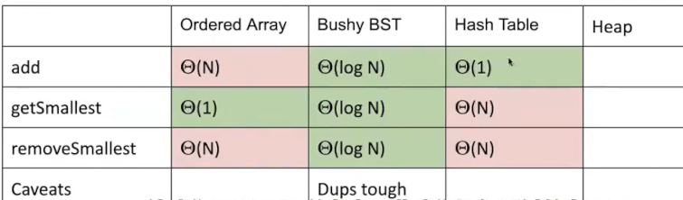

### 有序数组

我们需要扫描整个数组以插入保证有序性

插入时也要将后续项目依次挪到下一位

所以插入是O(n)

找到最小的只要a[0]，所以O(1)

移除最小的，需要后面的项依次向前移动

### 茂盛的BST

可以是红黑树或者2-3树

各种都是log n，都是只需要爬树

但是在二叉树中不会有两个项重复，或许我们的两个粒子能量相同，那么数据集中就应该同时存在二者

### 哈希表

加入时间O(1)，但是查找和删除都需要遍历其中所有元素 原因在于我们知道如何以O(1)的时间通过项目寻找到是否存在，但是不能直接找到最小的项目,除非遍历

## 堆

### 定义

**二叉最小堆** 

* 二叉意味这是一棵**二叉树**
* 并且这个二叉树是**完整**的 **完整的定义是，只能在最下层缺少节点，并且剩余节点都在左侧**
* 其中**每个根节点的值都小于等于两个子树中任意节点**

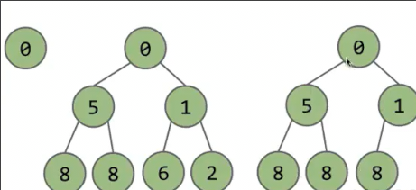

这两棵树就不是合法的二叉最小堆

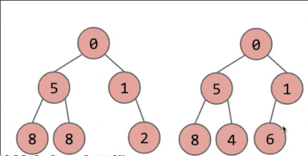

### 操作

堆的优势是使得优先队列的实现更快

#### 查询最小元素

根据二叉最小堆的性质，只需要返回根节点的值！

#### 添加

我们需要使得添加后的二叉树维持两个性质**根最小** **树完整**

我们暂时只考虑其中一个，之后对另一个进行修复

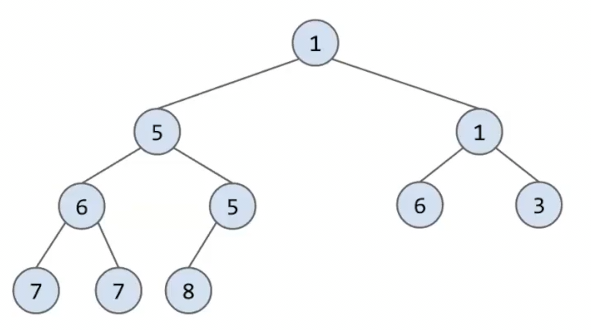

考虑完整性，显然我们应当添加到5的右下

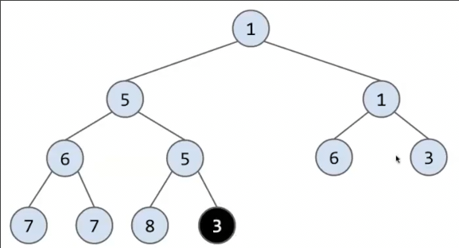

现在**根最小**被破坏了，问题出在刚刚插入的节点，我们重复交换其和其的父亲的值，直到问题解决

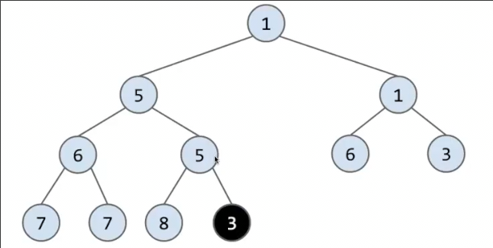

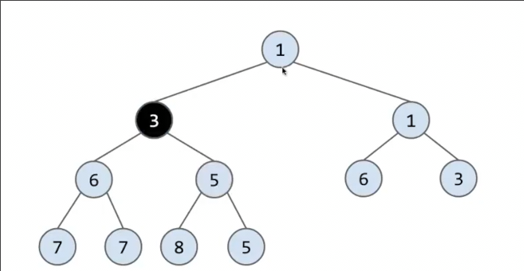

#### 删除最小的值

在堆中就是删除根节点

和添加相同，我们暂时违反另一条规则，只是将最后一个元素移到根

此时完整性满足，但是不满足**根最小**

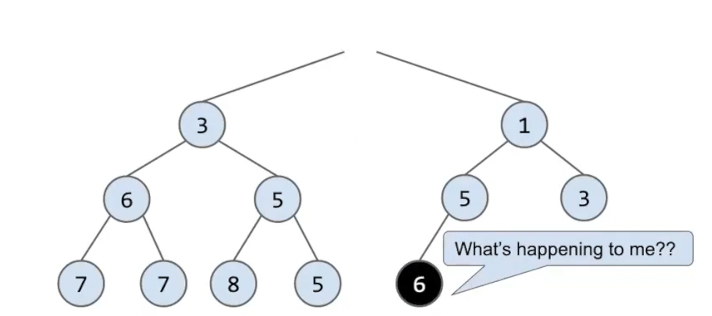

之后重复交换其和其子节点的较小值。直到其比所有子节点都小

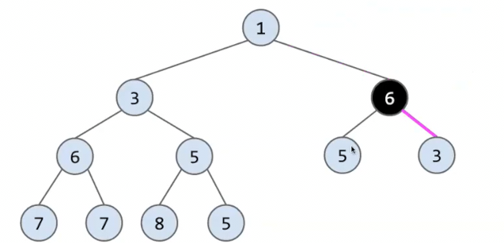

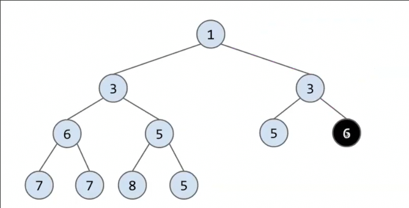

#### _复杂度分析

增删都是log n 级别 而查只需要 O(1)

### 代码实现

#### 如何表示树？

##### 父子关联

一种方式是每一个实例可以是一个节点，其有一些指针表示子节点，和一个key表示值

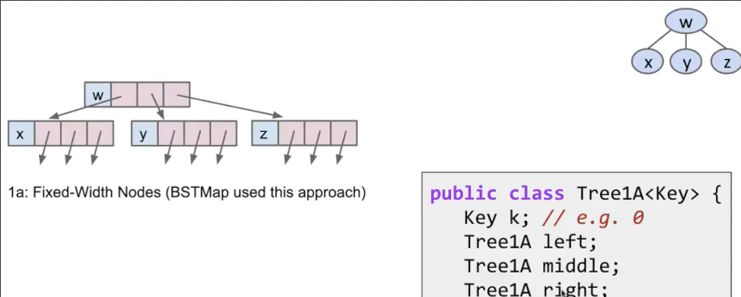

这与我们在BST中的表示相似，递归结构

如果子项不确定可以做成一个数组或者列表，存储子节点

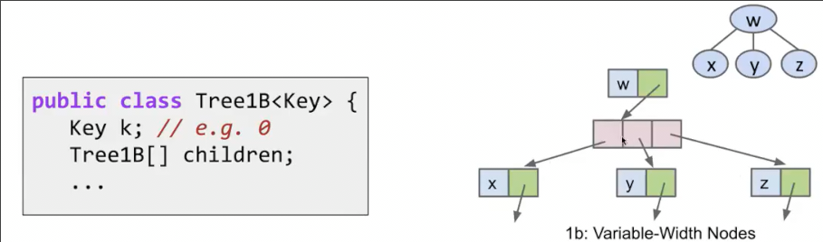

##### 父-长兄-兄弟关联_兄弟树

另一种表示有些奇怪, 每个节点只保留两个指针,尽管可以表示任意多子节点的树

第一个用于指向其最左的儿子，而第二个节点指向的是其右侧紧邻的兄弟

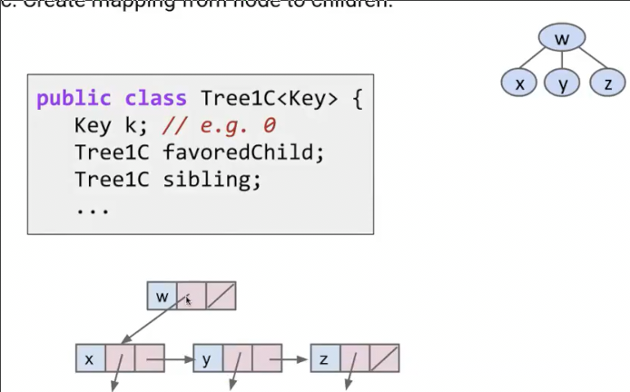

##### 数组表示

区别于前两种方式使用递归结构，这种方式用数组表示树

典型的应用就是我们之前的并查集

其索引表示这个节点的编号，而对于索引存储的值表示其父亲节点

我们还可以引入另一个数组表示每个节点的值

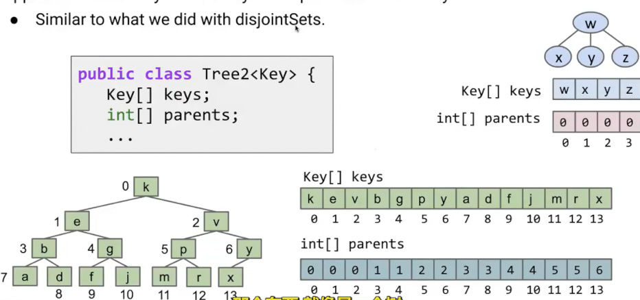

每个实例代表整棵树

并且！对于**完整树**这种表示方法有一个特殊的性质

会按照-1 0 0 1 1 2 2 3 3 ... 这样的排列（我们对节点层序编号）*如图所示*

因此诞生了完整树的数组表示

##### 完整树的数组表示

我们只存储key就可以了，由于上述**特殊的性质**，每个节点的父节点可以推算

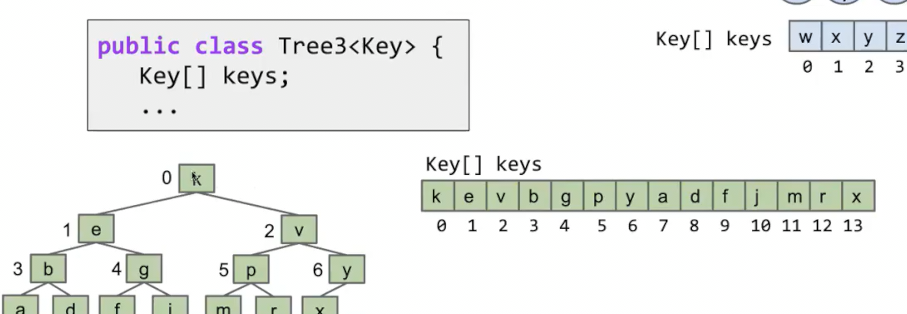

另一种思考方式是

* 第一层会有1个节点... 对应a[0]
* 第二层会有2个节点... 对应a[1-2]
* 第三层会有4个节点... 对应a[3-6]
* ...

因此我们的二叉最小堆就用这种方式构建

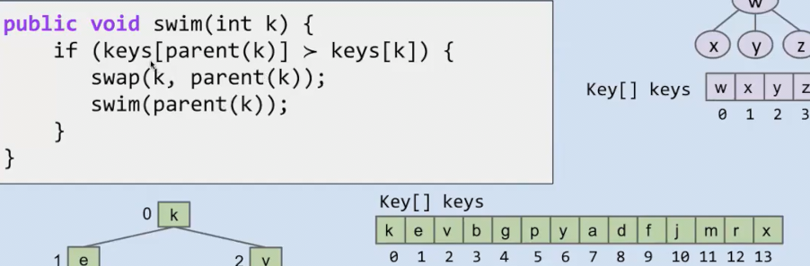

这是插入到末尾后，修复**最小根**的代码

我们在parent()中需要一些数学推导得到父节点索引

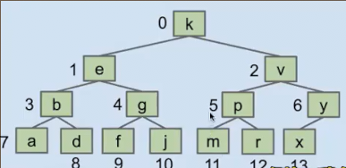

观察一下，`return (k - 1) 整除 2 `就可以啦！

同样的，我们需要在删除方法中修复最小根时得到子节点 `2k + 1` `2k + 2`

## 目前的数据结构的总结

目前我们学习了一些这门课的核心数据结构，其都有一个目的是**搜索**，我们存入一些数据，并且通过数据结构保持**有序性**，最终期望**搜索操作是高效的**

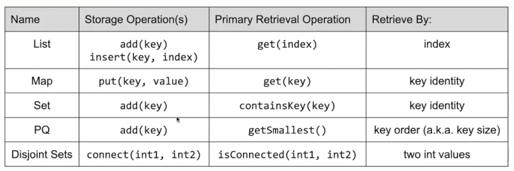
