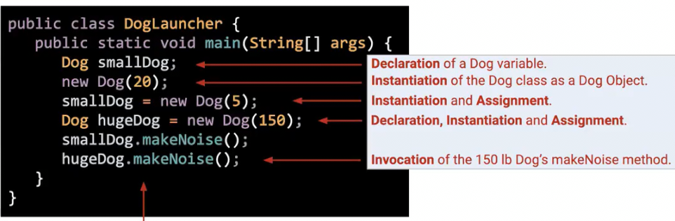

# 定义和使用类
 
* [不同类间调用](#不同类间调用)
* [对象数组](#对象数组)
* [静态和非静态](#静态和非静态)
* [IDEA_交互式调试](#IDEA_交互式调试)

## 不同类间调用

```java
public class Dog {
    public static void makeNoise() {
        System.out.println("Bark!");
    }
}
```

```java
public class DogLauncher {
    public static void main(String[] args) {
        Dog.makeNoise();
    }
}
```

* 每个代码必须在一个类中
* 运行程序必须有一个`main`方法

```java
public class Dog {

    public int weightInPounds;

    public Dog(weight) {
        weightInPounds = weight;
    }

    public void makeNoise() {
        if (weightInPounds < 10) {
            System.out.println("yipyipyip!");
        } else if (weightInPounds < 30) {
            System.out.println("bark!");
        } else {
            System.out.println("arooooooo!");
        }
    }
}
```

```java
public class DogLauncher {
    public static void main(String[] args) {
        dog = new Dog(5)
        dog.makeNoise();
    }
}
```

* 类不仅可以包含方法，还有数据
* 没有`static`修饰的方法为实例方法



我们做了这几件事

1. 声明`Dog`类型变量
2. 通过`new`将`Dog`类实例化为一个`Dog`对象 
    * 但是没有保存，其被**垃圾收集器**销毁
3. 实例化并分配给`smalldog`变量
4. 声明变量、实例化对象、对象赋值给变量
5. 调用对象的实例方法

## 对象数组


对于整个数组要`new`一次创建数组，而对于其中每个元素，还要再`new`以创建对象

## 静态和非静态


* 方法为静态时，方法是**通用的**，这里适用于所有狗，而不是对于任何特定的，通过**类名调用**
* 而对于非静态方法，是针对特定的一个狗，通过**对象名调用**

静态方法有什么作用呢？

* 有时候**类从不会被实例化**，比如`Math`，我们直接调用这个**功能类的一些静态方法**

```java
    public static Dog maxDog(Dog d1, Dog d2) {
        if (d1.weightInPounds > d2.weightInPounds) {
            return d1;
        } else {
            return d2;
        }
    }

    public Dog maxDog(Dog d2) {
        if (weightInPounds > d2.weightInPounds) {
            return this;
        } else {
            return d2;
        }
    }
```

这是两种比较大小的实现

同样可以有**静态属性**，整个狗类共用 **通过类名访问**

## IDEA_交互式调试

在某个地方随时暂停，并查看程序中当前的事物

可以到下一行，也可以深入到某个函数中，但是不能后退

也可以执行一些语句以检验


