# 树的遍历_图
 
* [树的总结](#树的总结)
  * [遍历树](#遍历树)
* [图](#图)
  * [图的定义和分类](#图的定义和分类)
  * [著名的图问题](#著名的图问题)
  * [s-t_路径连通性_深度优先搜索_DFS](#s-t_路径连通性_深度优先搜索_DFS)
    * [深度优先路径](#深度优先路径)

## 树的总结

我们回顾树

* 是一系列节点的集合
* 从一个节点到另一个节点有且只有一条路径

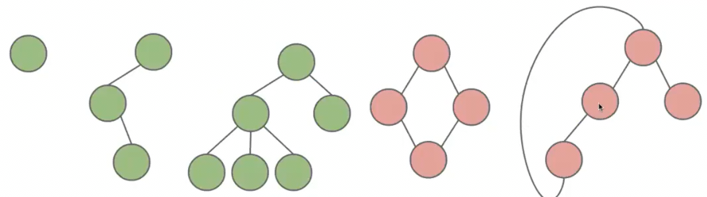

特别地**有根树**只是选择了一个节点作为根

* 此时父节点是通往根节点路径的第一个节点

### 遍历树

有很多自然的顺序来遍历所有节点

* 层序遍历 从上到下，从左到右
* 先序遍历 在遍历到一个节点时，尽可能向左侧继续遍历 *打印目录结构*

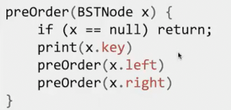

如果两个儿子都遍历过，则向父亲返回 

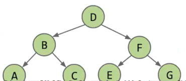

顺序是 DBACFEG

* 中序遍历 我们递归到某一节点时，先不做事情（此时假装为未遍历到）前继续遍历左儿子

只有左树的事情做完后，才会做根节点的事情，再做右树的，之后返回父亲

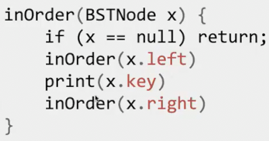

顺序是 ABCDEFG

* 后序遍历 *查看目录大小 因为要知道父的大小要先知道所有子项的大小*

先做左树，再做右树的时期，之后做自己的，然后返回

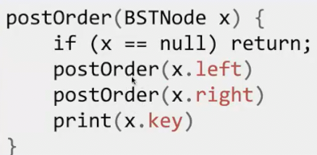

顺序是 ACBEGFD

一种方便了解先序 中序 后序的方式是 **逆时针方向**包裹住树

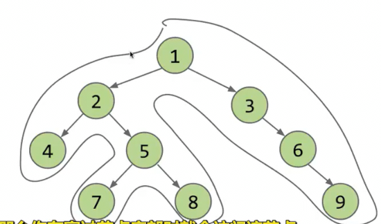

* 先序遍历会在我们绘制包裹时，**路过节点的左侧**遍历节点
* 中序遍历会在路过**节点底部**遍历
* 后序遍历会长路过**节点右侧**遍历

## 图

树很适合表示文件系统或者公司领导关系这样的层次关系

而对于不遵循严格等级制度的关系，图往往可以很好处理 比如*巴黎地铁图*

可以处理从节点1到节点2有多种路线的情况

### 图的定义和分类

* 一系列节点的集合
* 两个节点间可以通过边相连

*不再限制节点之间有且仅有一条路径*

**树也是图的一种，是子集的关系**

**简单图**

额外引入两个约束

* 边连接的两个节点不同
* 两个节点之间只会有一条边，也就是不会存在两个边，它们连接的两个节点相同

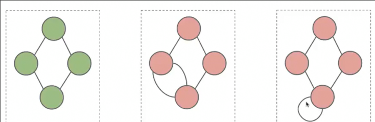

绿色是简单图

我们在课程中研究的大多数都是**简单图**

此外根据**边有无方向**我们分为**有向图**和**无向图**

根据**是否能从一节点出发回到自身**分为**有环图**和**无环图**

边带有数字**加权图**

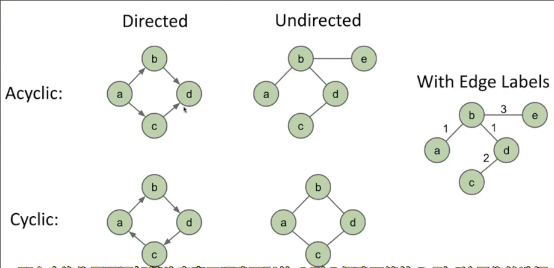

* 图中的节点`node`也叫**顶点**`vertices`
* **边**`edges` 通过边连接的节点也叫**相邻顶点**`adjacent`
* 边上可能赋予数字，也叫**标签**`label`或**权重**`weight`
* **路径**`path`是一系列由边连接的顶点，
  * **简单路径**`simple path`是没有重复顶点的路径
  * **圆圈**`cycle`是起点和终点相连的路径
* 如果两个顶点之间有路径，它们就是**相连**的`connected`
  * 如果图中任意两个顶点相连，那么整个图**连通**
* 顶点的**度**`degree`是从顶点出发有多少边

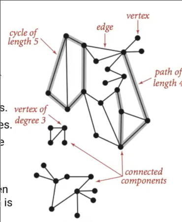

### 著名的图问题

* **s-t路径连通性** s t 之间是否存在路径
* **图的连通性** 图是否连通
* **双连通性问题** 是否存在一个顶点，将其删除后使得图分裂成为两个不相连的部分
* **最短路径问题** s t 之间的最短路径
* **图是否有环**
* **是否可以遍历图，只用一次全部边？**
* **是否可以遍历图，只用一次全部顶点？** *未解决*
* **是否可以遍历图，而不使用某些边？**
* **两个图是否相同 同构**

一些我们将涉及。而其中另一些问题甚至还无解决方案

### s-t_路径连通性_深度优先搜索_DFS

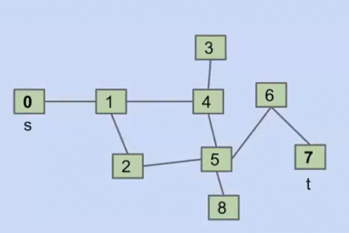

我们想判断0和7之间是否存在路径

需要以某种方式遍历图

一种想法是，采用递归

* 如果`s == t`返回true
* 如果不相等，则问所有邻居是否能到达t，如果有邻居返回true，则完成，返回true

但是有一个不足之处是0和1之间会互相反复询问，陷入循环。**需要标记已经问过的节点**

这种方法叫**深度优先搜索** 其特征是会在**遍历其他子图前，遍历更左子图的全部节点**

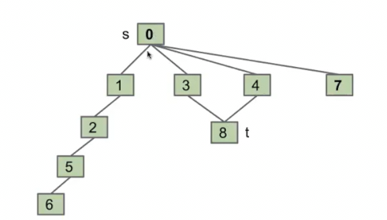

#### 深度优先路径

基于深度优先搜索的推广

之前我们的目标是给定两个节点，查看他们之间是否存在路径，我们应用了深度优先搜索

现在我们希望给出从1个给定节点**到所有其他节点的路径**

当我们用深度优先搜索遍历到节点时，**记录下来源的父节点**

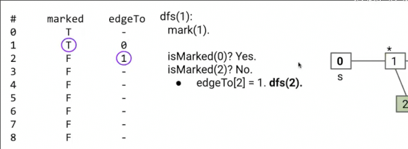

到达1时，记录下1的来源节点是0

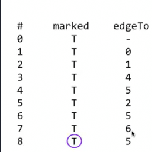

最终我们从目标节点每次指向前一个节点，来获得路径

#### 图的遍历

和树类似，图的遍历也分为几种

* **前序遍历** 在完成当前节点的事情后，进行其它节点的递归调用 **DFS的调用顺序**
* **后序遍历** 只有完成其它节点的递归调用（其中也完成了其它节点的事情）才做本节点的事情 **DFS的返回顺序**
* **广度优先遍历**
