# 最小生成树
 
* [切割属性](#切割属性)
* [最小生成树算法](#最小生成树算法)
  * [Prim_算法](#Prim_算法)
    * [优化](#优化)
  * [Kruskal算法](#Kruskal算法)
    * [_细节](#_细节)
    * [复杂度](#复杂度)

**MST**

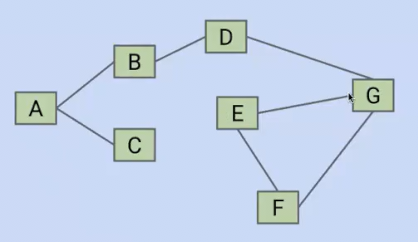

我们想判断图中是否存在环

* 可以采用深度优先搜索，寻找是否会遇到被标记过的顶点
* 另一种想法采用并查集，遍历所有的边，如果边的两个顶点不在同一集合，则合并，如果在一集合说明二者间之前存在路径，那么意味着循环

另一个问题是，对于一个连通加权无向图，我们希望找到一种的一系列边，这些边是**无环但是又在同一连通图中**

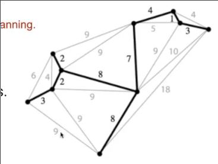

也就是找到这样一组边

* 连通
* 无环 前两点表明这是一棵树
* 触及所有顶点 *生成*

这样的树称为**生成树**

此外，希望所有边的权重和最小 **最小生成树**

最小生成树是图的属性 但是可能一个图可能会有一个或多个最小生成树

## 切割属性

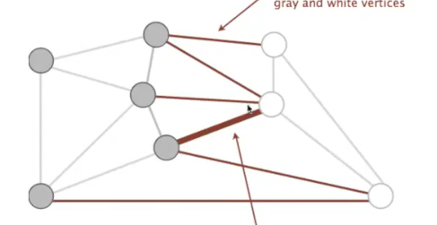

1. 随机将节点分为两组 灰 白
2. 找出图中一端连接灰一端连接白的全部边
3. 其中**权值最小的边一定是最小生成树的组成部分**

也就是边按照权重排序后，第一个连接灰白的边一定是最小生成树的组成部分

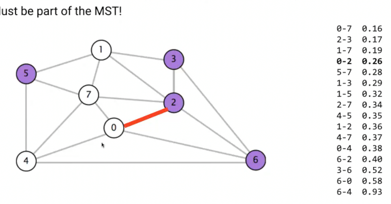

反证法可以证明

## 最小生成树算法

为了生成完整的最小生成树，我们应用切合属性

### Prim_算法

1. 从任意节点开始 标记其作为1队，其余的作为2队，应用切割属性得到最小生成树连接其的一条边
2. 将这条边连接的2队节点添加到1队，再次应用切割属性，得到另一条边
3. ... 直到全部节点成为1队

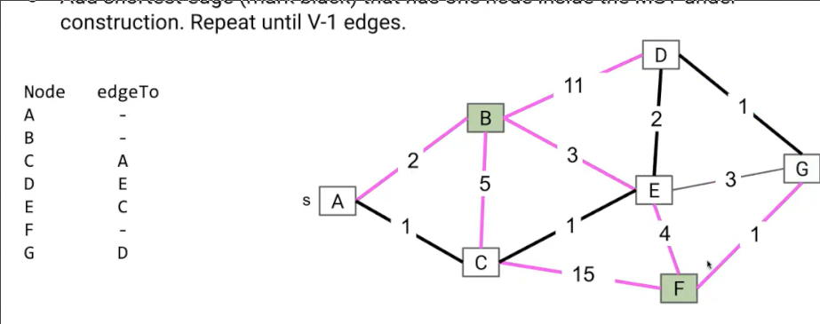

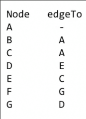

#### 优化

是prim的优化版本，但是很难看出其是同一种算法

优化算法受到Dijkstra启发

在Dijkstra中，我们依次选择距离最小的顶点，然后对于这些顶点，**松弛**其出边（就是比较新的路径是否比旧路径好）

在优化算法中

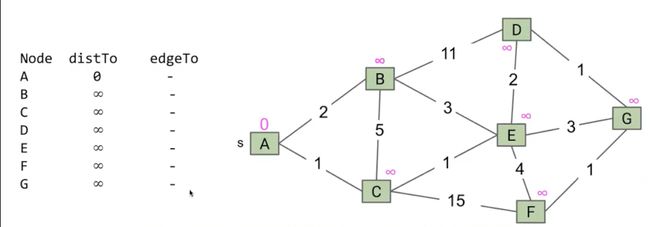

还是和dijkstra相同的准备，但是我们不关心**和开始点的距离**，而是关注**和目前构建的最小生成树的距离**

1. 最初各节点距离最小生成树的距离设置为无穷,出发节点距离最小生成树为0（对应Dijkstra中没有路径通往任意所求节点的初始化）
2. 从出发节点，查看其出边，出边权重加小于出边连接节点数字（注意，不考虑出发节点的数字，出发节点距离最小生成树都为0），则更新（边加入**虚线边** *目前最小生成树的最佳已知边*）

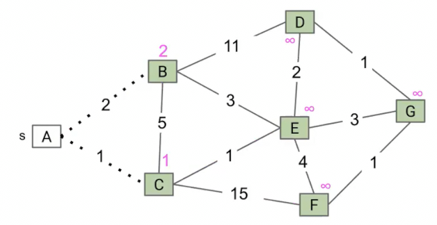

3. 选择新的出发节点，找到距离最小的节点，**将其的入边改为实线** *确认这就是最终的最佳边* 设置其距离为0 回到2...

将虚线改成实线是自然而然的过程，因为和Dijkstra类似，我们永远不会再改变已经出发节点的入边

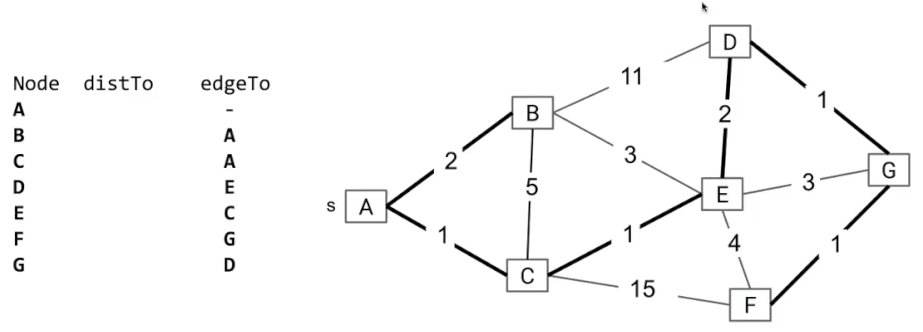

和Dijkstra同样的复杂度

### Kruskal算法

将所有边按照权重排序

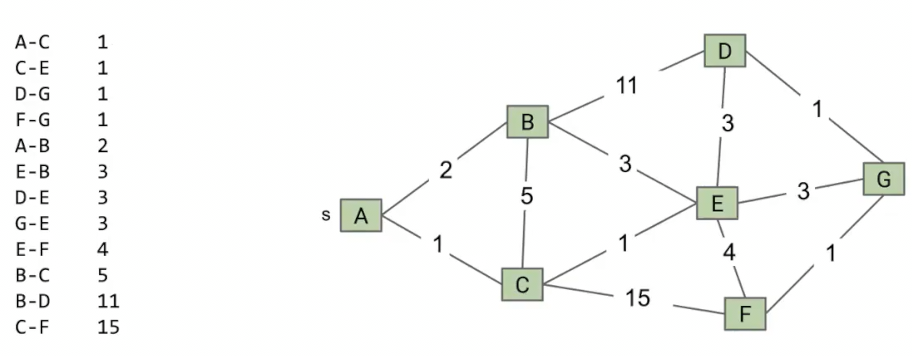

整个算法会逐一检查这些排序边，**除非检查到循环，否则会将边添加到最小生成树**

#### _细节

* 每次获取最小的边可以使用优先队列
* 可以使用并查集判断是否成环
  * 在添加前查询是否相连 相连则成环 不连接
  * 不相连则将边添加到最小生成树 并在并查集中相连

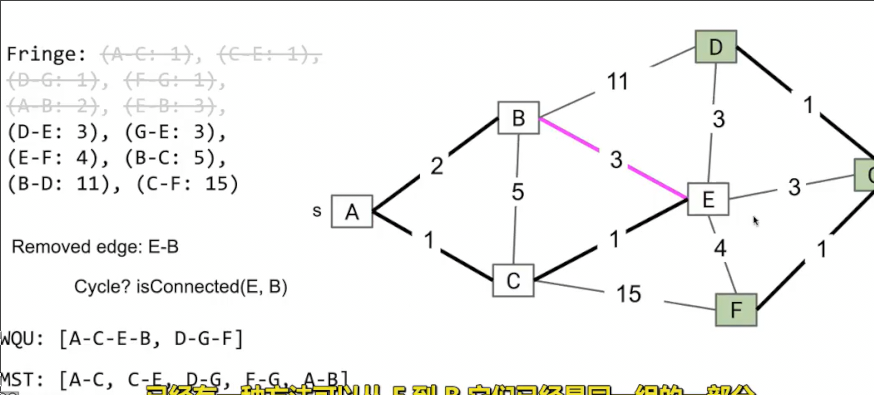

#### 复杂度

两种数据结构，实现主要消耗在其操作上

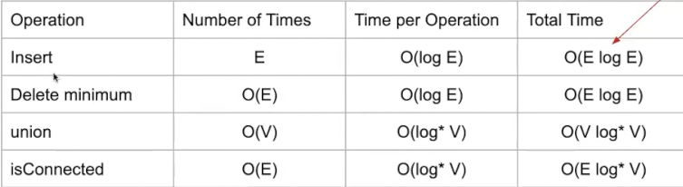

* log*是之前提到的永不超过5的函数，因此近乎常数

其中的主导项是Elog(E)

而如果我们实现有排序好的边，无需使用优先队列，那么复杂度为Elog*(V)，近乎可以看作E

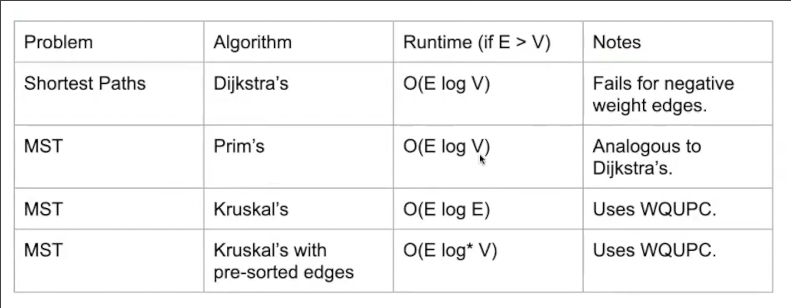

因此对比prim's，其复杂度O(ElogV) 与 Kruskal's的 O(ElogE)差异不大（可能prim's稍微快一点，但是实现更慢）

而如果我们已经有预先排序的边列表，显然用Kruskal's更好
