# 有向无环图
 
* [全部事务的合法顺序_拓扑排序](#全部事务的合法顺序_拓扑排序)
* [算法](#算法)

**DAG**

## 全部事务的合法顺序_拓扑排序

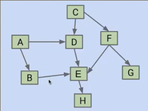

假设每个节点是一项任务

我们必须在进行H之前先进行E，进行E之前先进行D，在此之前先执行A

我们希望找到一个合法顺序

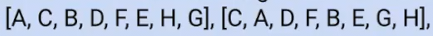

在最终的顺序中，所有指向节点的顶点，必须出现在前面

## 算法

首先对于图采用DFS，得到**返回顺序**，之后反转这个排序

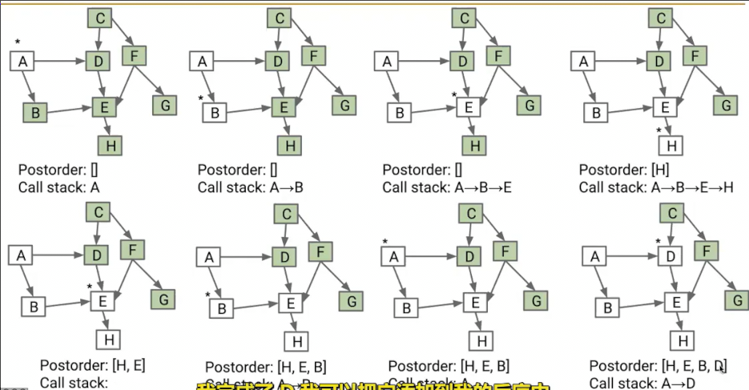

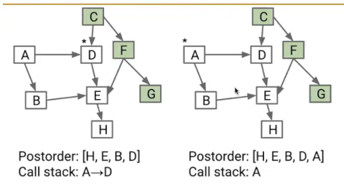

得到一个排序，但是还有节点没有被包含，在未包含的节点上重复 仍然在返回时向之前的**返回顺序**列表中继续添加

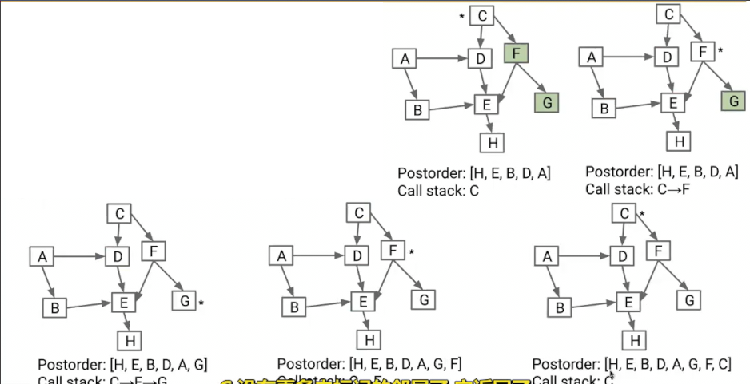

...

直到所有节点被遍历过

最终反转列表得到做全部事情合法的顺序

**选择节点时需要选择一个没有入边的**

这种顺序称为**拓扑排序**

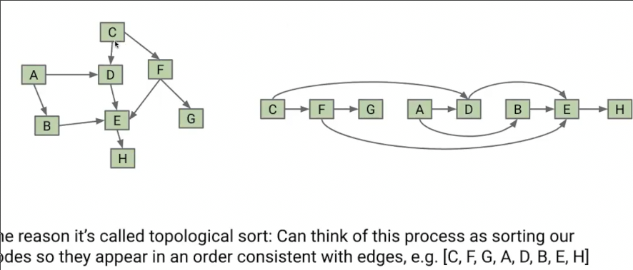

当我们按照顺序重新排列图中节点的顺序，会得到一个相同的图，其中箭头总是指向右侧

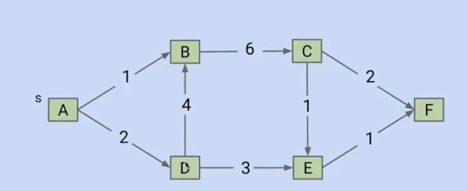

```txt
A -> D -> E -> F [F]
A -> D -> E [F E]
A -> D -> B -> C [F E C]
A -> D -> B [F E C B]
A -> D [F E C B D]
A [F E C B D A]
{A D B C E F]
```

## 有向无环图的最短路径

dijkstra同样不能运用在含有负权重的有向无环图上，原因在与，如果负权重，可能出现改变之前已经出发过节点的最短路径

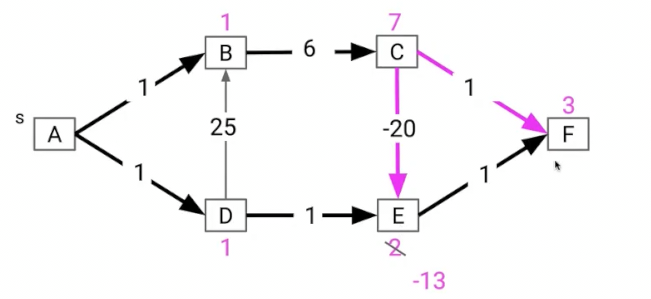

是否专门在**有向无环图**中有可以处理负权重的方式？

我们这次按照**拓扑顺序**松弛节点（而不是dijkstra的距离最小顺序）

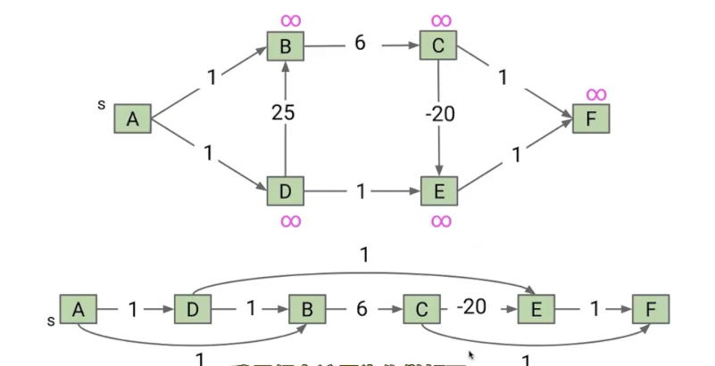

以这个顺序作为Dijkstra松弛节点的顺序

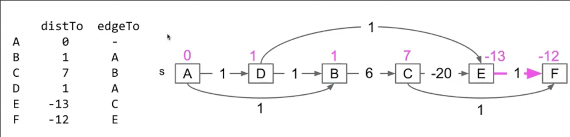

算法有效的原因在于 

假设我们已经松弛ADB，而没有开始松弛C

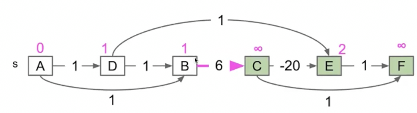

负权重导致异常的原因是，**尝试修改了白色节点的入边**

但是以拓扑顺序，后面节点永远不会指向前面节点，因此永远不会修改白色节点的入边

而这样也可以求得最短路径的原因是

与dijkstra每次松弛最小节点的原因相同，**后面永远不会有通往最左节点的路径**，因此当前的最小就是全局的最小路径！

## 最长路径

图的最长路径还没有有效的方案，只能以2^E效率不断尝试 *未解决 是一个有名的难题*

不过在有向无环图，这个问题变得简单一些

**将所有权重取负，按照有向无环图的最短路径求解即可。**

之所以对于普通的非负权图dijkstra的变体（比如每次松弛距离最大节点，如果邻点的新距离更大则更新）行不通 其原因在于

我们之前每次选择最小节点，是因为后面的任何路径都比这个节点已知路径长，因此这个节点的最短路径已经确定 **一个更大的节点 加上未知的边权重一定大于这个更小的节点**

但是如果我们每次选择最大节点，**后续的路径完全可能比这个节点的已知路径更长 一个更小的节点加上未知的边权重不一定还小于这个更大的节点** 

但是！有向无环图的最短路径求解不依据于此，而是依据**拓扑排序**，其后松弛节点永远不会有通往前节点的路径，因此！松弛过的左侧节点，其最大/最小路径永远确定！

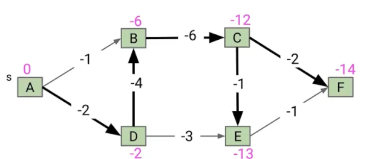

而翻转其实际上是另一种思想**Reduction**（尽管和上述本质相同），由于我们有向图适用于负值

因此我们**修改问题，交给已知的可适用的解决方案**

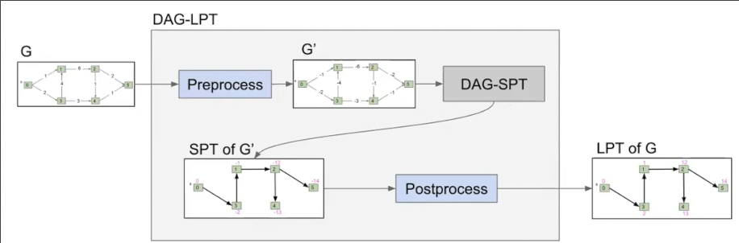

这是**算法中重要的思想** **化未知为已知**
