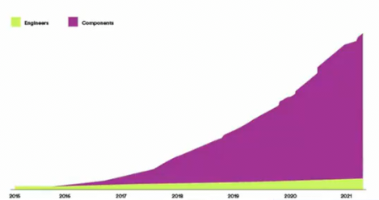
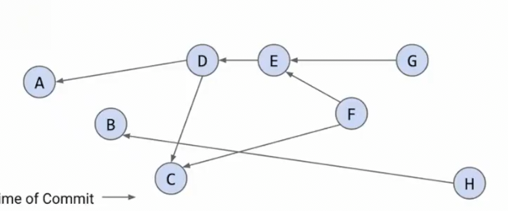
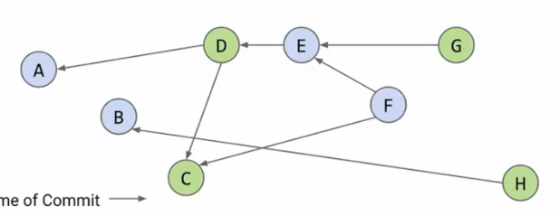

# 软件工程_其一
 
* [代码复杂度](#代码复杂度)
  * [不可避免的复杂性](#不可避免的复杂性)
  * [可避免的复杂性](#可避免的复杂性)
* [战术编程](#战术编程)
* [战略编程](#战略编程)
* [例子_资源配合和测试](#例子_资源配合和测试)
* [例子_提交历史](#例子_提交历史)

**管理功能和程序之间的交互**

软件工程在工业上的应用

我们需要对事物进行取舍，为什么用TreeMap?为什么用HashMap?...

## 代码复杂度

在其他工程中，我们受到现实的限制，材料的缺陷、环境的缺陷...

在计算机中，限制不在于我们能做什么，而是**选择做什么和如何设计**

* 阿波罗的计算或许比不上我们任何一部现代计算机

过去的游戏尽管某些会简单一些，但是占用内存很小，使得我们可以运行它。

**限制我们的是我们的计划事物的方式，而不是拥有的资源**

1. 一个程序员不能单独管理一个大型软件系统，因为如今的软件系统非常庞大
2. 如果软件系统由很多程序员管理，那么每个人应只需理解其代码的一小部分而不是整个代码库

一种定义是**代码复杂性是与软件系统结构相关的，使得其难以理解和修改的事物**

简单的，给程序添加更多功能，复杂度就会提高。而我们的目标是尽量减小复杂度。

* 复杂度过高，很难理解代码如何工作
* 同时也困难去修改bug
* 修改代码非常困难 甚至不知道要查看什么位置

这样需要维护代码的人员越来越多，线性增长，而代码量却指数增长

进行一次更改必须评估是否会影响其他内容

随着代码量越来越多，添加一个小小的功能，也会变得困难

### 不可避免的复杂性

是正在做的事情中固有的

比如音乐软件中播放、暂停、跳过功能

### 可避免的复杂性

* 使得代码清晰、直观
  * 比如Proj1的**哨兵**，使用其规避了特殊情况。**情况变少**
* 模块，**抽象**的概念，可以使得某个想法黑盒化 **HashMap** **BSTMap** 向外提供的信息仅仅是其是一个Map，允许放入键值对，而在功能中不告知其是如何实现

## 战术编程

希望快速让一些一些东西跑起来

对于测试失败的特例，仅仅添加不断添加if，以求通过更多的测试

其需要场景通常不需要考虑可维护和复杂性

**缺点**

* 难以维护
* 当更换方法时，往往需要从头开始

## 战略编程

我们考虑长期战略和未来 如何编写易于维护和优雅的代码

并且我们可以在未来更改我们的战略和实现

## 例子_资源配合和测试

比如我们现在需要展示一些数据，而有很多excel文件

一种方式是对于每一个文件写一个网页

但是，假如文件更改，我们不得不去更新代码中的数据。

因此**配置一个通用的资源属性**

我们只要传入资源的不同配置，生成不同的页面

**资源验证**判断传入配置的合法性

**缺失字段测试**

**测试包含之前功能中对用户重要的测试用例，其在一个大型测试套件中，因此后续即便更改其他内容，也会测试是否影响之前的内容**

## 例子_提交历史

假设我们想查看目前开发项目的一些版本发生了什么更改

每个项目并不会在每次提交后发布新版本

假设我们无法判断一个提交是否在已发布版本中

我们将Git视为一个图

新的提交指向其父级，先前的提交

绿色是已部署的提交

包含C的已部署提交有哪些？

DG 因为我们从C出发依次递归指向其的子提交，如果是绿色，则为我们要的结果

一种方案是从最新的提交出发（没有入边），直到找到C或者没有出边,记录遇到C前的路径

另一种方案是颠倒边，从C出发，自然地找到所有绿色节点
