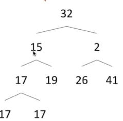

# 排序

通过排序往往可以构建更好的算法和更好的数据结构

**排序的定义**

如果对于两个key存在这种关系

* 只会有三种关系中的一种`<` `=` `>`
* 并且这种关系具有**传递性**

那么排序就是通过以上的性质将所有元素按顺序排列

也可以根据key的不同，对元素有不同的排序规则

字典序和字符串长度

对于排序算法好坏的衡量有**时间复杂度**和**空间复杂度** 其中空间复杂度通常依据**额外空间**，而不计入原始问题数组的占用空间

## 逆序

这个数组并没有完全排序，但是很接近排序

**表示数组几乎排序了的一种方法是计算数组中的逆序对**

* 选择任意两个元素比如`8` 和 `7`，发现他们的顺序相反（7本应在8前面），因此，其就是一组逆序对
* 对于这个数组，目前有6个逆序对，而完全乱序中可能的逆序对有55个（9+8+..+1）因此很接近排序了

排序的另一种定义是 将**逆序对的数量逐渐减为0** （某些排列算法会逐渐减少，而有些先增加后减少，但是最终都会为0）

## 选择排序

每次遍历数组的未排序部分 找到最小的项目 交换其与最前项

需要O(N^2)的时间复杂度

### 改进 朴素堆排序

每次我们都选出最小的项目，我们知道有数据结构可以更快选出最小项目 **堆！**

1. 将所有项目装入堆 NlogN
2. 一遍一遍删除项目 NlogN

使用最小堆是可以的，但是我们也可以考虑一下最大堆

将所有东西装入最大堆，重复取出，得到从大到小的元素

堆的底层表示

之后依次取出堆顶，放到输出数组的末尾

这种**堆排序**的时间复杂度是θ(Nlog N)，而空间复杂度，我们需要用一个同样大小的数组表示堆 因此θ(N)

### 原地堆排序

我们尝试不引入额外的空间

这是原始的排序数组，我们希望把他变成堆

但目前并不是有效的最大堆

调整：从底层开始，逐渐向上扫描，尽量把当前节点向下沉。调整得到**有效的最大堆**

将节点向下沉的过程实际上和堆元素的删除一致（末尾节点放在堆顶，后下沉）

调整用时Nlog N

* 向上扫描的过程只需要从后向前遍历数组

之后我们应当将堆中元素依次取出，放入输出数组，但是同样我们可以利用这个堆数组

这也是我们使用**最大堆**的原因

**当我们取出元素时，堆会减小，因此数组中的后面被废弃，因此，我们可以直接存入**

原地堆的时间复杂度仍然是O(Nlog N) 而空间复杂度变为O(1)

但我们这里说的O(Nlog N) 只是简单看出的上限，更严格的证明下，实际上从下到上的转化堆操作时间复杂度为theta(N) 不过重复取出堆元素的操作是O(Nlog N) 对整个原地堆排序的时间复杂度没有影响
