# 归并排序_插入排序_快速排序
 
* [归并排序](#归并排序)
  * [合并](#合并)
  * [归并](#归并)
  * [时间复杂度](#时间复杂度)
* [插入排序](#插入排序)
* [原地插入排序](#原地插入排序)
  * [时间复杂度](#时间复杂度)
* [快速排序](#快速排序)

## 归并排序

### 合并

我们有两个排过序的数组 希望将其合成一个更大的排序数组

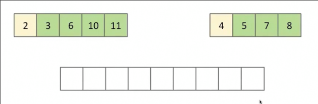

逐一比较最前的元素，放置较小的，移动指针

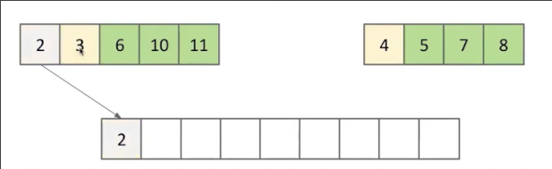

直到某一个数组的指针移动到末尾

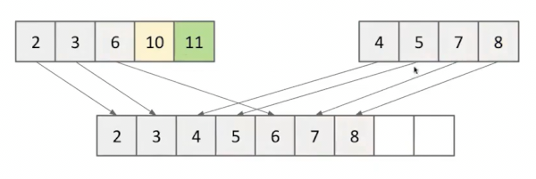

之后逐个复制另一个数组的剩余元素

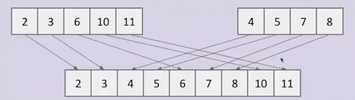

复杂度为O(N)

### 归并

我们有64个元素的数组 如果对其进行简单的选择排序会花费N^2，也就是4096个时间单位

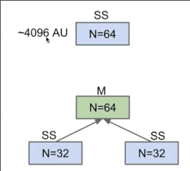

我们不对较大的数组排序，而是分为两个小数组**分别排序**

之后进行**合并**

32\*32\*2 + 64 = ~2112 个时间单位

由于我们的这种策略，时间几乎下降一半

但是复杂度仍然在θ(N^2)

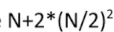

继续在此基础改进，重复上述的过程呢？？

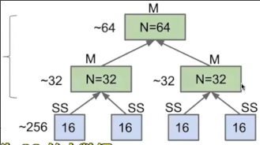

在进行刚刚的32小数组排序时，将其分为两个16的小小数组，分别排序，而后合并 完成小32数组的排序

两层下降低为 1152个时间单位（有近乎下降一半！）

不过在有限次归并下，仍然是θ(N^2)的复杂度

我们再分、再分...

当我拆分到1时，只需要返回其。这就是基本情况

### 时间复杂度

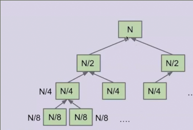

在每层，我们主要的工作是花费N的时间进行合并

1=2^0 2^1 2^2 ... 2^k = N 共有 k = logN 层

因此总体的复杂度进化为θ(Nlog N)

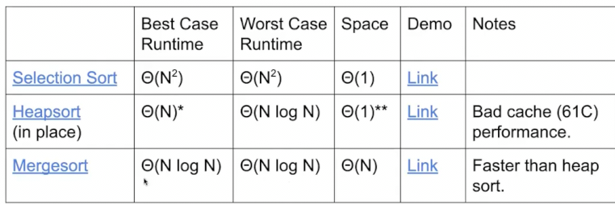

(堆排序实际用的很少，可能比其他排序慢)

## 插入排序

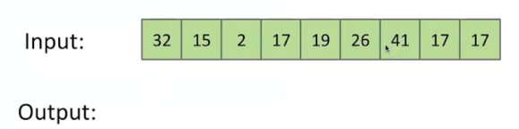

1. 首先将目前第一个元素放入输出
2. 查看下一个元素应该放在输出的哪个位置
3. 进行插入

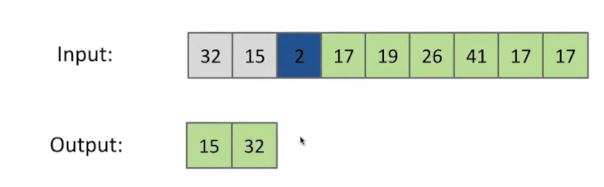

重复插入

## 原地插入排序

在Java中，数组不能进行直接元素的插入，我们需要对细节进行处理

不再需要输出数组

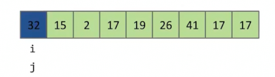

对于每个元素，在已排序部分找到合适位置，前进的过程每次交换遇到元素的位置

第一个元素不动

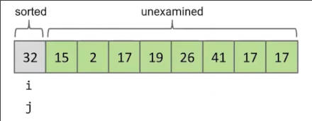

排序第二个元素

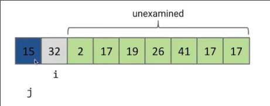

第三个元素逐个比较，重复交换，知道左侧元素比它大，或者到达最左

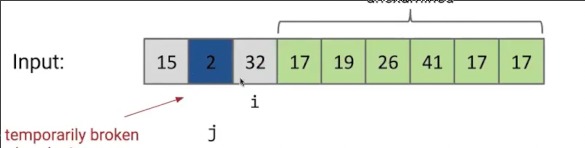

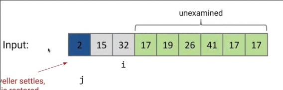

完成排序

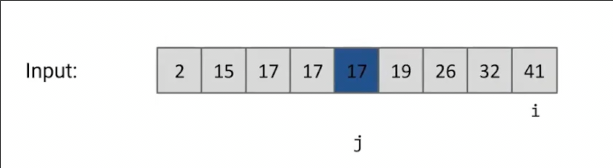

这里有一个不变量：**每个将开始旅行的元素，其左侧元素都是排序好的**

### 时间复杂度

Ω(N) O(N^2)

最好只需要 查看每个元素并比较其和其左侧

最坏情况 我们要把每个元素旅行到最左侧 （0+1+2+..+N)

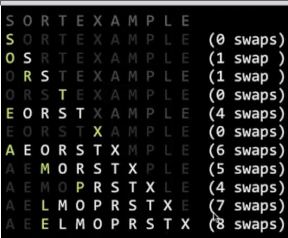

**当我们改变了一个有序数组的一个元素，重新排序 插入排序是最优解** 只需要N的时间 而其他排序都需要更长时间

因此插入排序非常适合只有部分（尤其有限项）无序的情况 只需要O(N)

另一种情况 **当数组非常小时，插入排序会比其他排序更快** N < 15 （Java内置的归并排序不会一直归并到1,而是当数组比较小时采用插入排序）

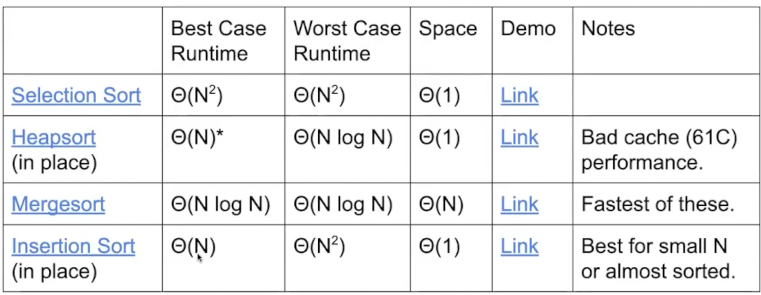

区分各排序的关键是 **思考使其其作用的关键操作**

## 快速排序

关键想法是 
