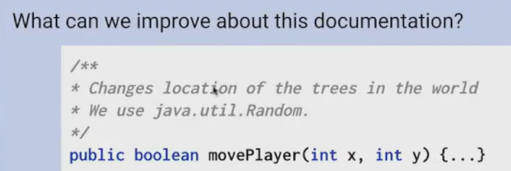

# 软件工程_其二
 
* [设计阶段](#设计阶段)
  * [设计的重要性](#设计的重要性)
  * [设计文档](#设计文档)
* [管理代码复杂度](#管理代码复杂度)
  * [重构的思路](#重构的思路)
* [文档](#文档)
  * [糟糕文档的特征](#糟糕文档的特征)
* [团队协作](#团队协作)

如何从头构建一个项目 

在proj3中 我们将得到一个空白画布 从头构建

## 设计阶段

### 设计的重要性

“与其浪费时间设计程序，不如直接开搞” 这样的思想我们需要**避免**

设计是开发中非常重要的一步

* 在真正开始写代码前花时间设计**可以确保考虑所有的需求和限制**
  * 仔细考虑规范，如何满    足规范的每一部分 如何通过测试
* 考虑多种方案之间的利弊
  * **第一想法往往不是最好想法**
* 避免出现从头再来，以及补丁套补丁来修复bug的情况

如何以正确的方式思考设计呢？

### 设计文档

不一定有特点的格式 但应该向读者提供关于项目的易读的信息

* 其中一个重要部分不仅仅是**怎么做的**，而是**如何想的**以及**为什么没那么做** 以解释我们的想法是最佳方向
* 应随着项目进展而更新
  * 随着项目的更新，可能不会完全依照文档，不必完全坚持它

在项目开始之前，首先会先经过评审

**Chorimum的设计文档**

* 处理系统的上下文
* 设计背后的意图
* 这样做的理由

代码是如何相互作用的 以便我们修改代码

并且思考这些类的组合，而不是把所有东西放在一个文件。**思考类扮演的角色**

**思考每个方法的目的** 一个好的方法应该只有一个目的

## 管理代码复杂度

这个游戏的代码太糟糕使得其已经在windows上不复存在，其难以调试

我们需要在有限的时间内，使得代码优雅美观，完美无缺，且文档齐全

**质量和数量的权衡**

 好的代码通常容易被除了原作者之外的其他人阅读、理解和修改 

* **可读性**
* **简洁性**
* **可测试** **可调试**

长方法比短方法难以调试

* 在一个项目中命名方法应保持一致
* 不要引入不必要的循环、条件
* 不要重复实现相同逻辑的代码 **引入一个方法来处理**

**重构** 不影响功能的前提下，对代码进行修理，使其更易读，更简洁

在重构前，应当添加并提交代码，以便恢复

### 重构的思路

我们有这个糟糕的代码，首先，应该测试其能否正确运行

之后进行重构

1. 尝试用一些语法糖

进行测试

工作并不顺利

我们尝试拆分这个方法 以更好debug

测试

但是还是多了一些`,`，并且每个方法都有相同的bug

由于这些方法逻辑相同，尝试使用**泛型**

打印出了些错误 查阅如何打印嵌套数组

* **良好的代码风格**

## 文档

伴随软件或系统的各种书面材料

* 代码注释
* API
* 用户手册
* 设计规范
* 测试文档

注释、README、设计文档、小片段进行测试 这些都是文档

* 我们在移动玩家还是树？
* 为什么使用java.util.Random

改进

写好git commit以留下历史记录 

* **首字母大写**
* **祈使句**
* **重点是what和why**
* **50字母之内** 不要一次提交太多，而是更频繁提交

### 糟糕文档的特征

* 搜索能力下降 一个文件中有很多代码，那么不得不花费大量时间去寻找想做的事情
* 好的代码，应当都被团队中理解

## 团队协作

* 项目三的目的是**合作和创造力**

**群体智力**

相互尊重 坦诚相待 设定期望

**反思** 

* 团队集体反思团队目标、策略和流程
* 并相应进行调整的能力

期望给予和反馈持续发生的环境

不同水平的搭档是完全可以的

1. **接受反馈和给予反馈**都很难 措辞
2. 提供有效的反馈 

一种学习反馈的方式是两个人工作在一台电脑，其中一人专注于设计，另一人专注于设计和准确性

在远端也可行

这种模式效率也很高 

* 明确角色定位
* 15-30分钟互换角色

行业中的反馈 **站立会议**

