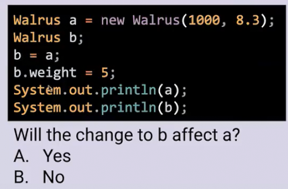
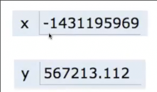

# 引用 链表

## 一个谜题



b会影响a吗


x会影响y吗

这是一个[Java可视化在线工具](https://cscircles.cemc.uwaterloo.ca/java_visualize/)


当将b赋值为a时，b和a指向同一个对象，因此显然**第一个问题的答案是会**


而将x赋值为y时，会新增一个数字，二者互不影响，**第二个问题的答案是不会**

## 声明 赋值 底层

这一切是如何发生的？

### 基本类型


这是内存中常见基本类型的存储，注意到 `72`和`H`存储形式相同，我们如何判断它到底是哪一种？**查看其类型**

这是Java中的**8种基本类型**


* 当声明变量时 `int x;` `double y`
  * 计算机从内存中**寻找足以存放此类型的任何1和0的空间，用于存储**


* 当给变量赋值时 `x = -142361` `y = 64328.327`
  * 计算机**实际设置这段用于存储的空间**


可以将其简化



* **变量赋值给另一变量** `y=x`
  * 所做的**永远是获取x空间中的所有位，赋值给分配给y的空间中**
  * **赋值的黄金法则**

### 引用类型

而在**八种基本类型**之外的都称为**引用类型**


* 当实例化一个对象时，**实际上创建对该对象的引用**
  * 从内存中找到能存储新对象的空间 （能存放下其属性）
  * 由于对象或许很大，我们**不记录整个对象的完整比特**
  * `new`关键字会**记录下这个对象的地址**并返回


* 当赋值给变量时，变量的**存储空间的所有比特即是引用类型所在的地址**
    * `someWalrus = null;` 会将空间设置为全0


我们可以将存储地址的变量简化为指向这块空间的指针


因此**将变量赋值给变量**，只是将**引用**的地址赋值，其**指向仍是同一对象**

* 如果我们只声明不赋值，空间仍会有东西，但是Java不允许我们访问

### 传参

当我传参时，同样**遵循赋值的黄金法则**，只是简单两空间中所有位


* 对于基本类型，那么只是复制了值，因为这些位就代表值
* 对于引用类型，复制了地址，因为位代表地址，所以**传入的引用类型，在内部的改变会影响外部**

## 数组

数组是引用类型


## 链表

*我们最近的目标*

在Java中，数组有固定的大小，我们希望列表像python中可以随着更多数据而增长

```java
public class IntList {
    public int first;
    public IntList rest;

    public IntList(int f, IntList r) {
        first = f;
        rest = r;
    }

    /*通过递归返回列表的大小*/
    public int size() {
        if (rest == null) {
            return 1;
        } else {
            return 1 + rest.size();
        }
    }

    /* 不使用递归返回链表大小 */
    public int iterativeSize() {
        int size = 1;
        IntList current = this;
        while (current.rest != null) {
            size++;
            current = current.rest;
        }
        return size;
    }

    /* 返回链表的第i项 */
    public int get(int index) {
        if (index == 0) {
            return first;
        } 
        return rest.get(index - 1);
    }

    public static void main(String[] args) {
        IntList L = new IntList(15, null);
        L = new IntList(10, L);
        L = new IntList(5, L);
        System.out.println(L.iterativeSize());
        System.out.println(L.get(2));
    }
}
```

