# 比较排序的最佳上限

目前我们认为**快速排序是平均情况下最好的排序，而归并排序是所有排序中性能最稳定的**

排序是一种基本问题

是否有绝对最佳的排序算法？

* 只需要比较和交换元素的排序 **插入排序** **选择排序** **冒泡排序** **归并排序** **快速排序** **堆排序** （目前我们学习的排序都是）

* 非比较排序 **计数排序** **基数排序**  **重力排序** **随机排序**（随机打乱数组，每次查看是否排好序） **睡眠排序** （给元素设置对应大小定时器，依次取出）

## 排序算法的数学问题

我们证明这两个复杂度的好坏

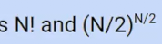

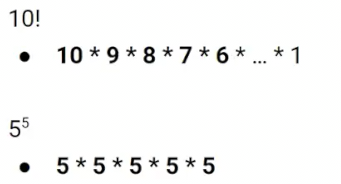

这里N!更大，而对于更大的N, N！会更大，因此N!的复杂度更差

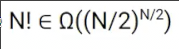

简单的证明，这也是成立的

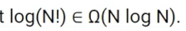

而反之，也是成立的

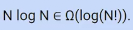

原因在于

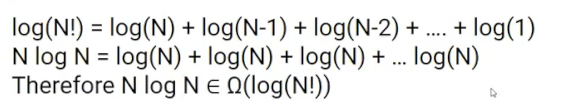

因此二者相同 Nlog N 和 log(N!)

## 排序算法的优化界限

我们能做到比NlogN更好吗

假设这种算法的在最坏运行时间为R(N)

算法的下限最坏情况应为O(N logN)，因为这种复杂度的排序算法我们已知

而其的上限应为Ω(1)，不过更严格，我们应当查看每个项目至少一次，那么应为Ω(N)

而我们将证明这种算法实际上为Ω(Nlog N)，也就是确切的θ(N logN)，和我们已知的最快排序一样

### 证明

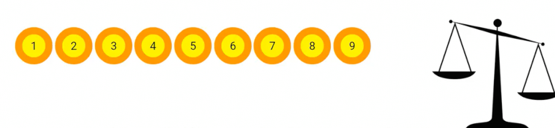

* 天平问题，在9枚金币中存在假币，假币的重量更高，天平在使用两次后会损坏，应当如何决策，以百分百找到假币？

* 均分三组，其中两组放到天平
* 如果两组重量相同，则假币在另外一组，否则在较重的一组
* 对于甄别出的一组重复上述过程

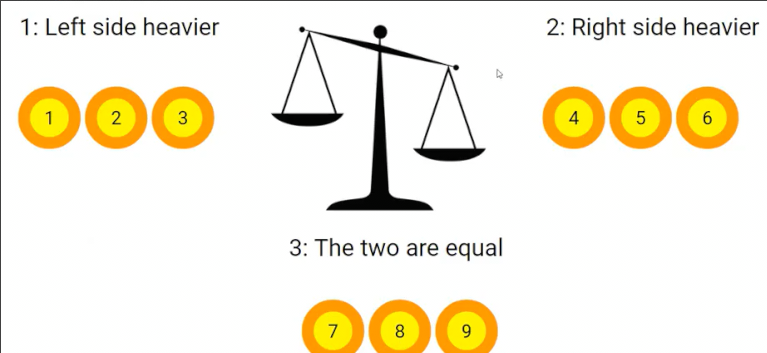

这是我们表示决策的树

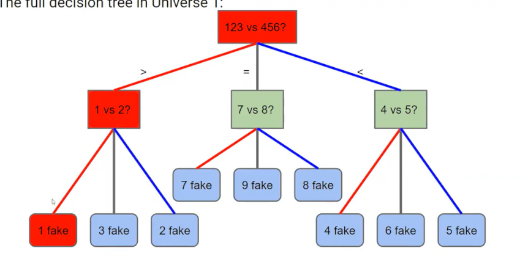

那么有10个硬币，存在方案吗？

是不可能的，可以用这棵树的9个叶子和10个宇宙的观点解释，**每次决策最多分为三个叶子**

同理，如果有三次决策机会，那么有3^3 = 27个决策叶子，最多可以完全甄别27个节点中的一枚假币

如果硬币超过3^N，那么我们无法完美解决这个问题，而不超过，则一定存在解

通过上面的例子 在一个**k层的决策树中**，每次有R个分支，可以最多解决 R^K 个情况的问题 

反之，有R^K种情况的问题，那么至少需要K层每次分支R的决策树

故，有K种情况的问题，至少需要log K层的**时间**

* 另一个问题，我们有三个不同重量的箱子，ABC，仍然有一个天平，我们希望尽可能少用天平。希望得到ABC的重量顺序

这个问题有多少中情况？3 * 2 * 1 = 6

决策树高度呢？每次通过天平，分出两种情况（大于和小于，没有相等的情况），因此2是分支因子

所以log_2 6 四舍五入后高度为3

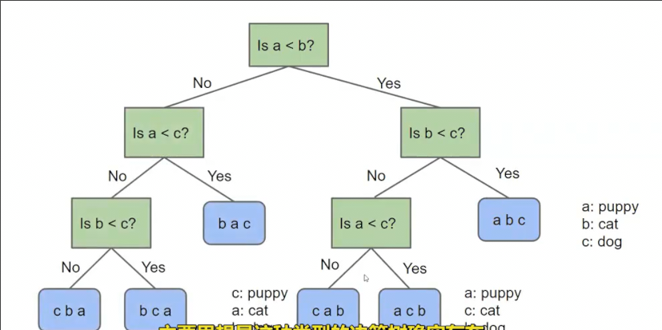

因此需要提问log_2 N!次（共有N!)种情况

复杂度为Ω(log(N!)) ---> Ω(Nlog N)

我们同样可以基于排序解决这个问题，因此！排序的算法最好不会超过这个上限（由于可以这个方法可以解决这个问题，所以这个方法的复杂度不超过问题的最佳理论复杂度）

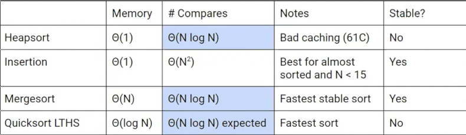

然而！这个上限仅限制基于比较的排序算法（通过比较查看两个数字差异的排序算法）
