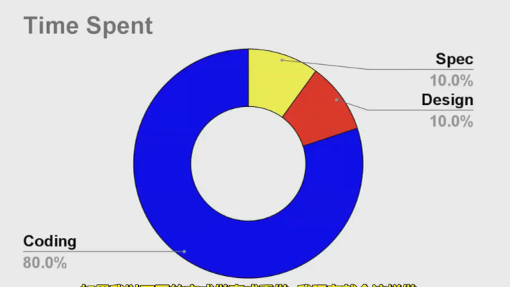
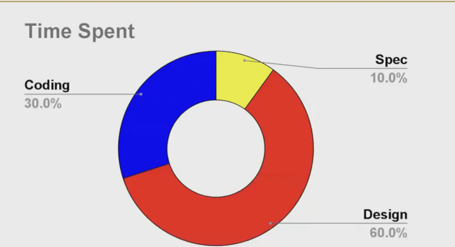
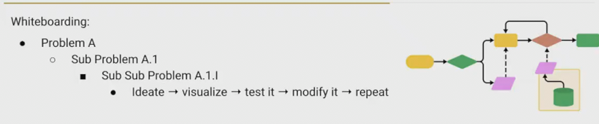
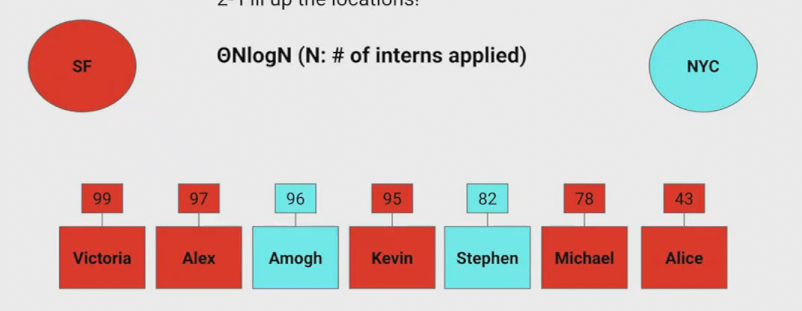
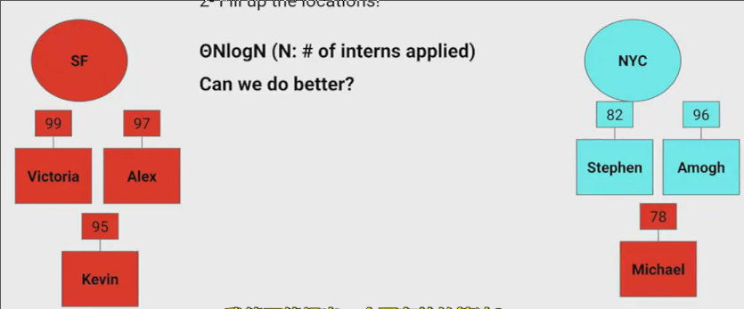
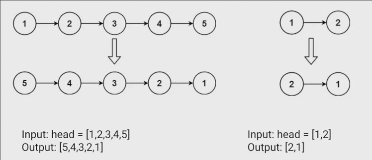
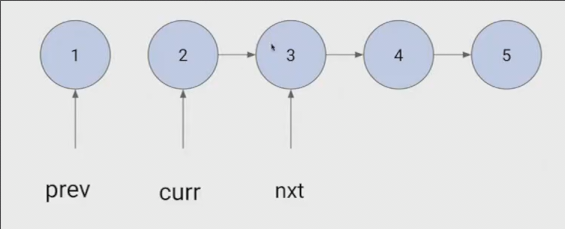
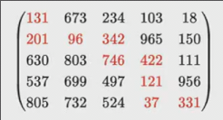
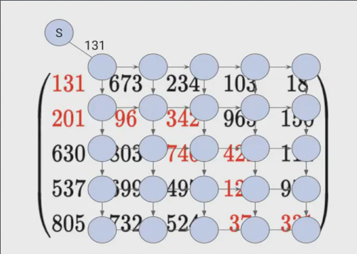

# 软件工程_其三
 
* [项目实例_Gitlet](#项目实例_Gitlet)
* [白板编程](#白板编程)
* [软件工程基础](#软件工程基础)
  * [例子_办公室录取分配](#例子_办公室录取分配)
* [练习](#练习)

## 项目实例_Gitlet

一个版本控制系统

**槽糕的计划**

```
 在设计文档写了几点内容，试图一开始就设计出涵盖所有主要功能的方案
 之后立即写代码，没有写任何测试，没有认真考虑极端情况
 无意义的提交信息
```

## 白板编程

在设计或思考前写很多代码，会导致浪费很多时间在槽糕的实现上



理想的项目应这样实行



最初我们不需要一个很详尽的设计文档，而可以提出一个初始设计

使用两个基本的步骤编写程序

* 找到问题的算法 *将问题划为更小的子问题*

1. 用**自然语言**描述算法或者解决方案
2. 记录下来转化为伪代码

* 将伪代码转换为代码



## 软件工程基础

我们是工程师，我们能够**规划事物并给出蓝图**，这是目前大语言模型做不到的

### 例子_办公室录取分配



我们有若干实习生，但是只会被录取6个，并且有两个办公地点，每个人有自己的意向，如何分配比较好？

想法一，对这些实习生按照分数排序，(Nlog N)，之后从高到低（先淘汰一部分），依次查看一人，并分配到对应地点，当某地点满之后，剩余的未被淘汰实习生调剂到另一地点



是否有更好的算法？

另一种想法，我们使用一个**优先队列**

将每个学生首先插入到队列中，并出队最小的(N log6 -> N)

这样得到未淘汰的6个，之后就可以按照上述过程调剂

在上述分析我们没有立即编写任何代码，而是思考解决方案，并尝试找到更好的 **使用白纸，白板可视化一些东西**

## 练习

在面试中会被问到如上的问题

* LeetCode 简单到中等的 适合求职面试的问题
* CodeForces 更难一些 竞赛
* Project Euler 偏数学 专注于算法设计 （找到答案，而不太在意实际代码）
* Cruptopals 计算机安全的特殊问题
* ...


一些编程风格的游戏







5 * 5的矩阵找到左上和右下的最短路径和，只能向右或向下

* 动态规划
* Dijkstra


