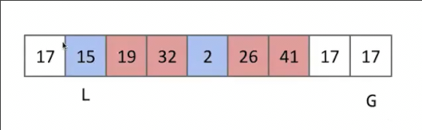
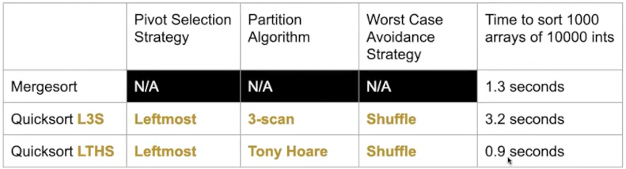

# 快速排序实验和选择
 
* [原地分区算法](#原地分区算法)
* [过于完美的的两种基准选择](#过于完美的的两种基准选择)

哪些快速排序运行更好呢？

## 原地分区算法

如何选择分区基准？

* 始终选择最左侧项作为主元来分区
* 扫描小于主元的值复制过来，再操作相等的复制，最后扫描大于的项 **三扫描**分区算法
* 排序前打乱

* 我们替换三扫描算法为**就地算法**，两个相对的指针，逐步交换他们不喜欢的项

1. L出发，当L到达第一个其不喜欢的元素时，停止
2. G出发，当G到达第一关不喜欢的元素（小于等于主元）停止
3. 两元素交换，两指针各进步1 回到第一步

直到两指针相遇或者G在L之前

应用这种分区方法使得快速排序好于归并排序（常数系数的优化)

## 过于完美的的两种基准选择

* 一种想法是**选择确切的中位数**

这样可以每次精确将数据分成两部分 避免最坏情况

那么如何找到？**PICK算法** θ(N)的时间找到中位数

然而结果是糟糕的，原因在于这种算法常数很大

* **用分区找到中位数**

1. 首先我们选择最左侧的9做为基准来进行分区
2. 查看9是否确切落在中间 来判断9是否为中位数
3. 由于9落在偏左，选择其右侧的第一个做为新基准来分区，回到第2步，依次类推

这样下来14落在整个数组的中心

这种中位数查找 最坏情况 N^2

* 本身就是有序的，分区一次需要N，而共有N/2次分区以确定中位数（每次都会以最左侧为基准）

平均情况 θ(N)

* 不是NlogN的原因是，在**舍弃一边后我们不需要对这边再进行操作**，这就是与快排的不同之处
* *或许可以推广到找到无序数组中第i大的元素*

结果依然不是很好，理由和PICK算法相同 常数太大 不必太追求完美
