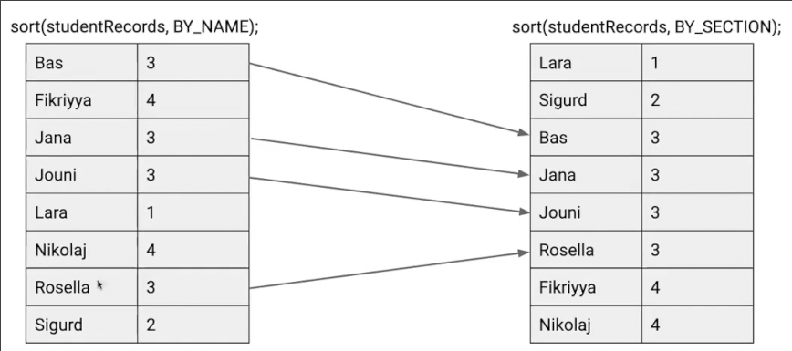
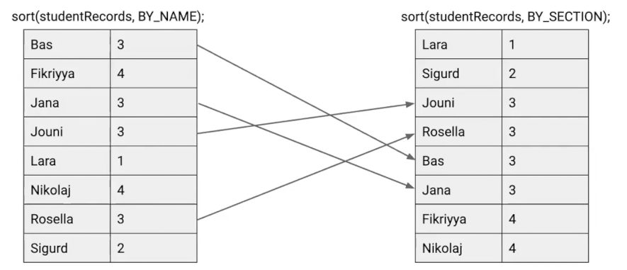
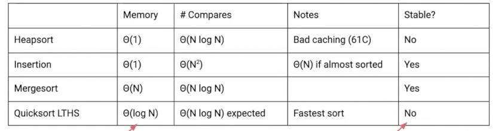
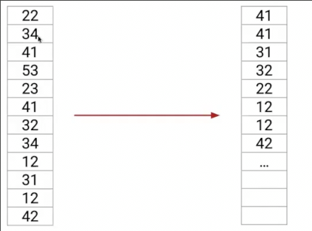
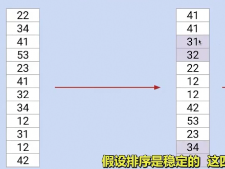
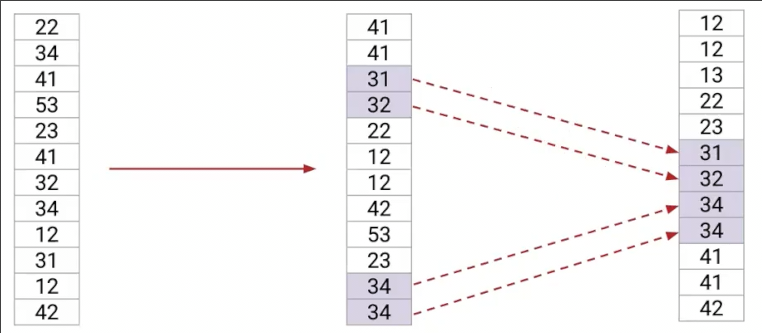
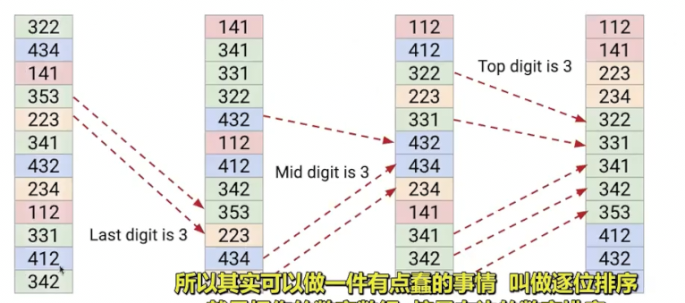

# 排序稳定性 排序技巧 逐位排序

## 排序稳定性

**排序稳定性**指的是两个对象依据排序的key相同，排序后其顺序稳定不变

这种排序就不是稳定的

* 插入排序 **稳定** 我们可以决策本来顺序靠后的元素在**小于等于时**停止旅行
* 快速排序 
  * 三扫描分区 稳定
  * 原地分区 不稳定
* ...

(不稳定的快排更快)

在Java中，内置排序`sort`会考虑稳定性，对于整数，采用不稳定的快排（因为不会区分其顺序），对于对象，采用稳定的归并排序

## 一些排序的技巧

* 插入排序在处理小于15的数组时表现最好
  * 因此当归并排序递到小于15时可以直接插入排序，而不是递归到最后
* 排序自适应 分析数组并使用不同的排序 从而获得最快的表现
  * python中的`TimSort`

## 按位排序

对于一组数字，假设我们完全忽略十位数字，仅仅按照个位排序

稳定性取决于我们采用排序算法的稳定性

假设采取稳定的排序

在此基础上对十位再进行稳定排序

因此十位低的会在前面，而如果两个十位相同，由于这一步采取了稳定排序，因此之前个位靠前的（低），也会在前，所以排好了！

因此连续的稳定排序就构成了逐位排序

由于每一位的可枚举性，逐位排序可以采用θ(N)的排序算法，其也会达到θ(N)的复杂度

### 计数排序

不基于比较，因此，可以超过Ω(NlogN)的界限

* 首先数组中所有0的项目放到数组前面
* 1的项目
* 2的项目
* ...
