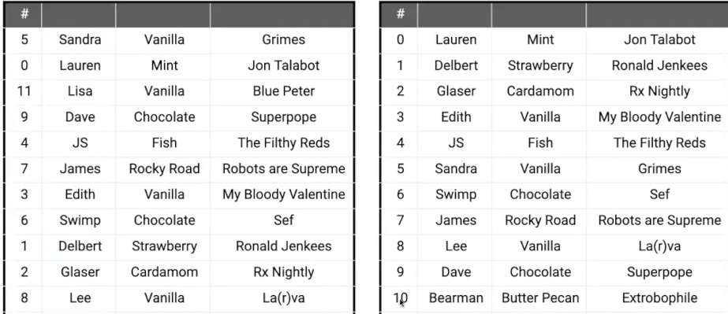
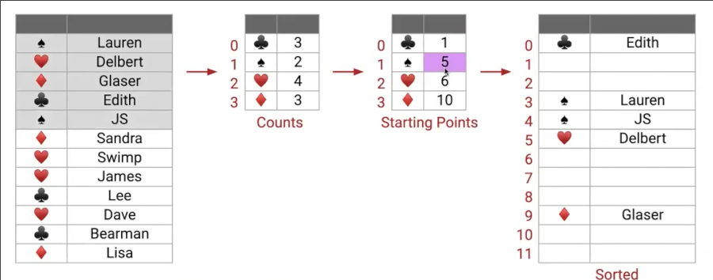
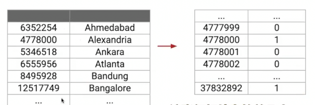
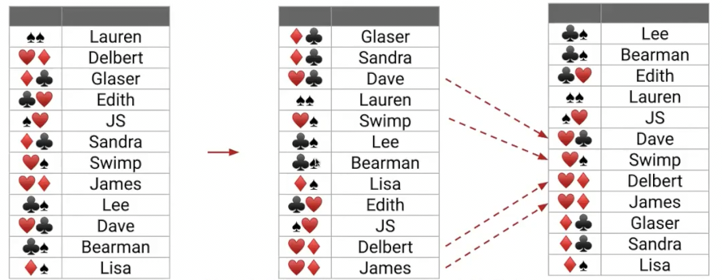
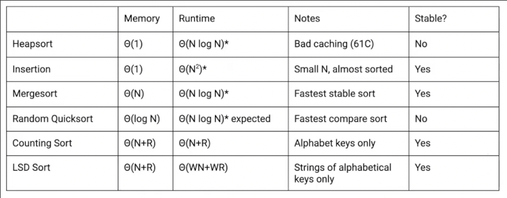
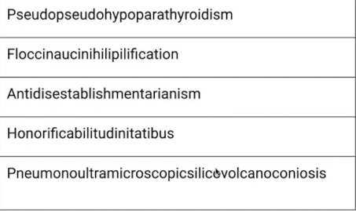
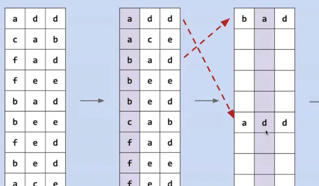
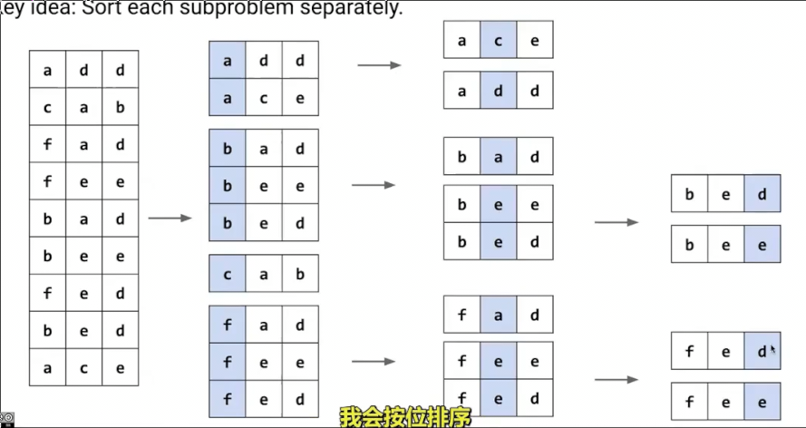
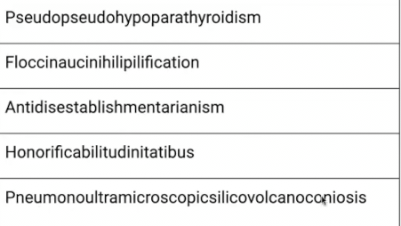
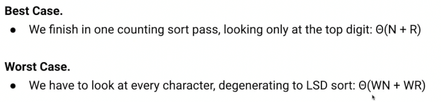

# 排序稳定性_排序技巧_非比较排序
 
* [排序稳定性](#排序稳定性)
* [一些排序的技巧](#一些排序的技巧)
* [非比较排序](#非比较排序)
  * [延时排序](#延时排序)
  * [唯一排序](#唯一排序)
  * [按位排序](#按位排序)
  * [计数排序](#计数排序)
    * [效率问题](#效率问题)
  * [基数排序_lsd_最低有效位](#基数排序_lsd_最低有效位)
    * [复杂度](#复杂度)
  * [基数排序_msd_最高有效位](#基数排序_msd_最高有效位)
    * [效率问题](#效率问题)
  * [比较基数排序和基于比较的排序](#比较基数排序和基于比较的排序)

## 排序稳定性

**排序稳定性**指的是两个对象依据排序的key相同，排序后其顺序稳定不变

这种排序就不是稳定的

* 插入排序 **稳定** 我们可以决策本来顺序靠后的元素在**小于等于时**停止旅行
* 快速排序 
  * 三扫描分区 稳定
  * 原地分区 不稳定
* ...

(不稳定的快排更快)

在Java中，内置排序`sort`会考虑稳定性，对于整数，采用不稳定的快排（因为不会区分其顺序），对于对象，采用稳定的归并排序

## 一些排序的技巧

* 插入排序在处理小于15的数组时表现最好
  * 因此当归并排序递到小于15时可以直接插入排序，而不是递归到最后
* 排序自适应 分析数组并使用不同的排序 从而获得最快的表现
  * python中的`TimSort`

## 非比较排序

### 延时排序

N个程序同时输入N个元素中的一个，元素多大就延时多少秒输出，这样输出顺序就是有序的

复杂度为 N + max(A) （N是开启N个程序需要的时间，而max(A)是输出所耗时，取决于二者谁占主导地位）

利用空间来绕过NlogN

### 唯一排序

假设我们按照ID排序，并且**ID唯一**

我们可以在O(1)的时间就确定某数据放在数组的某个位置

这依赖于**ID唯一**

实际是一种特殊的计数排序

### 按位排序

对于一组数字，假设我们完全忽略十位数字，仅仅按照个位排序

稳定性取决于我们采用排序算法的稳定性

假设采取稳定的排序

在此基础上对十位再进行稳定排序

因此十位低的会在前面，而如果两个十位相同，由于这一步采取了稳定排序，因此之前个位靠前的（低），也会在前，所以排好了！

因此连续的稳定排序就构成了逐位排序

由于每一位的可枚举性，逐位排序可以采用θ(N)的排序算法，其也会达到θ(N)的复杂度

### 计数排序

不基于比较，因此，可以超过Ω(NlogN)的界限

**稳定**

* 首先统计出各元素的个数 梅花3个 红心4个...
* 这样以来我们知道了个元素的起始位置
* 接下来再扫描一遍填充对应位置即可

**空间换时间（额外的数组*大小为元素种类数*用于存储各元素起始位置）**

如果key很稀疏

#### 效率问题

使用数组作为种类统计浪费很多空间（为0的项），而在这里，由于key过大，会导致千万长的数组！

而对于原始长度为100的数据，这远不如直接快排迅速

计数排序的复杂度是θ(N+R) N表示数据量 而R表示key的所有**可能种类**（而不是数据中的实际种类，因为我们使用数组, 但是哈希表可以优化为实际种类？）

### 基数排序_lsd_最低有效位

适用于字符串或整数以及有限长度，每一位是有限种类的事物

结合**按位排序**和**计数排序** 对于每一位，应用**计数排序** 因此其key的种类始终为常数

#### 复杂度

影响的变量有**数据量N** **key种类R** **数据长度W** W影响逐位排序的排序次数

复杂度为θ(W(N+R))

不过我们在其它排序中没有考虑w，更长的字符串也会导致比较操作变慢

### 基数排序_msd_最高有效位

在之前我们先排序个位，之后十位，但是低位很多情况是不影响顺序的

首先我们对最高位排序

但是我们接下来直接对第二位排序会导致第一位的顺序被打乱

我们不妨分别对第一位相同的数据分别按位排序，而在下一层对一二位都相同的数据按位排序

**一个递归过程，基本情况是排序的数据只有一个**

#### 效率问题

对于这种情况，BSD只需要比较两位即可完成 而LSD需要从个位一直比较到最前

这是BSD的最好情况，而最坏情况是所有位都相同，退化为和LSD相同的效率

注意由于字符串和数字长度所影响的比较不同，补"0"的位置相异

### 比较基数排序和基于比较的排序

对于归并排序，如果我们考虑字符串长度W的影响

那么其时间复杂度为θ(WNlogN)

那么对比LSD的θ(WN+WR)如果比较key的种类R为常数，那么为θ(WN)

若N非常非常大，则基数排序会快很多

但是如果字符串长W会极大影响key种类R，或许归并排序更快（城市人口的例子）

**基数排序的常见改进**

* 换用更高的进制以获得更少的位数 牺牲种类
* 将多个位合并在一起已获得更少的位数 512312 -> 51 23 12 同样牺牲key种类
