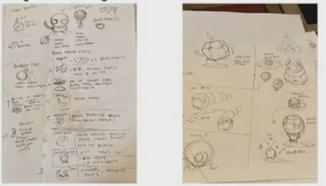

# 软件工程_其四
 
* [教程](#教程)
* [反馈](#反馈)
* [体验多样化](#体验多样化)
* [游戏制作的流程](#游戏制作的流程)
* [程序员的视角](#程序员的视角)
  * [有限状态机](#有限状态机)
* [游戏引擎](#游戏引擎)
* [游戏模组](#游戏模组)

电子游戏设计

**独立游戏开发**指独立开发者，相比于游戏公司

* 自由度更高，但是也具挑战性 *需要自行设定截止日期和管理工作时间表*

关键和基本原理在于让玩家投入其中 如果玩家过于投入 会有*上瘾*的感觉

这个游戏中，玩家只有一个操作：点击屏幕 难点在于掌握时机 

给我们的启发有

* 简单的操作空间
* 存在一些有趣的东西，使得在简单的操作下却很难精通

## 教程

如果操作空间确实很复杂，需要**一种方法让玩家逐渐学习这些机制** *教程*

* 教程需要系统化，比如应当开门、火遇到草会燃烧这些细节
* 应当与世界互动来学习，而不是文本这种枯燥的方式 *show, don't tell*
* 没有口头指示，玩家自己弄清楚 *暗示* 典型的例子是传送门2 

在教程中，已经帮助玩家提前放置一个橙色门，而玩家只需要放置一个蓝色门，就可以穿过而到达本来去不了的平台

这里的关键思想是 告知玩家通过传送门可以到达不可触及的地方 **启发式**

## 反馈

但是玩家通常希望方式，而不是只是学习，需要**反馈**

* **正反馈** 一种奖励，当玩家表现出色时，会获得物品、能力，使得其游戏变得更容易 **自我强化的循环**

但是如果正反馈太强，会导致游戏过于简单和无聊，一点点成功导致后面都很简单，而一开始犯了小错误会导致后面太难

* **负反馈** 当玩家表现出色，会获得更具挑战的关卡和更差的道具 QQ飞车 落后的玩家有一些武器来击倒领先的玩家，并且更可能获得加速

当负反馈过强时，玩家会失去提升自己的动力 **不合理的匹配机制** 

负反馈更适合聚会游戏而不是竞技游戏，而正反馈则比较适合竞技游戏

## 体验多样化

玩家在一次通关后就知道游戏的所有事情，就会变得很无聊

可以采取一些措施

* 随机分配物品 
* 随机地图
* 不断添加新内容

* 积分系统
* 商店系统
* 敌人
* 背景故事

## 游戏制作的流程

假设我们已经按照上述设计了游戏，如何变为最终产品？

我们有一些合作人员和时间表

1. 首先是设计的想法 
2. 制作纸质原型
3. 创建**最小可行产品** *MVP*
4. α版本 -> β版本 -> release 迭代改进

以我的世界为例 

构思阶段是**和游戏相关的几句话或元素**

* 一个基于方块的世界
* 玩家具有创造性
* 世界随机生成

纸上原型是**将游戏呈现在纸上** 以让人们讨论所有想法并更改，而无需实际编写代码

主要的机制

MVP阶段 基本可玩的游戏 告诉人们这个想法是可行的，因为已经有实际代码了

对于我的世界 

* 平坦的世界
* 没有敌人

α阶段 面向更广泛的受众展示游戏 更局限于认识的人

 让其进行游戏测试并收集反馈

β阶段 面向公众的初始发布版本

发布版 决定游戏脱离β阶段，宣布游戏是正式版 *模糊的界限*

引入了通关方式

在正式版后，游戏仍会积极更新，不是静态的产品，而是需要不断完善

## 程序员的视角

如何具体编写代码？

假如我们在实现一个**遭遇战系统**

随机走动，并触发 *类似踩到地雷*

游戏的流程是

* 处理输入，更新世界状态，将当前状态渲染给用户
* 延时一段时间进行下一次更新

然而在不同的场景中，做的事情略有不同，在普通场景中，等待输入并渲染瓦片，在遭遇战场景中，输入不同，并且渲染内容也变化

我们还希望能够相对容易添加新场景 *代码复杂度*

尝试一些解决方案

但是如果我们要创建一个新场景，要添加一层嵌套循环 损失了简洁性，并且无法做到三个场景任意切换

另一种方法是使用if-elseif

字符串表示当前场景，而检查当前场景是什么，来做不同事情 但是上白次的 if else也不是很简洁

### 有限状态机

用于管理具有许多不同场景的复杂游戏

比如 Flappy Bird 的标题 倒计时 游戏 结算界面等等

可以抽象为**有向图**和**状态**的结合

机器在同一时间只能处于一种状态 我们需要跟踪这个**状态**

**在每个时刻，获取输入，检查当前状态的任意出边是否满足其转换条件**

而代码中

`stateMachine`表示整个的当前状态机

在主循环中获取输入并检查能否更新状态机，并渲染

状态机类则要保存一个哈希表来映射状态到游戏状态

## 游戏引擎

从头编写代码很困难，并且大多数游戏都可以用共同的框架代码

游戏引擎为我们提供了**样板代码**

Unity并不需要写代码皆可以做游戏

在Unity中，游戏中存在的所有东西被称为GameObject 别人制作的GameObject可以直接拖放到Unity中

如果我们要自己写代码，Unity依然为我们提供了一层抽象，只需要我们定义**想要什么样的游戏对象**，并将**脚本组件**附加到想控制的游戏对象

脚本的类继承自MonoBehavior 应重写这两个方法

* 第一帧做什么
* 每一帧做什么

那场景转换如何实现？

Unity底层实现了有限状态机，提供一些函数来改变场景状态

可以新建场景，定义场景中需要存在哪些对象，在场景开始时应做什么 转换场景只需要调用`sceneManager.loadScene()`函数

一些原则

* DPY 不要重复 
  * 制作敌人时，制作一个基础的并继承
* 数据和逻辑分离
  * 不要在游戏中硬编码
* 学习使用不同类型的资产
  * 图像音频 3D模型
* 学习不同算法 
  * 我的世界中的僵尸使用A*寻路算法

## 游戏模组

在已经有的游戏基础上修改而不是全新的添加

关卡编辑器

代码添加内容

`tmodloader`

阅读文档

* 在最初阶段 大多数游戏都没有模组支持，并不是合法的，而此时一些人对游戏进行逆向工程，并为模组支持平台创建了支持
* 一些游戏公司意识到游戏模组实际上有助于原始游戏 于是变为半官方支持
* 另一些游戏最初就支持模组
* 模组还会为官方版本的游戏提供帮助思路
* 注意法律问题 

独立游戏开发的一点好处是可以选择制作游戏时的抽象程度，从0开始？从游戏引擎开始？高一些的层面失去一些自由，但会更轻松
