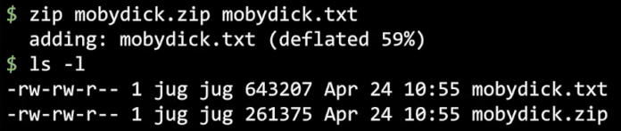
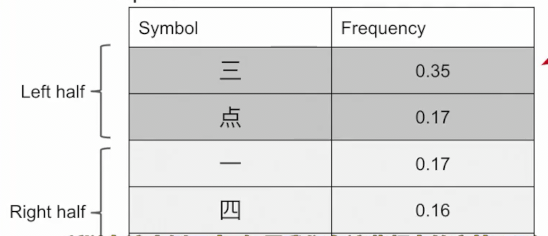
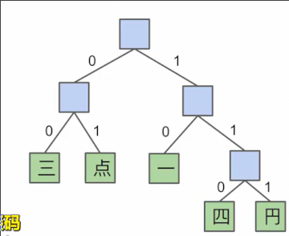

# 压缩
 
* [香农熵](#香农熵)
* [文本的压缩](#文本的压缩)
* [无前缀码](#无前缀码)
* [shannon-fano_编码](#shannon-fano_编码)
* [哈夫曼编码](#哈夫曼编码)

不损失文件的前提下，把文件缩小的原理是什么呢？

**无损压缩**

要保证这个缩减函数是**单调**的，也就是解压时也满足一一对应的关系

我们传递的信息没有减少，只是使用更少的位来表达

## 香农熵

尽管这个字符串有10000长，但是比只有10个长度的混乱字符串容易记，为什么呢？

因为其一个字符中含有的数据量远远少于混乱字符拥有的数据量

在计算机中，**比特存储的信息量通常少于使用的初始比特数**

数据集越可预测，人类越可能记住它，其所需比特越少

这种数据中含有信息量称为**香农熵**，是衡量数据可预测性的一个指标

简单地，是**字符串的所有可能性**

* 对于随机的10长度字符串 26^10种可能 而把这种可能性换为位为log_2(26^10)大概为47比特的熵，也就可以压缩为47比特的数据
* 对于10000个字符但是限制其每一位相同，因此只有26种可能 具有4.7比特的熵

而单词实际上也不是随机字符串

很多单词可以省略部分字母而被读懂

而**限制变为人类可读并具有意义的字符串** 

由此得到标准英语的香浓熵大概是每个字符1bit 因此47个字符的字符串大概可以压缩为4.7bit

而在实际中，做到比理论的1bit稍大一些的熵

衡量压缩程度的一个特征就是下一个bit的可预测性，如果下一个bit完全50%
的概率是1或是0，那么已经趋近完全压缩

## 文本的压缩

默认下，每个字符占8bit

第一个方式是减少bit，26个字母少于2^5，因此仅仅需要5位即可表示

突破平均5位的方式是使用为每个字母使用可变数量的位

对于频率较高的字符使用更短的bit

但是会有一些歧义

## 无前缀码

在莫尔斯电码中，使用停顿来避免

用前缀树表示

在一个字符结束后用1位进入到子节点

**产生歧义的原因在于某个字符的编码是另一个的前缀** 我们要加以避免

改进的方式就是让每个字符都出现在树的叶节点

并且这个树尽可能茂盛

但是如何确定每个字符用多长的bit呢？

## shannon-fano_编码

统计每个字符出现的频率 并将其分为频率大致相同的左右两边

其中一方获得0，另一方获得1，递归下去

按照频率大致相同的原因在于，使得每一位的预测概率大约为50%

但是证明存在更好的无前缀码编码方式

## 哈夫曼编码

1. 首先统计各个字符的权重，并且每个字符和一个节点对应
2. 每次合并权重最低的两个节点
3. 直到只有一个节点

这种编码方式更好一些 每个符号占用更少的位（仍比理论高一些）

可以使用**优先队列**完成构建

这就是**哈弗曼压缩**的原理，在文件中写入哈弗曼编码后的文本以及构建的哈弗曼树

---

此外还有其他的压缩方式 

* **游程编码**用自身连接的次数来替代如xxxyyyy写为3x4y
* **LZW** 搜索输入中常见的重复模式

这两种方法倾向于在实际zip压缩中使用

而压缩算法，不仅仅只减少空间，根据数学证明，其一定会在一些情况会增加空间

**不能压缩到低于数据集的熵** 平均而言会保持字符串长度不变

真实数据一般都是低熵，因此大多可以很好压缩

一般压缩算法越慢，其压缩越多，但是**永远不会超过香农熵的极限**

是否存在最佳的压缩算法？我们暂时无法证明，这等同于P=NP问题
