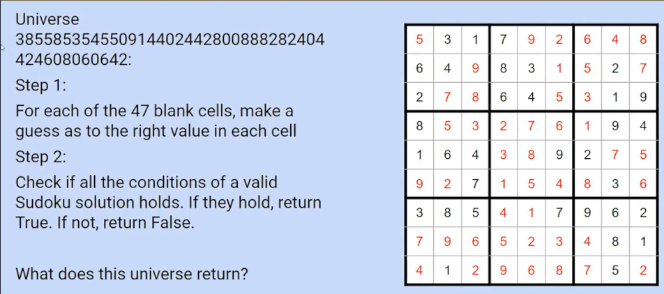

# 复杂度_P=NP
 
* [图灵规约下的等价性](#图灵规约下的等价性)
* [图灵机](#图灵机)

## 图灵规约下的等价性

背包问题 计划偷走总价值最高的物品组合

而背包中只能携带10磅重的物品

如何抉择呢？

这个问题可以引出这三个子问题

* 返回所应偷的所有物品
* 返回所能偷的最大价值
* 返回是否可以偷到一个目标价值

而其关联如下

假设我们有一个预言机：一个可以在多项式时间解决其中一个的东西

那么剩下的问题也可以在常数或多项式时间内解决

* 如已知问题2，很容易得到问题3的解
  * 比较目标值和最大价值即可
* 已知问题1，相加其价值就能得到问题2的答案
* 同样也可以从1依次推到3

但是反方向是比较困难的

* 从问题2到问题1
  * 首先得到所能偷的最大价值k
  * 移走一样东西，再次得到最大价值，如果仍为k，意外不在清单上，否则，在
  * 直到k为0
* 从问题3到问题2
  * 二分尝试能否达到某价值，确定最大价值的精确值
* 从问题3到1传递

如果几个问题在多项式时间内解决其中一个，剩下的也能在多项式内解决，称为这几个问题等价，**图灵规约下的等价性**

这三种问题的返回值类型不同 **列表 整数 布尔值**

我们思考其熵

* 列表可能有很多不同输出
* 整数有几十亿可能性
* 布尔值只有两种可能的值 其熵最小 因此是最简单的

我们称返回布尔值的问题为**判定问题**

通常有一种方法将任意非判定问题转换为判断问题

## 图灵机

渐进运行时间实际上以**图灵机**对应的时间单位表示   

任何Java程序都有等效的图灵机，普通Java程序和图灵机的区别在与在图灵机中假设具有无限大的内存

如果任何图灵机都可以使用该语言的程序来模拟，那么这种编程语言称为**图灵完备**

* Python
* Java
* C
* MC的红石

图灵完备要求非常低

我们可以将图灵机视为任何可以同Java编写的返回布尔值的函数 **确定性图灵机**

集合P是**可以在多项式时间内用确定性图灵机解决的所有判定问题**

* 数组是有序的吗？

**非确定性图灵机**运行猜测 所有猜测都假，才假 NP是**可以在多项式时间内用非确定性图灵机解决的问题**

数独有解吗？

1. 非确定性图灵机的解决方案是对于每个可能的单元格进行随机猜测 
2. 检查数独的所有不成立条件，以查看是否得到了有效的解，返回True或False
3. 只要我们曾返回True，那么结果即为True

False

False

...

False

True

==> True

假设这些猜测并行运行，运行时间取决于最慢的宇宙（用于验证）

对于n^2 * n^2的数独 需要 n^4 的复杂度

那么之前的背包问题是NP吗？是否能得到某目标值

* NP 我们可以每次猜测一组物品，查看其是否在价值大于目标值的同时，重量小于限定值

在P问题中的任何问题都是NP问题，如果问题可以在多项式时间内解决，则可以在多项式时间验证

> 我没怎么看懂，后续不再记录

