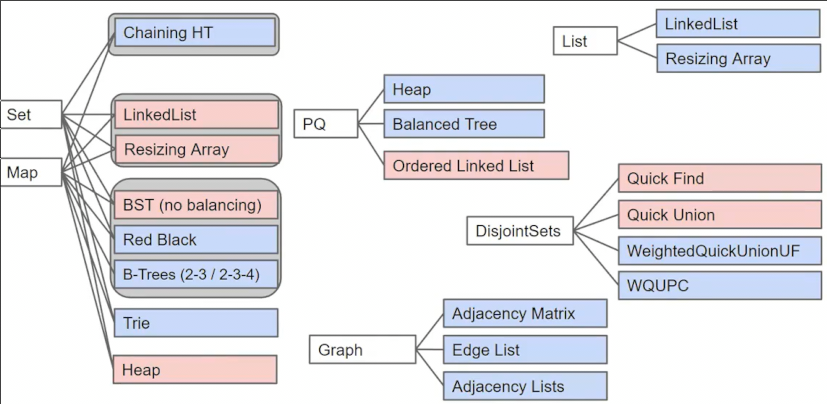
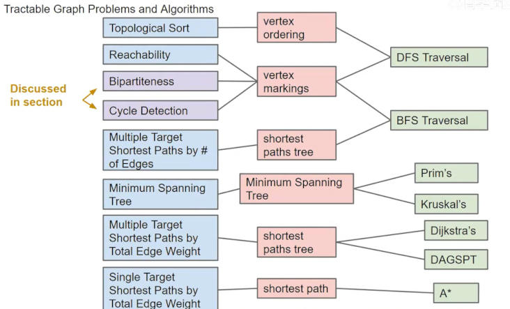
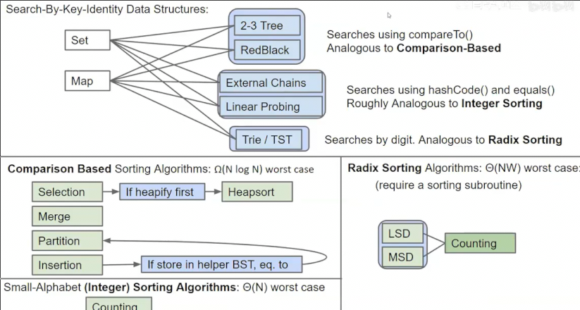

# 最后一节课
 
* [总结](#总结)
* [下一步](#下一步)
 
## 总结

在最初，我们进行了Java的语法学习 

然后是数据结构部分

之后是一些图算法

搜索操作 排序操作 

一些软件工程 单元测试 调试

## 下一步

我们将学什么？

更远地，我们将在现实中做什么？

* CS61A 如何编程
* CS61B 为什么编程
* CS61C 从机器的角度 怎么编程更高效 
* CS170 理论的角度 如何高效编程

之后深入到更细微的层面

* CS161 计算机安全 
* CS162 操作系统 计算机如何正确运行层面

尝试构建新的东西（失败没关系！）是学习CS的重要方式

将CS视为一种爱好而非工作

* www.calhacks.io 黑客马拉松 关在房间一整天 创作任何事情！*在学校阶段至少参加一次*

长期而言呢？

只要有时间和动力去实现你想要的，你可以做任何你想做的对世界有益的事 CS195 计算机伦理道德

* CS188 较为落后的AI 和尖端发展相异
* 讲师很喜欢的课 MATH191 很好的证明写作课
