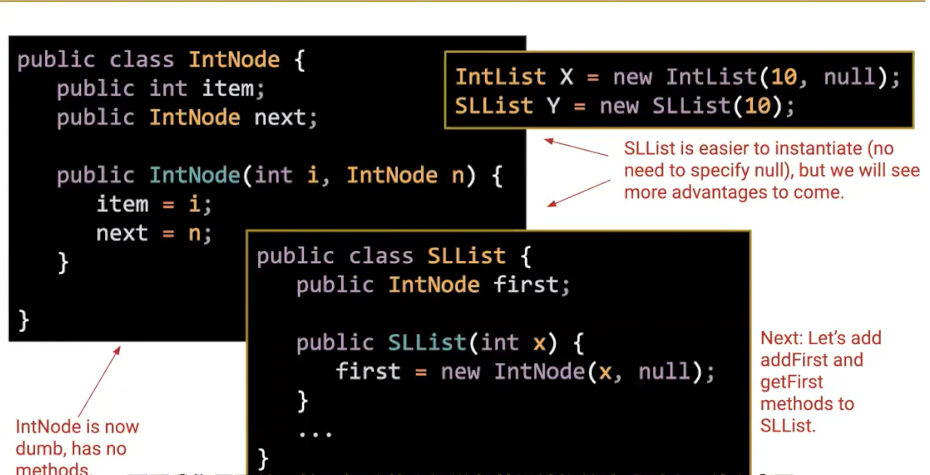
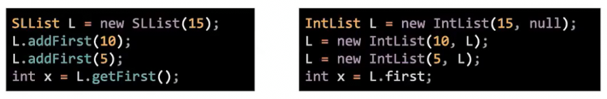
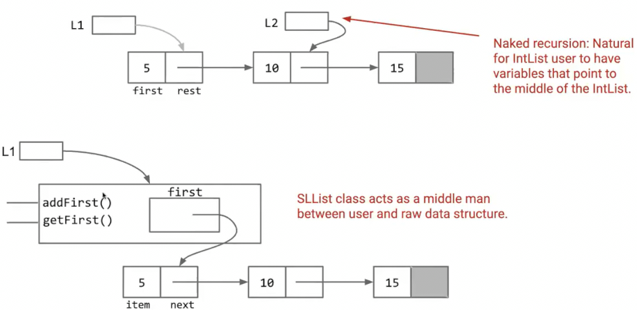
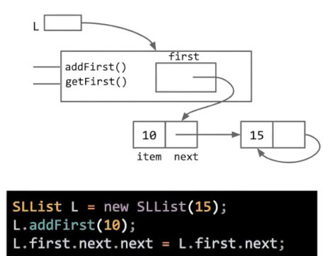
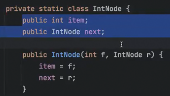
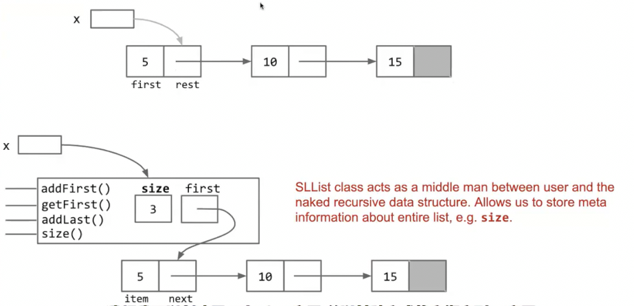
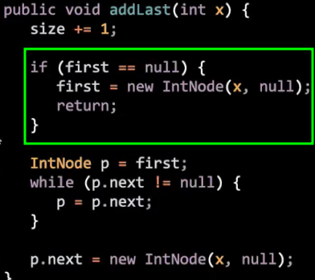
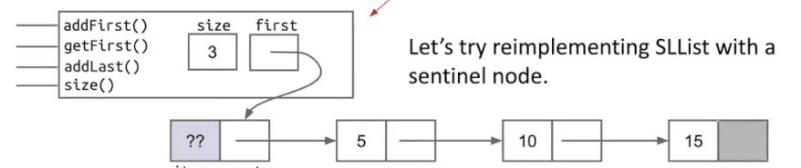

# 替换裸递归
 
* [底层的包装](#底层的包装)
* [权限控制](#权限控制)
* [嵌套类](#嵌套类)
  * [帮助方法](#帮助方法)
* [效率_实时追踪](#效率_实时追踪)
* [代码简洁性](#代码简洁性)

## 底层的包装



左上是我们之前的版本，**裸递归**指，使用我们实现的类的用户，必须对递归有很深的理解

* 用户必须指定`IntList`的第二个参数为另一个`IntList`或者是`null`
* 而我们通过`SLList`将其包装，`null`隐藏在实现中
* 通过包装裸递归，用户无需考虑赤裸的递归等数据结构

对比用户的使用



我们引入了一个*中间人*，替使用者面对底层的复杂结构



## 权限控制

用户有时会更改我们的底层结构，也许是我们不愿看到的



我们只希望用户使用我们的方法

可以修改属性的权限为`private`

**权限控制**的一些其他作用

* 向使用者**隐藏类的细节** *抽象 这是本课程很重要的思想 可以帮助我们构建庞大的程序*
* 安全 但并非密码等针对攻击者的安全 *仍有一些方法访问私有属性方法* 而是提醒用户如果不知道在做什么就不应该去搞砸

## 嵌套类

用户现在已经永远不会使用IntNode`，我们可以将其放入我们的`SLList`中

并且用户不需要知道这个类的存在

```java
private class IntNode
```

* **如果用户需要实际获取这个类的实例对象** 那么必须要设为`public`
* 如果是获取将其包装的外部类的实例对象，那么`private`就好

并且这种情况应设置其为`static`，**使得内部实例变量不能访问外部类的元素**



嵌套类表示**内部类只是外部类的一个子功能**，通常使用者不去访问内部类，设置为`private static` 在外部类中可以访问，并创建内部类实例

### 帮助方法

在比如使用递归实现时，或许外部类不是一个递归实现，无法直接递归

有时候，我们希望借助一个帮助函数来传入更多的参数

**我们可以将其设为private的一个同名函数，因为其有不同的参数，因此为重载，而`public`的函数就是调用其，留给用户访问的接口**

```java
    /* 返回列表的大小 */
    public int size() {
        return size(first);
    }

    /* 返回 链表从 node 开始之后的长度 */
    private int size(IntNode node) {
        if (node == null) {
            return 0;
        }
        return 1 + size(node.next);
    }
```

## 效率_实时追踪

这种`size`的方法和列表的大小是线性的关系，每次调用都要从头到尾扫描一边链表

我们可以实时追踪一个属性`size`，当我们添加元素时，改变`size`，当用户调用`.size()`时，只是返回这个属性

这样调用`size()`只是一个常量时间

```java
private int size;
```

我们牺牲了一点点内存和调用相应方法时改变size的额外一点点时间

这也是对内部类包装的额外一个好处，我们有很自然的地方来放`size`



## 代码简洁性

我们尝试重载一个新的构造函数，不传参，其构造一个空链表

```java
    /* 创建一个空链表 */
    public SLList() {
        first = null;
        size = 0;
    }
```

但是这回在我们的`addLast`上产生bug, 原因是我们每次都判断`first.next`是否为空，但是空列表的`first`根本没有`next`

一种解决方法是增加一个特殊情况



但是**增加特殊情况的代码会变得丑陋，调试更困难，理解更困难**

我们尝试找到不需要添加特殊情况的方法

在创建空链表时，与其创建一个`first=null`，不如创建一个实际的`node`，保证每次都能找到`first.next`

那么第一项永远存储我们不需要的值，作为哨兵`sentinel`

```java
    /* 传入内容创建一个新列表 */
    public SLList(int x) {
        sentinel = new IntNode(0, null);
        addFirst(x);
        size = 1;
    }

    /* 创建一个空链表 */
    public SLList() {
        sentinel = new IntNode(0, null);
        size = 0;
    }
```



如果第一项存在，那么其永远是`sentinel.next`

这种叙述也被成为**不变式**，可以用它们来推理我们的代码

```java
public class SLList {

    private static class IntNode {
        public int item;
        public IntNode next;
        public IntNode(int f, IntNode r) {
            item = f;
            next = r;
        }
    }

    /* 哨兵 */
    private IntNode sentinel;

    private int size;

    /* 传入内容创建一个新列表 */
    public SLList(int x) {
        sentinel = new IntNode(0, null);
        addFirst(x);
        size = 1;
    }

    /* 创建一个空链表 */
    public SLList() {
        sentinel = new IntNode(0, null);
        size = 0;
    }

    /* 向链表头部添加节点，值为x */
    public void addFirst(int x) {
        sentinel.next = new IntNode(x, sentinel);
        size++;
    }

    /* 获取第一个节点的值 */
    public int getFirst() {
        return sentinel.next.item;
    }

    /* 将末尾添加一个值为x的节点 */
    public void addLast(int x) {
        IntNode p = sentinel;
        while (p.next != null) {
            p = p.next;
        }
        p.next = new IntNode(x, null);
        size++;
    }

    /* 返回列表的大小 */
    public int size() {
        return size;
    }
/*
    // 返回 链表从 node 开始之后的长度 
    private int size(IntNode node) {
        if (node == null) {
            return 0;
        }
        return 1 + size(node.next);
    }
*/

    public static void main(String[] args) {
        SLList L = new SLList();
        L.addLast(10);
        System.out.println(L.getFirst());
    }

}
```
