# 双向链表
 
* [单向链表中尾部操作效率](#单向链表中尾部操作效率)
* [双向链表_DL](#双向链表_DL)
* [通用链表_泛型](#通用链表_泛型)
* [数组](#数组)
  * [创建数组](#创建数组)
  * [二维数组](#二维数组)

## 单向链表中尾部操作效率

在我们向尾部添加节点时，需要扫描整个链表，我们希望得到优化

思路是**跟踪尾部**

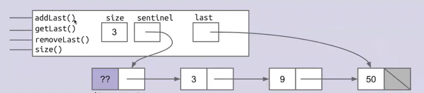

或许是这样？

添加、获取尾部似乎都没问题，但是移除尾部呢？我们需要将倒数第二项的`next`变为`null`，但我们似乎不能直接访问倒数第二项

给导数第二项添加指针？那么移除最后一项后，更新新的导数第二项指针还会面临我们的问题

## 双向链表_DL

解决这个问题的方式是**前面的节点不止指向后面，同时后面的节点也指向前面**

这样我们再存储`last`指针就可以快速访问到倒数第二项，以完成尾部的操作

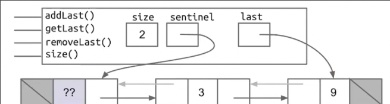

为了不产生**特殊情况**（当列表为空时last指向头哨兵，不为空时，指向真实节点），我们可以在尾部也引入一个哨兵

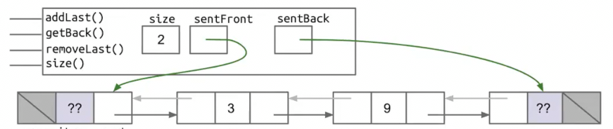

另一种更美妙的方式是使用一个哨兵，但我们构建一个**循环列表**，尾元素的`next`指向哨兵，哨兵的`front`指向尾元素

* 当链表为空，哨兵的`next`和`front`都指向自身
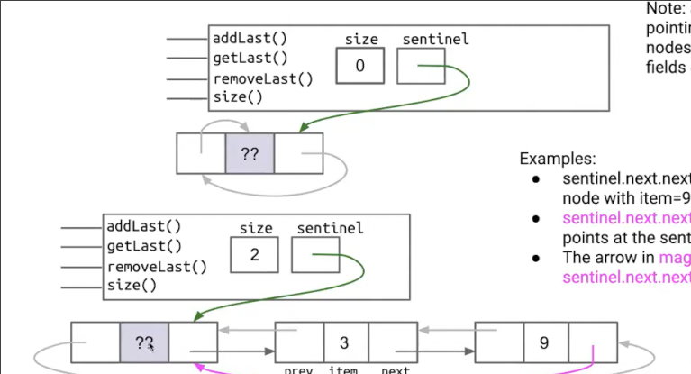

这是我们自**裸链表**以来的所有改善

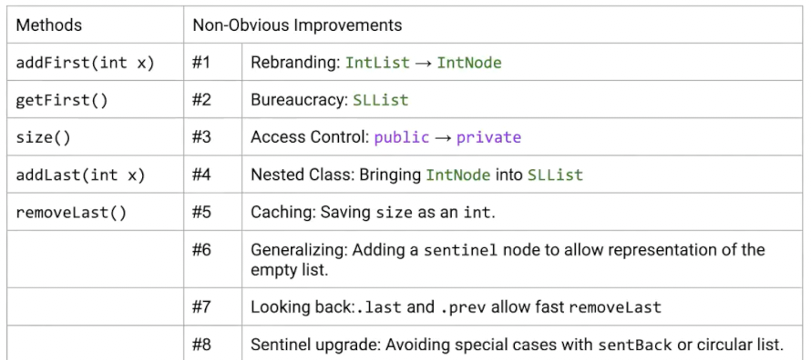

## 通用链表_泛型

我们的链表目前只能存储整数数据

```java
public class SLList<Pineapple> {
```

通过在类定义时，定义一个表示类型的占位符

我们可以在类内任意这个不定类型的地方，使用这个占位符类型（也可以在嵌套的子类中 *这种情况子类似乎不能通过static修饰*）

```java
        public Pineapple item;
```

定义好泛型类后，使用通过`ClassName<String>`这种表示具体的类

```java
        SLList<String> L = new SLList<String>();
```

或者声明后new时不指定也是可以的

```java
        SLList<String> L;
        L = new SLList<>();
```

要注意泛型的使用都要用到对象，比如`int`对应的对象是`Integer`
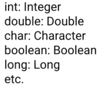

## 数组

我们还是构建和之前相似API的列表，但是底层以数组作为数据结构

和我们的对象差不多
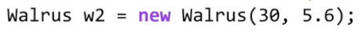

通过变量名获取到地址，可以访问对象的实际空间，对象空间中，有一些属性其有具体的名字，可供我们查阅修改

而在数组中，我们同样用变量名获取地址，并访问到数组的实际空间，但是在空间中，**所有位置没有具体名字**，但是有一个数组**索引**

在数组new时，Java在空间中找到足够容纳数组的**连续空间**

数组有一个**属性**`length`（不能被改变），**没有方法**

### 创建数组

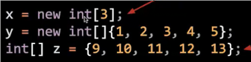

* new大喊新数组的地址
* x通过**黄金法则**接受到数组地址，并持有
* 声明时总是通过`int[]`这种类型，不需要`[]`里面有东西

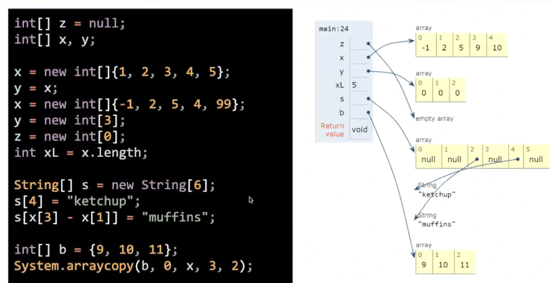

最后一句是一种数组复制方式 相当于

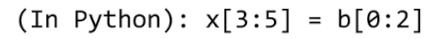

从b的0开始 目标开始于x的3 复制两个元素

应用场景可能是**不希望传入函数的数组被搞乱，复制一个副本**

### 二维数组

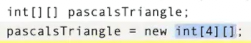

这句抽象的声明指的是**一个4个长度大小，装整数数组的数组**

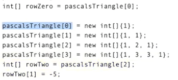

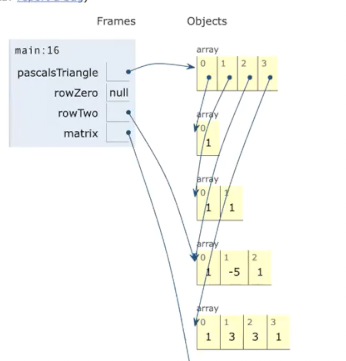

而这种new法内部的数组是后续才会指定大小的

而我们也可以在new时指定内部数组的大小

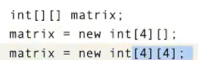

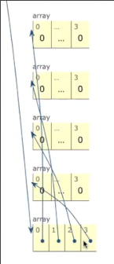

这样同时对于外部数组的每一个元素 自动new了一个默认的数组 而不是null，后续就不必对内部数组再new了
