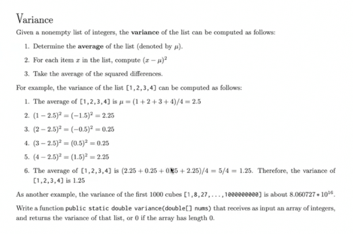
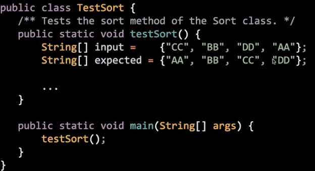
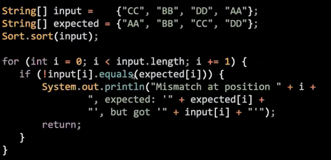
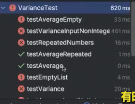

# 测试
 
* [自己编写测试](#自己编写测试)
* [Truth](#Truth)

## 自己编写测试

我们**自己编写测试**

我们或许不能数学意义上完全确定我们的代码是100%正确，但我们可以编写一些测试来给其正确性提供证据


这个问题是我们要写一个**计算列表方差的函数**

在之前我们会立即编写，然后把代码塞到评分器中，查看输出

但现实的很多问题是没有自动评分的，而我们会在写代码之前编写测试



我们可以在测试函数中指定输入和期望输出，并调用我们实现的函数获得实际输出，并对比期望输出和实际输出



但是具体的写这些错误信息很乏味，其他人已经为我们提供了很好的库！

* 比如Google开发的`Truth`


## Truth

我们可以在写**真正代码之前**，根据我们的思路先写一些测试代码 这样也可以使我们更了解我们的代码

```java
import org.junit.Test;

import static com.google.common.truth.Truth.assertThat;

public class VarianceTest {

    @Test
    public void testVariance() {
        double[] input = {10, 20, 30, 40};
        double except = 125.0;
        double actual = Variance.variance(input);
        assertThat(actual).isEqualTo(except);
    }
}
```

这是我们测试的语法

* `@test` 隶属于`junit` 允许我们不显式在main方法调用测试方法，从而允许测试函数
* `assertThat`是Truth库中的方法，可以比较预期和测试是否相同等 *其语法很像自然英语*

在写好测试和代码之后，我们运行测试，或许很多会失败


我们可以逐个解决 先挑些简单的

```java
import org.junit.Test;

import static com.google.common.truth.Truth.assertThat;

public class VarianceTest {

    @Test
    public void testVariance() {
        double[] input = {10, 20, 30, 40};
        double expected = 125.0;
        double actual = Variance.variance(input);
        assertThat(actual).isEqualTo(expected);
    }

    @Test
    public void testEmptyList() {
        double[] input = {};
        double expected = 0.0;
        double actual = Variance.variance(input);
        assertThat(actual).isEqualTo(expected);
    }

    @Test
    public void testRepeatedNumbers() {
        double[] input = {61, 61, 61, 61, 61};
        double expected = 0.0;
        double actual = Variance.variance(input);
        assertThat(actual).isEqualTo(expected);
    }

    @Test
    public void testNegative() {
        double[] input = {-1, -2, -3, -8};
        double expected = 7.25;
        double actual = Variance.variance(input);
        assertThat(actual).isEqualTo(expected);
    }

    @Test
    public void testVarianceInputNotIntegers() {
        double[] input = {1.5, 2.5, 3.5, 4.5};
        double expected = 1.25;
        double actual = Variance.variance(input);
        assertThat(actual).isEqualTo(expected);
    }
    
    @Test
    public void testAverageZero() {
        double[] input = {0};
        double expected = 0.0;
        double actual = Variance.average(input);
        assertThat(actual).isEqualTo(expected);
    }

    @Test
    public void testAverageEmpty() {
        double[] input = {};
        double expected = 0.0;
        double actual = Variance.average(input);
        assertThat(actual).isEqualTo(expected);
    }


    @Test
    public void testAverageRepeated() {
        double[] input = {5, 5, 5, 5, 5, 5, 5, 5, 23};
        double expected = 7.0;
        double actual = Variance.average(input);
        assertThat(actual).isEqualTo(expected);
    }

    @Test
    public void testAverageOutputNotIntegers() {
        double[] input = {5, 5, 5, 5, 5, 5, 5, 24};
        double expected = 7.375;
        double actual = Variance.average(input);
        assertThat(actual).isEqualTo(expected);
    }

    @Test
    public void testAverageInputNotIntegers() {
        double[] input = {5.5, 6.5};
        double expected = 6.0;
        double actual = Variance.average(input);
        assertThat(actual).isEqualTo(expected);
    }
}
```

