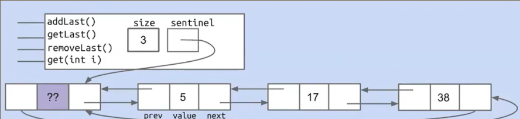
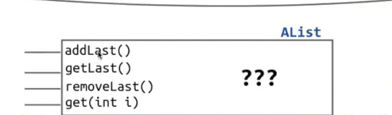
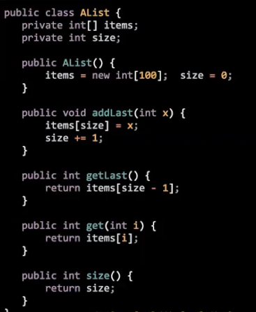
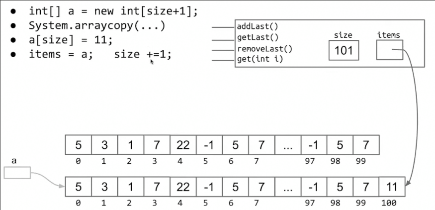
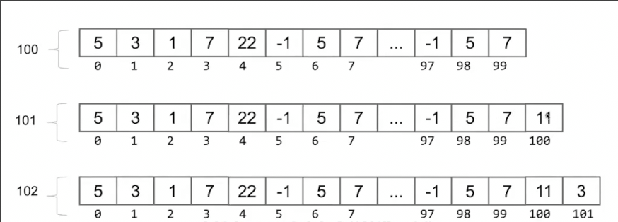
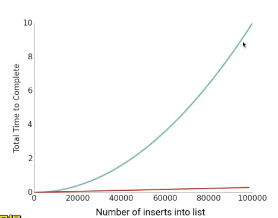
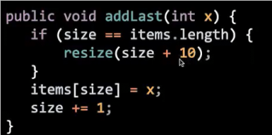
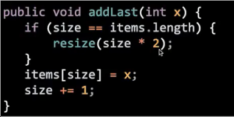

# 数据构建列表
 
* [链表的弊端](#链表的弊端)
* [实现列表](#实现列表)
* [实现和用户思维模式匹配即可](#实现和用户思维模式匹配即可)
* [列表扩容](#列表扩容)
* [扩容的效率问题](#扩容的效率问题)
  * [每次复制很占用时间](#每次复制很占用时间)
  * [解决方案](#解决方案)
  * [删除大量元素后的问题](#删除大量元素后的问题)
* [泛型](#泛型)

## 链表的弊端

为什么我们需要数组来作为列表的底层结构？

之前我们使用了双向链表，它通过哨兵可以很高效完成对首尾项的修改和获取，添加或删除

但是如果我们向查看或修改中间的任意项呢？我们要遍历链表的好多项以索引到我们列表的指定项



而这个时候使用数组就是一个明智的选择

对于数组而言，任意项都可以通过索引高效地直接访问

但有一个麻烦是Java创建的数组是不可改变大小的，我们必须通过某种方式使得我们的列表无限可扩展

## 实现列表

和SLList相同，我们的`AList`需要以下几个方法





我们还分析得到一些**不变量**

```java
    // 当我们添加元素时，永远会在索引size处添加
    // 当列表中的最后一个元素 在items中索引永远 size - 1
```

## 实现和用户思维模式匹配即可

我们实现`removeBack`时，不必真实删除底层数组中的元素，使用`AList`的人根本不关心底层是什么样，我们只需要稍微改变`size`使得其对用户不可见

```java
    /** 删除列表中的最后一个元素 并返回 **/
    public int removeLast() {
        int x = getLast();
        size--;
        return x;
    }
```

## 列表扩容

如果用户一直添加元素，使得列表的size将超过数组最初的大小 怎么办？

**用户的思维是其不关心我们的数组，而是希望一个无限可扩容的列表**

创建一个足够大的新数组！并把元素复制



```java
    /** 将底层数组调整为目标容量 **/
    private void resize(int capacity) {
        int[] a = new int[capacity];
        System.arraycopy(items, 0, a, 0, items.length);
        items = a;
    }

    /** 将元素 x 添加到 列表的结尾 **/
    public void addLast(int x) {
        if (size == items.length) {
            resize(size + 1);
        }
        items[size] = x;
        size++;
    }
```

将`addLast`拆为两个函数的原因是因为，给数组扩容的过程似乎也可以单独为一个功能，并且可以对其单独测试

## 扩容的效率问题

### 每次复制很占用时间

我们当前是每次超过容积就把容积扩大1

这样当我们在达到最大时，如果连续添加两个元素，那么两次触发扩容

但是每次扩容都要重新分配空间，完整地复制整个数组的元素，效率就会很慢



如果我们从100（最初的容积）开始，一直`addList`到1000呢？

我们复制900次数组，对于所有元素，总的复制次数就是`100+101...+999`，大概是1100*900/2 大概50万次，用户期望的是大概只有900的时间（只是在后面放个元素！）


其添加效率远远低于SLList

### 解决方案

我们可以每次扩容时多预留些空间，而不是值扩容一个



但是仍是抛物线的，尽管比之前效率高了许多

更好的解决方案实际是每次乘以2



### 删除大量元素后的问题

10亿元素的列表，我们删除9.9亿个，但目前我们列表占用的空间没有改变

我们可以在列表中元素很少时，调用`resize`使得空间占用减少

## 泛型

和SLList一样，我们可以使得列表适应不同元素，但是！Java不允许实例化泛型类型的数组

```java
        items = new Pineapple[100];
```

报错！我们应当这样实例化

```java
        items = (Pineapple[]) new Object[100];
```

在泛型中调用`removeLast`，应当使得底层数组中对对象的引用被删去，否则在用户没有覆盖掉这部分引用时，对象由于存在引用仍会存储在内存

```java
    /** 删除列表中的最后一个元素 并返回 **/
    public Pineapple removeLast() {
        Pineapple x = getLast();
        items[size - 1] = null;
        size--;
        return x;
    }
```

```java
public class AList<Pineapple> {
    private Pineapple[] items;
    private int size;

    // 当我们添加元素时，永远会在索引size处添加
    // 当列表中的最后一个元素 在items中索引永远 size - 1
    
    /** 创建空列表 **/
    public AList() {
        items = (Pineapple[]) new Object[100];
        size = 0;
    }

    /** 将底层数组调整为目标容量 **/
    private void resize(int capacity) {
        Pineapple[] a = (Pineapple[]) new Object[capacity];
        System.arraycopy(items, 0, a, 0, items.length);
        items = a;
    }

    /** 将元素 x 添加到 列表的结尾 **/
    public void addLast(Pineapple x) {
        if (size == items.length) {
            resize(size * 2);
        }
        items[size] = x;
        size++;
    }

    /** 返回列表的最后一个元素 **/
    public Pineapple getLast() {
        return items[size - 1];
    }

    /** 删除列表中的最后一个元素 并返回 **/
    public Pineapple removeLast() {
        Pineapple x = getLast();
        items[size - 1] = null;
        size--;
        return x;
    }

    /** 获取列表的任意位置元素 **/
    public Pineapple get(int i) {
        return items[i];
    }

    /** 获取列表的元素个数 **/
    public int size() {
        return size;
    }

    public static void main(String[] args) {
        AList<Integer> L = new AList();
        int i = 0;
        while (i < 10000000) {
            L.addLast(i);
            i = i + 1;
        }
    }
}
```

