# 继承
 
* [接口继承](#接口继承)
  * [接口](#接口)
  * [覆盖和重载](#覆盖和重载)
* [实现继承](#实现继承)
  * [静态类型_动态类型](#静态类型_动态类型)

## 接口继承

我们的SLList和AList的接口差不多

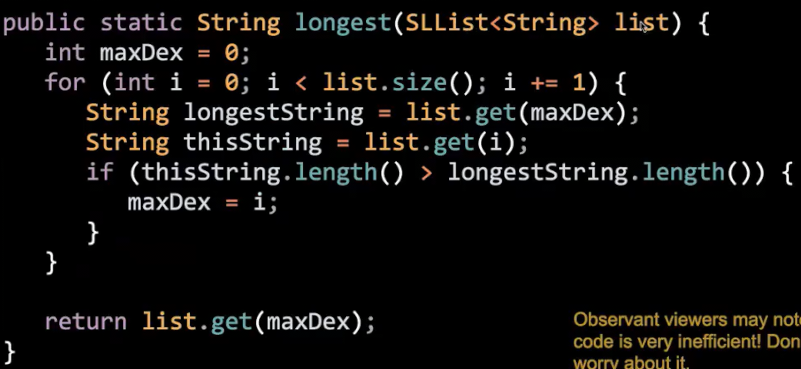

这是找到单词列表中最长单词的方法

或许用户有时需要用AList存储

我们要重载`longest`方法吗

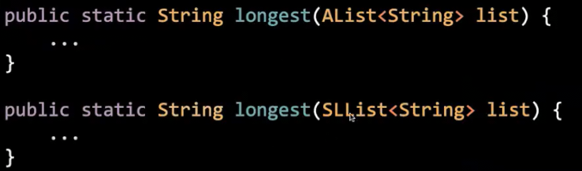

这两种方法几乎相同，因为使用的两种列表接口一样

我们希望找出一个适用于所有列表的**通例**的函数

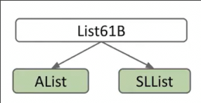

### 接口

如何得到这个通例

* 定义一个**新类型**
* 告诉Java，AList和SLList是这个类型的特例

```java
public interface List61B<Item> {
    public void addFirst(Item x);
    public void addLast(Item x);
    public Item getFirst();
    public Item getLast();
    public Item size();
}
```

`interface`来替代`class`，只给出方法的签名

之后我们还要告诉实现的特例列表，其属于这个通类

```java
public class SLList<Pineapple> implements List61B<Pineapple>{
```

我们皆可以把`longest`方法对通类实现

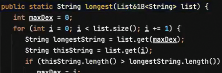

我们可以将这个通类形参的特例实参传入

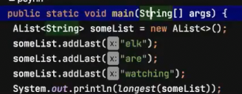

**为什么可以通过黄金法则将AList实参传递给List61B形参**

List61B变量可以持有任意的`List61B`！AList也是`List61B`的一种

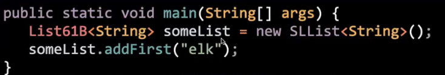

### 覆盖和重载

我们在特例上实现了通类签名的方法，就是`override`覆盖了通类的方法

二者相同签名

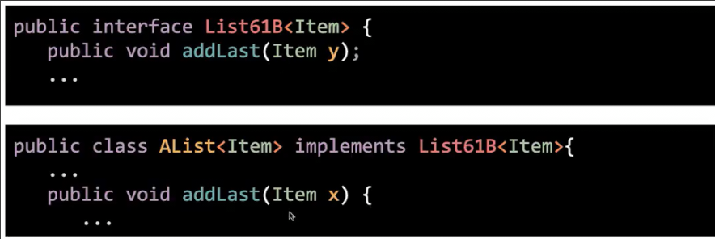

两个方法有相同的名称 但是却有不同的参数 签名不同，称为重载`overload`

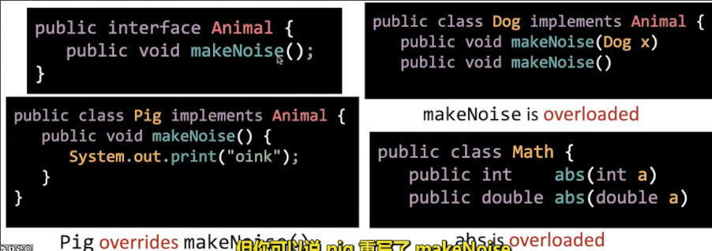

我们可以对特例实现通类的方法添加一个标记`@override`提醒自己做了什么

这样也可以防止我们在实现通类中的方法时，发生拼写错误，（override会在不是通类的方法时报错）

在**接口继承**中，**子类必须实现接口类的所有签名方法**

## 实现继承

不同于接口继承，子类不是继承了方法的签名，以必须实现。其得到了实际的已实现代码

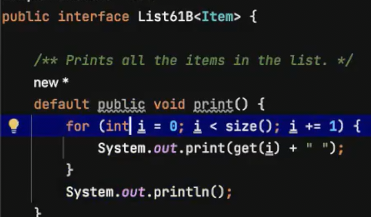

**通过`default`关键字**

但是这种打印方法对于一些列表尽管有效（我们使用的都是接口类中的方法），但是可能效率不高，比如链表的get很慢，可能需要更高效的**独特方法**

此时我们仍然可以在链表类中override覆盖接口类中的默认实现

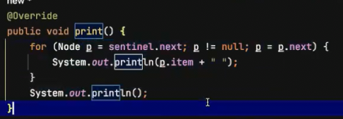

### 静态类型_动态类型

这个`someList`调用的是谁的`print`呢

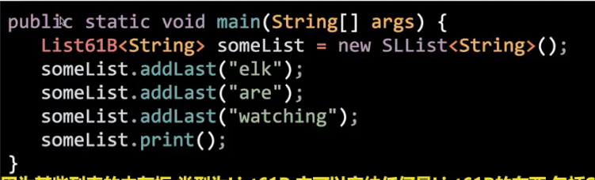

实际上是特类自己的print

原因在于

Java中创建的每个变量不仅仅是一种类型，其同时具有**静态类型**和**动态类型**

* **静态类型**是声明时指定的类型 **永远不会变** 也叫*编译时类型*
* 同时声明时，动态类型会为`null`
* 而在赋值后，变量会被绑定**动态类型** **可以随着赋值的对象类型的变化而变化** 也叫*运行时类型*

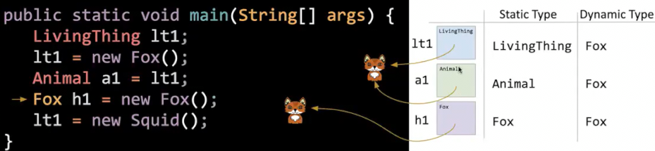

而我们在运行时，调用变量的`print`，其具有的类型就是运行时类型，自然会根据赋值对象拥有的方法来调用
