# extend_继承_封装_静态类型和类型转换
 
* [extend](#extend)
* [super引用父类](#super引用父类)
* [父子间的构造函数](#父子间的构造函数)
* [Object类](#Object类)
* [封装](#封装)
* [编译类型_类型转换](#编译类型_类型转换)

继承可以表示子类**is a**父类的关系，但如果子类**has a**父类，这种继承就是不好的，应该把后者作为前者的一个属性来实现。

比如set可以用sllist实现，我们可以说set has a sllist，但是从sllist继承就是不应该的 如果使用继承也会出现一些本不该有的方法

## extend

不仅仅从只有签名或者默认方法的接口类中继承

我们向在`SLList`基础上实现一个`RotaingSLList`，其具有和`SlList`完全相同的方法，但是还有一个自己的独特方法

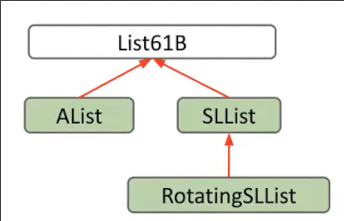

```java
public class RotatingSLList<Item> extends SLList<Item>{
```

extend的子类也可以实现自己的方法 这不是override

```java
    public void rotateRight() {
        Item x = removeLast();
        addFirst(x);
    }
```

extend使得我们继承实际类的所有非private的细节

* 所有属性、静态变量
* 所有方法
* 所有嵌套子类

## super引用父类

我们可以对父类继承来的方法重写，重写后或者重写时，我们可以通过`super`引用到父类，并调用父类中的原始方法（尽管他们在子类中已经被覆盖！）

```java
public class VengefulSLList<Item> extends SLList<Item> {

    private SLList<Item> lostItems;

    public VengefulSLList() {
        lostItems = new SLList<>();
    }

    public void printLostItems() {
        lostItems.print();
    }

    @Override
    public Item removeLast() {
        Item x = super.removeLast();
        lostItems.addLast(x);
        return x;
    }
```

## 父子间的构造函数

我们在实现子类的构造函数时，似乎并没有调用父类的构造函数，但是父类的哨兵什么的似乎被正确初始化

Java会**自动在子类的构造函数开始时，先调用父类的无参构造函数**

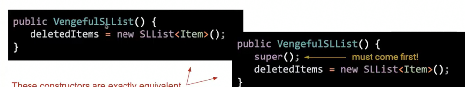

在这里这两行代码是等同的

但是当我们需要实现子类的有参构造，Java只会默认进入我们父类的无参构造，并不会根据参数选择不同的

这时候，如果我们希望父类有参构造，则要手动调用

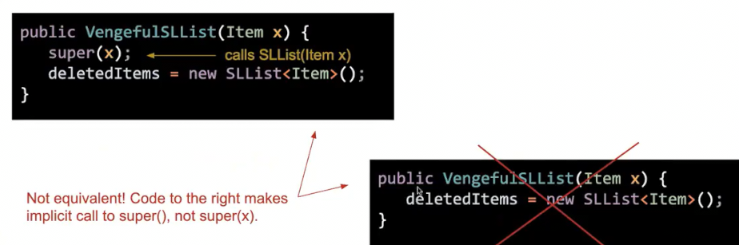

## Object类

Java中，定义的每个类都是Object类的子类

因此所有对象都能调用Object类的方法

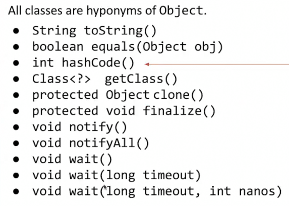

其中一些方法已经过时，我们在本课程关注前三种

## 封装

管理复杂性 复杂性过高的程序，构建时就会很痛苦

* 权限控制，隐藏使用者不需要关心的属性、方法

如果一个对象，**其实现细节是隐藏的，我们只能通过一组public方法或者接口与其交互**，那么其就是被封装的

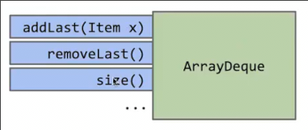

如果试图弄清底层的私有变量如真实数组如何工作，那么就是在错误的抽象层级上工作。我们只需要弄清公共属性和方式是否按照我们预测工作

Java中封装更严密，`private`关键字，这也是这门课使用Java的一个原因

这是`Dog`中两种实现`bark`和`barkmany`的方法

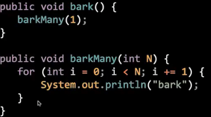

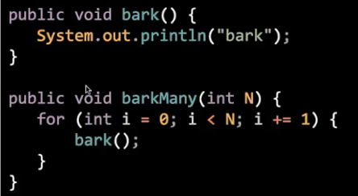

这两者行为相同

但是当我们有一个子类继承了`Dog`，当其覆盖`barkMany`方法，但是保留父类的`bark`

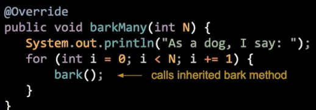

此时父类中的第一种实现显然会导致无限循环

本来我们不该关心类的实际实现代码是什么，而只关心其接口。但是**实现继承破坏了封装**，使得原有的接口可能不起作用

## 编译类型_类型转换

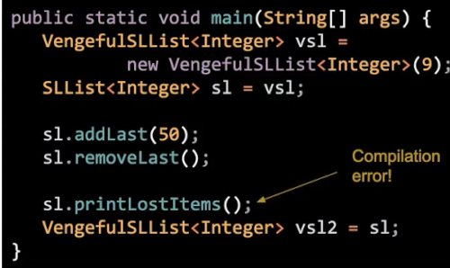

编译器只关心我们声明的类型，在`s1.print...`时，由于静态类型`SLList`没有`print..`方法，编译不通过。

下一行也是一样，s1的静态类型是`SLList`，但是！SLList不是一种VengnfulSLList，编译不通过

对于`new`时，后面的类型也是编译类型，赋值给变量遵循相应的原则，只有后面是变量编译类型的一种，才可以赋值

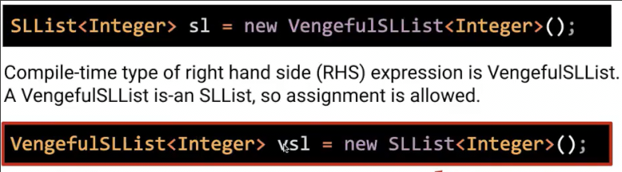

而表达式同样也有编译时类型

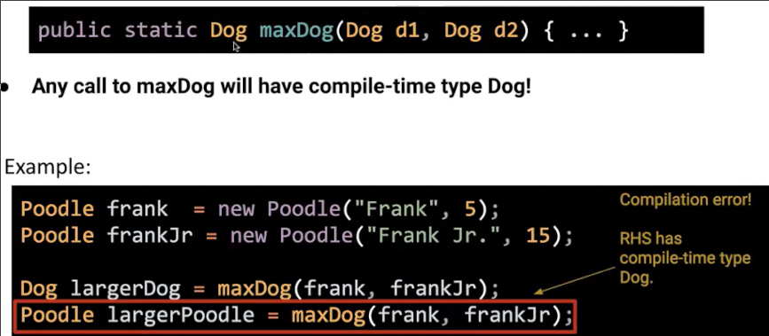

这里`maxDog`的编译时类型就是返回值类型`Dog`

这样就是可以通过编译的

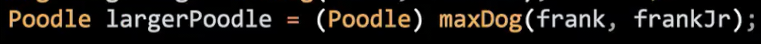

* **类型转换会更改编译时类型，不会影响运行方式**

但是，类型转换可能会导致运行崩溃

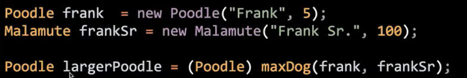

我们告诉编译器`maxDog`一定返回Poodle，因此编译器放心地通过了，但是在运行时，我们实际返回Malamute！，Poodle变量不能存储Malamute的地址
